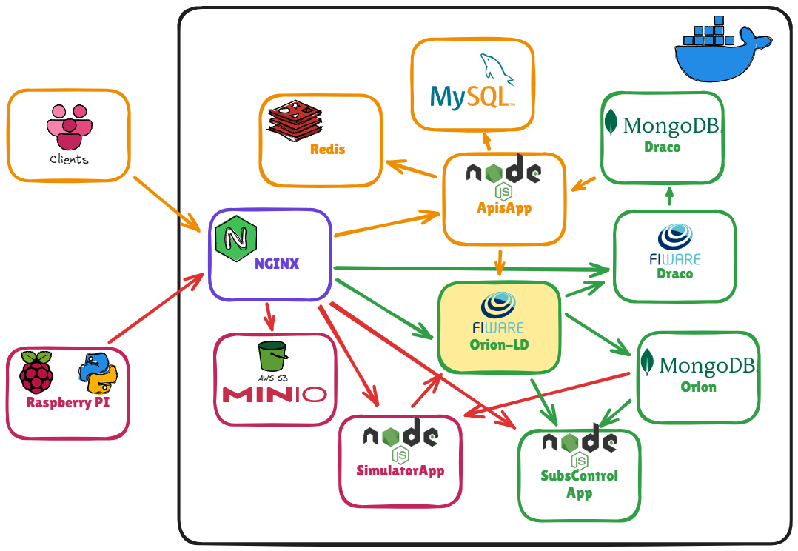

<p align="center">
  
</p>
<p align="center"><h1 align="center">MIDDLEWARE CIUDADLEGO</h1></p>
<br>


## 👾 Features

Este proyecto se divide princialmente en 4 grupos:

1. **CORE IoT:**  
    > Compuesto por el Context Broker, Draco y la aplicación web SubsApp, creada para gestionar las suscripciones.
2. **Infraestructura IoT:**  
    > Integrada por el simulador y todo el sistema real IoT. A este se le ha añadido el bucket MinIO para el almacenamiento de imágenes.
3. **Servicio para el Cliente Final:**  
    > Inicialmente formaba parte de un TFG realizado en paralelo con este, pero ha sido containerizado y modificado para incluir funciones adicionales, como la gestión de usuarios, el control de solicitudes realizadas en un intervalo de tiempo mediante API Keys, además de la modificación de la semántica de todas las APIs para hacerlas más escalables y adecuadas a las necesidades del proyecto.
4. **Despliegue:**  
   > Grupo especial que surge como una solución a la necesidad de desplegar todos los servicios en un servidor, enfrentándose a nuevos retos debido a las limitaciones de puertos expuestos del mismo. Esto hizo necesario configurar un reverse proxy NGINX para gestionar adecuadamente el tráfico y garantizar el acceso a
---

## ☑️ Requisitos
+ docker 
+ docker compose

## 📁 Project Structure

```sh
└── MiddlewareCiudadLego/
    ├── apis_app
    │   ├── CityApiV2
    │   ├── Dockerfile
    │   ├── 🟪 apis-app.yml 
    ├── bucket_minio
    │   ├── 🟪 bucket_minio_photo.yaml
    ├── draco
    │   ├── Dockerfile.draco-init
    │   ├── 🟪 draco-mongo.yml
    ├── orion
    │   ├── conf
    │   │   └── mime.types
    │   ├── data-models
    │   │   ├── datamodels.context-ngsi.backup.jsonld
    │   │   └── datamodels.context-ngsi.jsonld
    │   └── 🟪 orion-ld.yml
    ├── proxy-reverse
    │   ├── default.conf
    │   ├── index.html
    │   ├── 🟪 nginx-reverse.yml
    │   ├── red_proxy
    │   └── script_proxy-reverse.py
    ├── simulator
    │   ├── Dockerfile
    │   ├── app
    │   └── 🟪 simulator-app.yml
    ├── subs-control
    │   ├── Dockerfile
    │   ├── app_subs-control
    │   └── 🟪 subs-control-app.yml
    ├──  zz_env_services
    │   ├── apis_app.env
    │   ├── bucket_minio.env
    │   ├── config_env_files.sh
    │   ├── draco.env
    │   ├── orion.env
    │   ├── simulator.env
    │   └── subs_control.env
    ├── 🟨 services
    └── 🟨 services_aux_functions.sh
```


## 📂 Project Index
<details open>
	<summary><b><code>MIDDLEWARE CIUDADLEGO/</code></b></summary>
	<details> <!-- __root__ Submodule -->
		<summary><b>__root__</b></summary>
		<blockquote>
			<table>
			<tr>
				<td><b><a href='https://github.com/Tehedor/MiddlewareCiudadLego/blob/master/services_aux_functions.sh'>services_aux_functions.sh</a></b></td>
				<td>- The `services_aux_functions.sh` file in the project contains functions related to interacting with the Orion LD service<br>- Specifically, it includes functions for getting the heartbeat of the service and waiting for Orion to be ready<br>- These functions play a crucial role in managing the communication and synchronization with the Orion LD service within the project architecture.</td>
			</tr>
			<tr>
				<td><b><a href='https://github.com/Tehedor/MiddlewareCiudadLego/blob/master/services'>services</a></b></td>
				<td>- Facilitates starting, stopping, and managing various services in the project using Docker Compose<br>- Commands like 'build', 'start', 'stop' are available to handle services like Orion, Draco, Simulator, Subs Control App, Minio, and Apis App<br>- The script ensures a seamless setup and teardown of the project services.</td>
			</tr>
			</table>
		</blockquote>
	</details>
	<details> <!-- subs-control Submodule -->
		<summary><b>subs-control</b></summary>
		<blockquote>
			<table>
			<tr>
				<td><b><a href='https://github.com/Tehedor/MiddlewareCiudadLego/blob/master/subs-control/subs-control-app.yml'>subs-control-app.yml</a></b></td>
				<td>- Defines service configuration for the subs-control-app, specifying image, container settings, volumes, networks, and environment variables<br>- It sets up health checks and defines volumes and networks for the app.</td>
			</tr>
			<tr>
				<td><b><a href='https://github.com/Tehedor/MiddlewareCiudadLego/blob/master/subs-control/build'>build</a></b></td>
				<td>Builds a Docker image named 'subs-control-app' for the 'subs-control' service in the project.</td>
			</tr>
			<tr>
				<td><b><a href='https://github.com/Tehedor/MiddlewareCiudadLego/blob/master/subs-control/.env'>.env</a></b></td>
				<td>Define environment variables for the project, including the web app port and actuator IP address.</td>
			</tr>
			<tr>
				<td><b><a href='https://github.com/Tehedor/MiddlewareCiudadLego/blob/master/subs-control/Dockerfile'>Dockerfile</a></b></td>
				<td>- Builds a Docker image for a Node.js application, setting up necessary environment variables and dependencies<br>- Copies the application files, installs dependencies, and starts the application on port 4040<br>- This file is crucial for containerizing and running the subs-control service within the project architecture.</td>
			</tr>
			</table>
			<details>
				<summary><b>simulatorScripts</b></summary>
				<blockquote>
					<table>
					<tr>
						<td><b><a href='https://github.com/Tehedor/MiddlewareCiudadLego/blob/master/subs-control/simulatorScripts/subscribeDraco.py'>subscribeDraco.py</a></b></td>
						<td>- The `subscribeDraco.py` script in the `subs-control/simulatorScripts` directory facilitates communication with the Draco service by sending notifications to a specific URI endpoint<br>- It plays a crucial role in enabling subscription functionality within the project architecture, allowing for the seamless integration of various NGSI-LD entities for monitoring and control purposes.</td>
					</tr>
					<tr>
						<td><b><a href='https://github.com/Tehedor/MiddlewareCiudadLego/blob/master/subs-control/simulatorScripts/iniciarSimulator.py'>iniciarSimulator.py</a></b></td>
						<td>- Initiates simulator scripts to manage entities, actuators, and Draco subscriptions<br>- Executes Python scripts for each task using subprocess<br>- The file plays a crucial role in orchestrating the simulation environment within the project architecture.</td>
					</tr>
					<tr>
						<td><b><a href='https://github.com/Tehedor/MiddlewareCiudadLego/blob/master/subs-control/simulatorScripts/subscribeActuators.py'>subscribeActuators.py</a></b></td>
						<td>- Generates subscriptions for various sensors and sends HTTP requests to a specified URL for subscription creation<br>- The script facilitates the integration of sensor data with external systems by automating the subscription setup process for sensor updates.</td>
					</tr>
					<tr>
						<td><b><a href='https://github.com/Tehedor/MiddlewareCiudadLego/blob/master/subs-control/simulatorScripts/iniciarEntidades2.py'>iniciarEntidades2.py</a></b></td>
						<td>- Initiate entity creation for a Lego city simulation by sending sensor, actuator, building, and general data to an NGSI-LD context broker<br>- The script interacts with the broker API to populate the simulation environment with various entities like sensors, actuators, buildings, and the city itself.</td>
					</tr>
					</table>
				</blockquote>
			</details>
			<details>
				<summary><b>app_subs-control</b></summary>
				<blockquote>
					<table>
					<tr>
						<td><b><a href='https://github.com/Tehedor/MiddlewareCiudadLego/blob/master/subs-control/app_subs-control/app.js'>app.js</a></b></td>
						<td>- Initiates MongoDB connection, sets up Express server, and ensures data integrity by creating and validating JSON files<br>- Additionally, checks and initializes entities and subscriptions in the database<br>- Controls the flow of subscriptions based on the system state, either real or simulated.</td>
					</tr>
					<tr>
						<td><b><a href='https://github.com/Tehedor/MiddlewareCiudadLego/blob/master/subs-control/app_subs-control/package-lock.json'>package-lock.json</a></b></td>
						<td>- The code file in subs-control/app_subs-control/package-lock.json manages dependencies for the subs-control project<br>- It ensures that the necessary external libraries like axios, dotenv, express, and http-errors are included and maintained at specific versions<br>- This file plays a crucial role in orchestrating the project's functionality by handling its required dependencies effectively.</td>
					</tr>
					<tr>
						<td><b><a href='https://github.com/Tehedor/MiddlewareCiudadLego/blob/master/subs-control/app_subs-control/.env'>.env</a></b></td>
						<td>- Facilitates configuration of web app and MongoDB ports, container mode, actuators IP, and entities ID<br>- Determines initial state for simulator or real mode.</td>
					</tr>
					<tr>
						<td><b><a href='https://github.com/Tehedor/MiddlewareCiudadLego/blob/master/subs-control/app_subs-control/package.json'>package.json</a></b></td>
						<td>- Manages dependencies and configuration for the subs-control service within the project<br>- Orchestrates the setup and execution of the service, ensuring seamless integration with external libraries and tools<br>- Key components include Axios for HTTP requests, Express for web server capabilities, and Mongoose for MongoDB interactions.</td>
					</tr>
					</table>
					<details>
						<summary><b>subscriptions_controller</b></summary>
						<blockquote>
							<table>
							<tr>
								<td><b><a href='https://github.com/Tehedor/MiddlewareCiudadLego/blob/master/subs-control/app_subs-control/subscriptions_controller/control_subs.js'>control_subs.js</a></b></td>
								<td>- Control subscriptions for different modes and devices<br>- Manages switching between simulator and real modes, initializing subscriptions accordingly<br>- Provides functions to start subscriptions for Draco, real actuators, and simulator actuators<br>- Allows for changing the state and creating standard subscriptions.</td>
							</tr>
							<tr>
								<td><b><a href='https://github.com/Tehedor/MiddlewareCiudadLego/blob/master/subs-control/app_subs-control/subscriptions_controller/notify_template.js'>notify_template.js</a></b></td>
								<td>- Defines functions to generate subscription notification templates and update subscription formats and endpoints<br>- These functions facilitate creating and modifying subscription notifications for feedstock changes within the project architecture.</td>
							</tr>
							<tr>
								<td><b><a href='https://github.com/Tehedor/MiddlewareCiudadLego/blob/master/subs-control/app_subs-control/subscriptions_controller/create_delete_update_subs.js'>create_delete_update_subs.js</a></b></td>
								<td>- The code file orchestrates subscription management by creating, updating, deleting, and reactivating subscriptions via HTTP requests<br>- It interacts with external services to handle subscription operations based on specified entities and headers<br>- This functionality plays a crucial role in maintaining real-time data synchronization and event-driven workflows within the project architecture.</td>
							</tr>
							</table>
							<details>
								<summary><b>default_subs</b></summary>
								<blockquote>
									<table>
									<tr>
										<td><b><a href='https://github.com/Tehedor/MiddlewareCiudadLego/blob/master/subs-control/app_subs-control/subscriptions_controller/default_subs/draco_subs.js'>draco_subs.js</a></b></td>
										<td>- Facilitates subscription management for buildings, sensors, and actuators by creating and deleting subscriptions based on specified entities<br>- Handles subscription creation and deletion through dedicated functions for each entity type<br>- Centralizes subscription configuration and control for the entire system.</td>
									</tr>
									<tr>
										<td><b><a href='https://github.com/Tehedor/MiddlewareCiudadLego/blob/master/subs-control/app_subs-control/subscriptions_controller/default_subs/actuators_simulator-subs.js'>actuators_simulator-subs.js</a></b></td>
										<td>- The code file orchestrates the creation, update, and deletion of sensor subscriptions for actuators in a simulated environment<br>- It also facilitates switching entities to a simulator mode for testing purposes<br>- This functionality enhances the project's architecture by enabling efficient management of sensor subscriptions and simulation scenarios.</td>
									</tr>
									<tr>
										<td><b><a href='https://github.com/Tehedor/MiddlewareCiudadLego/blob/master/subs-control/app_subs-control/subscriptions_controller/default_subs/actuators_real-subs.js'>actuators_real-subs.js</a></b></td>
										<td>- The code file orchestrates real sensor subscriptions and updates within the project's architecture<br>- It handles the creation, deletion, and state changes of sensor subscriptions for actuators, ensuring seamless communication between entities.</td>
									</tr>
									</table>
								</blockquote>
							</details>
						</blockquote>
					</details>
					<details>
						<summary><b>subscriptions_controller.backup</b></summary>
						<blockquote>
							<table>
							<tr>
								<td><b><a href='https://github.com/Tehedor/MiddlewareCiudadLego/blob/master/subs-control/app_subs-control/subscriptions_controller.backup/control_subs.js'>control_subs.js</a></b></td>
								<td>- Manage subscription states between simulator and real modes, allowing for seamless switching and initialization of subscriptions for actuators, sensors, and buildings<br>- The code controls the creation and deletion of subscriptions based on the current mode, ensuring proper functionality and data flow within the system.</td>
							</tr>
							<tr>
								<td><b><a href='https://github.com/Tehedor/MiddlewareCiudadLego/blob/master/subs-control/app_subs-control/subscriptions_controller.backup/draco_subs.js'>draco_subs.js</a></b></td>
								<td>- The code file `draco_subs.js` in the `subscriptions_controller.backup` directory is responsible for setting up subscriptions to receive notifications about feedstock changes in the LegoCity building<br>- It utilizes Axios to communicate with a service at a specific URI and defines the attributes to watch for in the notifications<br>- This file plays a crucial role in managing subscriptions for the LegoCity entity within the larger project architecture.</td>
							</tr>
							<tr>
								<td><b><a href='https://github.com/Tehedor/MiddlewareCiudadLego/blob/master/subs-control/app_subs-control/subscriptions_controller.backup/actuators_simulator-subs.js'>actuators_simulator-subs.js</a></b></td>
								<td>- Generates subscriptions for sensor data to control actuators and deletes existing subscriptions<br>- Handles communication with external services for subscription creation and deletion.</td>
							</tr>
							<tr>
								<td><b><a href='https://github.com/Tehedor/MiddlewareCiudadLego/blob/master/subs-control/app_subs-control/subscriptions_controller.backup/actuators_real-subs.js'>actuators_real-subs.js</a></b></td>
								<td>- Generates and deletes sensor subscriptions for actuators using NGSI-LD, facilitating real-time data notifications for various sensors<br>- The code interacts with an NGSI-LD broker to manage subscriptions for different sensor types, enabling seamless communication between sensors and actuators in the system.</td>
							</tr>
							</table>
						</blockquote>
					</details>
					<details>
						<summary><b>controllers</b></summary>
						<blockquote>
							<table>
							<tr>
								<td><b><a href='https://github.com/Tehedor/MiddlewareCiudadLego/blob/master/subs-control/app_subs-control/controllers/generalControllerEntities.js'>generalControllerEntities.js</a></b></td>
								<td>Retrieve and format entities data for display by extracting relevant attributes and dates, ensuring a clean and structured presentation.</td>
							</tr>
							<tr>
								<td><b><a href='https://github.com/Tehedor/MiddlewareCiudadLego/blob/master/subs-control/app_subs-control/controllers/generalSubsRelations.js'>generalSubsRelations.js</a></b></td>
								<td>- Generates structured data for general subscription relations by mapping entities with specific criteria<br>- The function retrieves and transforms entity attributes, ensuring valid date formats, and filters based on a reference condition.</td>
							</tr>
							<tr>
								<td><b><a href='https://github.com/Tehedor/MiddlewareCiudadLego/blob/master/subs-control/app_subs-control/controllers/generalSubsDraco.js'>generalSubsDraco.js</a></b></td>
								<td>Transforms subscription entities data for Draco notifications by mapping and formatting fields for display, ensuring valid dates and default values.</td>
							</tr>
							</table>
						</blockquote>
					</details>
					<details>
						<summary><b>bin</b></summary>
						<blockquote>
							<table>
							<tr>
								<td><b><a href='https://github.com/Tehedor/MiddlewareCiudadLego/blob/master/subs-control/app_subs-control/bin/healtcheck.js'>healtcheck.js</a></b></td>
								<td>- Implements a health check mechanism for the web application, verifying its status by sending a GET request to a specified path<br>- The script exits with a success status code if the response matches the expected code, otherwise, it exits with an error status code<br>- This ensures the application's health is monitored effectively within the codebase architecture.</td>
							</tr>
							<tr>
								<td><b><a href='https://github.com/Tehedor/MiddlewareCiudadLego/blob/master/subs-control/app_subs-control/bin/www'>www</a></b></td>
								<td>- Handles server setup, port normalization, and error handling for the Express app<br>- It configures the HTTP server, listens on the specified port, and manages errors during server operation<br>- This file ensures smooth server functionality and graceful shutdown on interrupt or termination signals.</td>
							</tr>
							</table>
						</blockquote>
					</details>
					<details>
						<summary><b>models</b></summary>
						<blockquote>
							<table>
							<tr>
								<td><b><a href='https://github.com/Tehedor/MiddlewareCiudadLego/blob/master/subs-control/app_subs-control/models/entidades.js'>entidades.js</a></b></td>
								<td>Defines a MongoDB schema for entities with attributes and timestamps, facilitating data modeling and persistence within the project's architecture.</td>
							</tr>
							<tr>
								<td><b><a href='https://github.com/Tehedor/MiddlewareCiudadLego/blob/master/subs-control/app_subs-control/models/subscriptions.js'>subscriptions.js</a></b></td>
								<td>- Defines a MongoDB schema for entity subscriptions, including various fields like description, conditions, and headers<br>- Maps to a MongoDB collection named 'csubs' for storing entity subscription data.</td>
							</tr>
							</table>
						</blockquote>
					</details>
					<details>
						<summary><b>views</b></summary>
						<blockquote>
							<table>
							<tr>
								<td><b><a href='https://github.com/Tehedor/MiddlewareCiudadLego/blob/master/subs-control/app_subs-control/views/index.pug'>index.pug</a></b></td>
								<td>Manages the layout for the index page in the subs-control views, ensuring a consistent design across the project.</td>
							</tr>
							<tr>
								<td><b><a href='https://github.com/Tehedor/MiddlewareCiudadLego/blob/master/subs-control/app_subs-control/views/layout.pug'>layout.pug</a></b></td>
								<td>- Defines the layout structure for the project's web pages, including the title, favicon, stylesheets, and scripts<br>- It also sets up the navigation bar with links to different sections of the application<br>- The file plays a crucial role in ensuring a consistent and user-friendly interface across the application.</td>
							</tr>
							<tr>
								<td><b><a href='https://github.com/Tehedor/MiddlewareCiudadLego/blob/master/subs-control/app_subs-control/views/draco.pug'>draco.pug</a></b></td>
								<td>- Facilitates managing and displaying subscription data for the Draco service<br>- Displays subscription details, allows for creating, resetting, and deleting subscriptions, and provides visibility into subscription status and history<br>- Integrates with the controlSubsPublic.js script for enhanced functionality.</td>
							</tr>
							<tr>
								<td><b><a href='https://github.com/Tehedor/MiddlewareCiudadLego/blob/master/subs-control/app_subs-control/views/relations.pug'>relations.pug</a></b></td>
								<td>- Manages subscription relations, allowing users to switch between simulator and real modes, create subscriptions, view entity details, and perform actions like reactivation, deletion, and more<br>- Displays subscription information dynamically based on the current state, providing a seamless user experience within the subscription control system.</td>
							</tr>
							<tr>
								<td><b><a href='https://github.com/Tehedor/MiddlewareCiudadLego/blob/master/subs-control/app_subs-control/views/all.pug'>all.pug</a></b></td>
								<td>- Renders subscription details for two different subscription types, displaying entity information, status, and allowing actions like reactivation and deletion<br>- Handles cases where no subscriptions are found<br>- Integrates with a JavaScript file for additional functionality.</td>
							</tr>
							<tr>
								<td><b><a href='https://github.com/Tehedor/MiddlewareCiudadLego/blob/master/subs-control/app_subs-control/views/newSub.pug'>newSub.pug</a></b></td>
								<td>- Facilitates user subscription creation by providing a form to input subscription details and view the corresponding JSON request<br>- The form captures entity information, attributes to watch, notification settings, and endpoint details<br>- This view aids in setting up subscriptions efficiently within the application architecture.</td>
							</tr>
							<tr>
								<td><b><a href='https://github.com/Tehedor/MiddlewareCiudadLego/blob/master/subs-control/app_subs-control/views/entities.pug'>entities.pug</a></b></td>
								<td>- Renders a dynamic view displaying entities categorized as sensors, actuators, or other types, with their respective details and creation/modification dates<br>- Handles different entity types elegantly, providing a clear overview of the system's entities.</td>
							</tr>
							<tr>
								<td><b><a href='https://github.com/Tehedor/MiddlewareCiudadLego/blob/master/subs-control/app_subs-control/views/newEntity.pug'>newEntity.pug</a></b></td>
								<td>- Facilitates user subscription creation by providing a form to input entity details and generate a JSON request<br>- Supports customization of attributes, notification format, and endpoint URL<br>- Enhances user experience for interacting with the Context Broker.</td>
							</tr>
							</table>
						</blockquote>
					</details>
					<details>
						<summary><b>routes</b></summary>
						<blockquote>
							<table>
							<tr>
								<td><b><a href='https://github.com/Tehedor/MiddlewareCiudadLego/blob/master/subs-control/app_subs-control/routes/index.js'>index.js</a></b></td>
								<td>- Handles routing for rendering various views such as entities, Draco, relations, and adding subs<br>- Utilizes controllers to fetch data and render corresponding pug templates<br>- Implements error handling for graceful responses<br>- Supports dynamic configuration based on environment variables.</td>
							</tr>
							<tr>
								<td><b><a href='https://github.com/Tehedor/MiddlewareCiudadLego/blob/master/subs-control/app_subs-control/routes/requests.js'>requests.js</a></b></td>
								<td>- Handles various subscription-related requests, such as changing subscription states between 'Simulator' and 'Real', updating subscriptions, deleting subscriptions, reactivating subscriptions, and creating different types of subscriptions<br>- The code interacts with controllers to manage subscription entities effectively within the system.</td>
							</tr>
							</table>
							<details>
								<summary><b>debug_requests</b></summary>
								<blockquote>
									<table>
									<tr>
										<td><b><a href='https://github.com/Tehedor/MiddlewareCiudadLego/blob/master/subs-control/app_subs-control/routes/debug_requests/subscription_request.http'>subscription_request.http</a></b></td>
										<td>- Manages subscription updates by sending PATCH requests to the NGSI-LD server for specified subscription IDs<br>- The code facilitates the modification of subscription status to active, utilizing a predefined LD+JSON context.</td>
									</tr>
									<tr>
										<td><b><a href='https://github.com/Tehedor/MiddlewareCiudadLego/blob/master/subs-control/app_subs-control/routes/debug_requests/requests.http'>requests.http</a></b></td>
										<td>- Defines routes for debugging subscription state, allowing retrieval and modification<br>- Handles errors and sends appropriate responses<br>- Supports GET and POST requests for state manipulation<br>- The file facilitates interaction with the subscription system for debugging purposes, enhancing system observability and control.</td>
									</tr>
									</table>
								</blockquote>
							</details>
						</blockquote>
					</details>
					<details>
						<summary><b>utils</b></summary>
						<blockquote>
							<table>
							<tr>
								<td><b><a href='https://github.com/Tehedor/MiddlewareCiudadLego/blob/master/subs-control/app_subs-control/utils/controlJSON.js'>controlJSON.js</a></b></td>
								<td>- Enables manipulation and retrieval of control state data stored in a JSON file<br>- Facilitates changing the initial state and displaying the current state of the control system.</td>
							</tr>
							<tr>
								<td><b><a href='https://github.com/Tehedor/MiddlewareCiudadLego/blob/master/subs-control/app_subs-control/utils/control.json'>control.json</a></b></td>
								<td>Defines the initial state for the simulator within the project's control.json file, contributing to the overall architecture by providing a centralized configuration point for the simulator's starting state.</td>
							</tr>
							<tr>
								<td><b><a href='https://github.com/Tehedor/MiddlewareCiudadLego/blob/master/subs-control/app_subs-control/utils/createJSON.js'>createJSON.js</a></b></td>
								<td>- Ensure control.json file integrity by creating, checking, and validating its structure<br>- The code in createJSON.js manages the creation of control.json with specified initial states, ensuring its existence and well-formedness for the subs-control application.</td>
							</tr>
							</table>
						</blockquote>
					</details>
					<details>
						<summary><b>public</b></summary>
						<blockquote>
							<details>
								<summary><b>js</b></summary>
								<blockquote>
									<table>
									<tr>
										<td><b><a href='https://github.com/Tehedor/MiddlewareCiudadLego/blob/master/subs-control/app_subs-control/public/js/controlSubsPublic.js'>controlSubsPublic.js</a></b></td>
										<td>- Handles various subscription-related actions like deleting, updating, reactivating, and creating subscriptions based on user interactions<br>- Utilizes fetch requests to communicate with the server and provides real-time feedback to users through alerts<br>- The functions are designed to seamlessly manage subscription operations within the application.</td>
									</tr>
									<tr>
										<td><b><a href='https://github.com/Tehedor/MiddlewareCiudadLego/blob/master/subs-control/app_subs-control/public/js/jsontemplate.js'>jsontemplate.js</a></b></td>
										<td>- Generates a JSON subscription template based on user input for entity details, watched attributes, and notification settings<br>- Updates the displayed JSON output dynamically for user review and customization.</td>
									</tr>
									</table>
								</blockquote>
							</details>
						</blockquote>
					</details>
					<details>
						<summary><b>entities_controller</b></summary>
						<blockquote>
							<table>
							<tr>
								<td><b><a href='https://github.com/Tehedor/MiddlewareCiudadLego/blob/master/subs-control/app_subs-control/entities_controller/controler_entities.js'>controler_entities.js</a></b></td>
								<td>- Generates entities for buildings, sensors, and actuators in the system by sending POST requests to the specified URL<br>- The entities are created using predefined data structures and headers, facilitating seamless integration with the FIWARE Orion platform or a local server based on the environment configuration.</td>
							</tr>
							</table>
							<details>
								<summary><b>types</b></summary>
								<blockquote>
									<table>
									<tr>
										<td><b><a href='https://github.com/Tehedor/MiddlewareCiudadLego/blob/master/subs-control/app_subs-control/entities_controller/types/sensors.js'>sensors.js</a></b></td>
										<td>- Define sensor entities with specific properties and relationships for various IoT devices<br>- The code generates sensor data structures for different types of sensors like PirSensor, PhotoresistorSensor, PotentiometerSensor, etc., each associated with specific attributes and linked assets.</td>
									</tr>
									<tr>
										<td><b><a href='https://github.com/Tehedor/MiddlewareCiudadLego/blob/master/subs-control/app_subs-control/entities_controller/types/actuators.js'>actuators.js</a></b></td>
										<td>- Defines actuator entities for controlling various devices like LEDs, lights, engines, motors, and cameras<br>- Each entity has specific properties and relationships with controlled assets<br>- The code generates data for actuators based on environment variables, facilitating seamless integration with the project's architecture.</td>
									</tr>
									<tr>
										<td><b><a href='https://github.com/Tehedor/MiddlewareCiudadLego/blob/master/subs-control/app_subs-control/entities_controller/types/buildings.js'>buildings.js</a></b></td>
										<td>- Exports functions to generate data for different types of buildings in a Lego-themed city<br>- The functions create building entities with specific properties and relationships, contributing to the dynamic generation of building data within the project's architecture.</td>
									</tr>
									</table>
								</blockquote>
							</details>
						</blockquote>
					</details>
				</blockquote>
			</details>
			<details>
				<summary><b>app_subs-control.backup</b></summary>
				<blockquote>
					<table>
					<tr>
						<td><b><a href='https://github.com/Tehedor/MiddlewareCiudadLego/blob/master/subs-control/app_subs-control.backup/app.js'>app.js</a></b></td>
						<td>- Establishes MongoDB connection, initializes web server, and controls subscriptions<br>- Handles JSON file creation and ensures its well-formedness<br>- Starts subscriptions and entity creation based on initial state.</td>
					</tr>
					<tr>
						<td><b><a href='https://github.com/Tehedor/MiddlewareCiudadLego/blob/master/subs-control/app_subs-control.backup/package-lock.json'>package-lock.json</a></b></td>
						<td>- The code file `package-lock.json` in the `subs-control` project directory manages and locks the dependencies required for the `subs-control` application<br>- It ensures that the specific versions of libraries like `axios`, `dotenv`, `express`, and `http-errors` are used consistently across the project, maintaining stability and reproducibility in the codebase architecture.</td>
					</tr>
					<tr>
						<td><b><a href='https://github.com/Tehedor/MiddlewareCiudadLego/blob/master/subs-control/app_subs-control.backup/.env'>.env</a></b></td>
						<td>Defines environment variables for web app and MongoDB ports, container mode, actuators IP, entities ID, and initial state.</td>
					</tr>
					<tr>
						<td><b><a href='https://github.com/Tehedor/MiddlewareCiudadLego/blob/master/subs-control/app_subs-control.backup/package.json'>package.json</a></b></td>
						<td>- Manages dependencies and scripts for the 'subs-control' project, facilitating communication with external services and handling HTTP requests<br>- The code file defines essential configurations and libraries required for the project's backend functionality, ensuring seamless integration and operation of the application.</td>
					</tr>
					</table>
					<details>
						<summary><b>subscriptions_controller</b></summary>
						<blockquote>
							<table>
							<tr>
								<td><b><a href='https://github.com/Tehedor/MiddlewareCiudadLego/blob/master/subs-control/app_subs-control.backup/subscriptions_controller/control_subs.js'>control_subs.js</a></b></td>
								<td>- Manages subscription states and initiates subscriptions based on the application's mode<br>- Allows switching between simulator and real modes, creating and deleting subscriptions accordingly<br>- Essential for controlling the flow of data and ensuring proper functionality of the subscriptions within the architecture.</td>
							</tr>
							<tr>
								<td><b><a href='https://github.com/Tehedor/MiddlewareCiudadLego/blob/master/subs-control/app_subs-control.backup/subscriptions_controller/notify_template.js'>notify_template.js</a></b></td>
								<td>- Defines functions for creating subscription notification templates and updating subscription formats and endpoints<br>- These functions facilitate setting up notifications for feedstock changes with specific attributes and formats<br>- The code enhances the project's subscription management capabilities by providing structured templates for notifications.</td>
							</tr>
							<tr>
								<td><b><a href='https://github.com/Tehedor/MiddlewareCiudadLego/blob/master/subs-control/app_subs-control.backup/subscriptions_controller/create_delete_update_subs.js'>create_delete_update_subs.js</a></b></td>
								<td>- Enables creating, updating, deleting, and reactivating subscriptions for entities via NGSI-LD API<br>- Handles subscription management by interacting with the specified URL, utilizing Axios for HTTP requests<br>- Supports functions for creating, updating, deleting, and reactivating subscriptions based on entity data and headers.</td>
							</tr>
							</table>
							<details>
								<summary><b>default_subs</b></summary>
								<blockquote>
									<table>
									<tr>
										<td><b><a href='https://github.com/Tehedor/MiddlewareCiudadLego/blob/master/subs-control/app_subs-control.backup/subscriptions_controller/default_subs/draco_subs.js'>draco_subs.js</a></b></td>
										<td>- Facilitates creating and deleting subscriptions for buildings, sensors, and actuators in the project's architecture<br>- The code defines functions to manage subscriptions for different entity types using a common endpoint and headers<br>- It abstracts subscription creation and deletion logic for various entities, promoting reusability and maintainability.</td>
									</tr>
									<tr>
										<td><b><a href='https://github.com/Tehedor/MiddlewareCiudadLego/blob/master/subs-control/app_subs-control.backup/subscriptions_controller/default_subs/actuators_simulator-subs.js'>actuators_simulator-subs.js</a></b></td>
										<td>- Manages subscriptions for actuator sensors, allowing creation, update, and deletion<br>- Transitions entities to simulator mode by changing references<br>- Key functions include creating, updating, and deleting subscriptions for sensors, and switching entities to simulator mode.</td>
									</tr>
									<tr>
										<td><b><a href='https://github.com/Tehedor/MiddlewareCiudadLego/blob/master/subs-control/app_subs-control.backup/subscriptions_controller/default_subs/actuators_real-subs.js'>actuators_real-subs.js</a></b></td>
										<td>- Manages subscriptions and actuators for real sensors, facilitating creation, deletion, and updating of subscriptions<br>- Converts simulator sensor data to real sensor data for seamless integration.</td>
									</tr>
									</table>
								</blockquote>
							</details>
						</blockquote>
					</details>
					<details>
						<summary><b>subscriptions_controller.backup</b></summary>
						<blockquote>
							<table>
							<tr>
								<td><b><a href='https://github.com/Tehedor/MiddlewareCiudadLego/blob/master/subs-control/app_subs-control.backup/subscriptions_controller.backup/control_subs.js'>control_subs.js</a></b></td>
								<td>- Manages subscription states and controllers to switch between simulator and real modes, creating and deleting subscriptions accordingly<br>- The code file orchestrates the activation and deactivation of subscriptions for actuators, sensors, and buildings based on the current operational mode.</td>
							</tr>
							<tr>
								<td><b><a href='https://github.com/Tehedor/MiddlewareCiudadLego/blob/master/subs-control/app_subs-control.backup/subscriptions_controller.backup/draco_subs.js'>draco_subs.js</a></b></td>
								<td>- The code file `draco_subs.js` in the `subscriptions_controller.backup` directory is responsible for setting up subscriptions to receive notifications about feedstock changes in the Lego City buildings<br>- It interacts with the Draco service at `http://draco:5050/ld/notify` and configures subscriptions for specific attributes of the Building entities in the NGSI-LD context broker<br>- This file plays a crucial role in enabling real-time updates for monitoring Lego City's infrastructure.</td>
							</tr>
							<tr>
								<td><b><a href='https://github.com/Tehedor/MiddlewareCiudadLego/blob/master/subs-control/app_subs-control.backup/subscriptions_controller.backup/actuators_simulator-subs.js'>actuators_simulator-subs.js</a></b></td>
								<td>- Generates subscriptions for sensor data to control actuators and deletes them as needed<br>- Uses Axios to interact with the NGSI-LD context broker<br>- The functions create and delete subscriptions based on specified sensors or all available sensors.</td>
							</tr>
							<tr>
								<td><b><a href='https://github.com/Tehedor/MiddlewareCiudadLego/blob/master/subs-control/app_subs-control.backup/subscriptions_controller.backup/actuators_real-subs.js'>actuators_real-subs.js</a></b></td>
								<td>- Generates functions to create and delete sensor subscriptions for actuators<br>- Utilizes Axios to interact with NGSI-LD API, defining subscription details for various sensors<br>- Supports subscription creation and deletion based on specified sensors or all sensors<br>- Promotes efficient management of sensor subscriptions for actuator control.</td>
							</tr>
							</table>
						</blockquote>
					</details>
					<details>
						<summary><b>controllers</b></summary>
						<blockquote>
							<table>
							<tr>
								<td><b><a href='https://github.com/Tehedor/MiddlewareCiudadLego/blob/master/subs-control/app_subs-control.backup/controllers/generalControllerEntities.js'>generalControllerEntities.js</a></b></td>
								<td>- Retrieves and processes entity data from the database, extracting essential attributes for display<br>- Parses entity type and attributes, returning a simplified representation for frontend consumption.</td>
							</tr>
							<tr>
								<td><b><a href='https://github.com/Tehedor/MiddlewareCiudadLego/blob/master/subs-control/app_subs-control.backup/controllers/generalSubsRelations.js'>generalSubsRelations.js</a></b></td>
								<td>Transforms subscription entities, filtering out specific references, and formats them for consumption within the application.</td>
							</tr>
							<tr>
								<td><b><a href='https://github.com/Tehedor/MiddlewareCiudadLego/blob/master/subs-control/app_subs-control.backup/controllers/generalSubsDraco.js'>generalSubsDraco.js</a></b></td>
								<td>- Transforms subscription data for entities with a specific reference, ensuring valid date objects<br>- Maps entities to a new structure for streamlined processing and readability within the architecture.</td>
							</tr>
							</table>
						</blockquote>
					</details>
					<details>
						<summary><b>bin</b></summary>
						<blockquote>
							<table>
							<tr>
								<td><b><a href='https://github.com/Tehedor/MiddlewareCiudadLego/blob/master/subs-control/app_subs-control.backup/bin/healtcheck.js'>healtcheck.js</a></b></td>
								<td>- Performing health checks on the web application to ensure its availability and responsiveness<br>- The code sends a GET request to a specified path and port, checking for a successful response code<br>- If the response matches the expected code, the process exits with a success status; otherwise, it exits with an error status.</td>
							</tr>
							<tr>
								<td><b><a href='https://github.com/Tehedor/MiddlewareCiudadLego/blob/master/subs-control/app_subs-control.backup/bin/www'>www</a></b></td>
								<td>- Handles server setup, port normalization, and error handling for the Express app<br>- Configures HTTP server, sets port, and listens for connections<br>- Ensures graceful shutdown on interrupt or terminate signals<br>- Manages errors like elevated privileges or port already in use<br>- Facilitates smooth operation of the web application.</td>
							</tr>
							</table>
						</blockquote>
					</details>
					<details>
						<summary><b>models</b></summary>
						<blockquote>
							<table>
							<tr>
								<td><b><a href='https://github.com/Tehedor/MiddlewareCiudadLego/blob/master/subs-control/app_subs-control.backup/models/entidades.js'>entidades.js</a></b></td>
								<td>Defines a MongoDB schema for entities with attributes and timestamps, facilitating data storage and retrieval in the project's database.</td>
							</tr>
							<tr>
								<td><b><a href='https://github.com/Tehedor/MiddlewareCiudadLego/blob/master/subs-control/app_subs-control.backup/models/subscriptions.js'>subscriptions.js</a></b></td>
								<td>- Defines a schema for managing subscriptions in the project, including various attributes like description, entities, conditions, and metadata<br>- The schema is used to create a model for interacting with subscription data in the database.</td>
							</tr>
							</table>
						</blockquote>
					</details>
					<details>
						<summary><b>views</b></summary>
						<blockquote>
							<table>
							<tr>
								<td><b><a href='https://github.com/Tehedor/MiddlewareCiudadLego/blob/master/subs-control/app_subs-control.backup/views/index.pug'>index.pug</a></b></td>
								<td>Improve user interface consistency by extending the layout in the index.pug file within the subs-control module.</td>
							</tr>
							<tr>
								<td><b><a href='https://github.com/Tehedor/MiddlewareCiudadLego/blob/master/subs-control/app_subs-control.backup/views/layout.pug'>layout.pug</a></b></td>
								<td>- Defines the layout structure for the project's web pages, including the title, favicon, stylesheets, and scripts<br>- It also sets up a navigation bar with links to different sections of the application<br>- The layout ensures a consistent look and feel across all pages, enhancing user experience and navigation.</td>
							</tr>
							<tr>
								<td><b><a href='https://github.com/Tehedor/MiddlewareCiudadLego/blob/master/subs-control/app_subs-control.backup/views/draco.pug'>draco.pug</a></b></td>
								<td>- Generates a view displaying subscription details, allowing users to reactivate, reset, or delete subscriptions<br>- Handles different subscription states and provides relevant entity information<br>- Supports dynamic paths based on container mode.</td>
							</tr>
							<tr>
								<td><b><a href='https://github.com/Tehedor/MiddlewareCiudadLego/blob/master/subs-control/app_subs-control.backup/views/relations.pug'>relations.pug</a></b></td>
								<td>- Manages subscription relations display and interaction, enabling users to switch between simulator and real modes, view, reset, and delete subscriptions<br>- Displays entity details with status indicators and relevant timestamps<br>- Handles script loading for frontend functionality.</td>
							</tr>
							<tr>
								<td><b><a href='https://github.com/Tehedor/MiddlewareCiudadLego/blob/master/subs-control/app_subs-control.backup/views/all.pug'>all.pug</a></b></td>
								<td>- Renders subscription data in a visually appealing format, showcasing subscription details and providing actions like reactivation and deletion<br>- Displays information for two subscription types, subsRelations and subsDraco, with conditional handling for empty datasets<br>- Includes script references for functionality.</td>
							</tr>
							<tr>
								<td><b><a href='https://github.com/Tehedor/MiddlewareCiudadLego/blob/master/subs-control/app_subs-control.backup/views/newSub.pug'>newSub.pug</a></b></td>
								<td>- Facilitates subscription creation for IoT devices by providing a user-friendly form to input entity details, attributes, and notification settings<br>- Generates a JSON request preview for context broker integration.</td>
							</tr>
							<tr>
								<td><b><a href='https://github.com/Tehedor/MiddlewareCiudadLego/blob/master/subs-control/app_subs-control.backup/views/entities.pug'>entities.pug</a></b></td>
								<td>- Render a view displaying entities categorized as sensors, actuators, or other types based on their attributes<br>- Includes details like ID, type, value, creation/modification dates<br>- Handles different entity types gracefully.</td>
							</tr>
							<tr>
								<td><b><a href='https://github.com/Tehedor/MiddlewareCiudadLego/blob/master/subs-control/app_subs-control.backup/views/newEntity.pug'>newEntity.pug</a></b></td>
								<td>- Defines a subscription form for entities with specific attributes and notification settings<br>- Captures user input for entity details, watched attributes, and notification configuration<br>- Displays a JSON request preview for context broker communication.</td>
							</tr>
							</table>
						</blockquote>
					</details>
					<details>
						<summary><b>routes</b></summary>
						<blockquote>
							<table>
							<tr>
								<td><b><a href='https://github.com/Tehedor/MiddlewareCiudadLego/blob/master/subs-control/app_subs-control.backup/routes/index.js'>index.js</a></b></td>
								<td>- Handles routing for rendering various views based on data fetched from different controllers<br>- Renders pages like entities, draco, relations, all, and newSub, utilizing data from respective controllers<br>- Enables dynamic content display based on the environment setting.</td>
							</tr>
							<tr>
								<td><b><a href='https://github.com/Tehedor/MiddlewareCiudadLego/blob/master/subs-control/app_subs-control.backup/routes/requests.js'>requests.js</a></b></td>
								<td>- Handles various subscription control requests such as changing states between 'simulator' and 'real', updating subscriptions, deleting subscriptions, and reactivating subscriptions<br>- Manages the state of subscriptions and executes commands based on incoming requests<br>- This file acts as a central hub for controlling subscription-related operations within the project architecture.</td>
							</tr>
							</table>
							<details>
								<summary><b>debug_requests</b></summary>
								<blockquote>
									<table>
									<tr>
										<td><b><a href='https://github.com/Tehedor/MiddlewareCiudadLego/blob/master/subs-control/app_subs-control.backup/routes/debug_requests/subscription_request.http'>subscription_request.http</a></b></td>
										<td>Enables updating subscription status via PATCH request to NGSI-LD server.</td>
									</tr>
									<tr>
										<td><b><a href='https://github.com/Tehedor/MiddlewareCiudadLego/blob/master/subs-control/app_subs-control.backup/routes/debug_requests/requests.http'>requests.http</a></b></td>
										<td>- Defines routes for debugging subscription state, allowing retrieval and modification<br>- Handles requests to get current state, simulate changes, or apply real changes<br>- Supports interactions via HTTP requests to localhost on port 4040.</td>
									</tr>
									</table>
								</blockquote>
							</details>
						</blockquote>
					</details>
					<details>
						<summary><b>utils</b></summary>
						<blockquote>
							<table>
							<tr>
								<td><b><a href='https://github.com/Tehedor/MiddlewareCiudadLego/blob/master/subs-control/app_subs-control.backup/utils/controlJSON.js'>controlJSON.js</a></b></td>
								<td>- Enables manipulation and retrieval of control state data stored in a JSON file<br>- Facilitates changing the initial state and displaying the current state of the control system.</td>
							</tr>
							<tr>
								<td><b><a href='https://github.com/Tehedor/MiddlewareCiudadLego/blob/master/subs-control/app_subs-control.backup/utils/control.json'>control.json</a></b></td>
								<td>Facilitates defining the initial state for the simulator within the subs-control application.</td>
							</tr>
							<tr>
								<td><b><a href='https://github.com/Tehedor/MiddlewareCiudadLego/blob/master/subs-control/app_subs-control.backup/utils/createJSON.js'>createJSON.js</a></b></td>
								<td>- Generates and validates a JSON file to control the initial state of a subsystem<br>- Ensures the JSON file exists, is well-formed, and contains the correct initial state values<br>- If the file is missing or not well-formed, it creates a new JSON file with the default initial state.</td>
							</tr>
							</table>
						</blockquote>
					</details>
					<details>
						<summary><b>public</b></summary>
						<blockquote>
							<details>
								<summary><b>js</b></summary>
								<blockquote>
									<table>
									<tr>
										<td><b><a href='https://github.com/Tehedor/MiddlewareCiudadLego/blob/master/subs-control/app_subs-control.backup/public/js/controlSubsPublic.js'>controlSubsPublic.js</a></b></td>
										<td>- Manages subscription state changes and updates in the project, facilitating actions like deleting, updating, and reactivating subscriptions<br>- Handles API requests to modify subscription statuses and provides user feedback on success or failure<br>- Supports seamless subscription management within the application.</td>
									</tr>
									<tr>
										<td><b><a href='https://github.com/Tehedor/MiddlewareCiudadLego/blob/master/subs-control/app_subs-control.backup/public/js/jsontemplate.js'>jsontemplate.js</a></b></td>
										<td>- Generates a JSON subscription template based on user input for entity attributes, watch attributes, and notification settings<br>- Updates the displayed JSON output dynamically as form inputs change, facilitating easy customization of subscription configurations for monitoring entities in the system.</td>
									</tr>
									</table>
								</blockquote>
							</details>
						</blockquote>
					</details>
					<details>
						<summary><b>entities_controller</b></summary>
						<blockquote>
							<table>
							<tr>
								<td><b><a href='https://github.com/Tehedor/MiddlewareCiudadLego/blob/master/subs-control/app_subs-control.backup/entities_controller/controler_entities.js'>controler_entities.js</a></b></td>
								<td>- Implements a function to create entities by sending data to a specified URL using Axios<br>- The function organizes and posts data related to buildings, actuators, and sensors to a remote server<br>- This facilitates the management of entities within the system and supports integration with external services.</td>
							</tr>
							</table>
							<details>
								<summary><b>types</b></summary>
								<blockquote>
									<table>
									<tr>
										<td><b><a href='https://github.com/Tehedor/MiddlewareCiudadLego/blob/master/subs-control/app_subs-control.backup/entities_controller/types/sensors.js'>sensors.js</a></b></td>
										<td>- Generates sensor data objects for various types of sensors used in the project, including PirSensor, PhotoresistorSensor, PotentiometerSensor, InfraredSensor, SwitchSensor, RfidSensor, UltrasoundSensor, TemperatureSensor, and HumiditySensor<br>- The data includes sensor-specific properties and their relationships with controlled assets.</td>
									</tr>
									<tr>
										<td><b><a href='https://github.com/Tehedor/MiddlewareCiudadLego/blob/master/subs-control/app_subs-control.backup/entities_controller/types/actuators.js'>actuators.js</a></b></td>
										<td>- Generates data for actuator entities with specific properties and relationships for controlling various devices like LEDs, lights, engines, motors, and cameras<br>- Each entity is associated with a controlled asset and configured with initial states or values<br>- This file contributes to defining the structure and behavior of actuators within the project's IoT architecture.</td>
									</tr>
									<tr>
										<td><b><a href='https://github.com/Tehedor/MiddlewareCiudadLego/blob/master/subs-control/app_subs-control.backup/entities_controller/types/buildings.js'>buildings.js</a></b></td>
										<td>- Generate building data for a Lego city, including structures like street lights, trains, and radar<br>- The data defines properties and relationships for each building type within the city environment.</td>
									</tr>
									</table>
								</blockquote>
							</details>
						</blockquote>
					</details>
				</blockquote>
			</details>
		</blockquote>
	</details>
	<details><!-- bucket_minio Submodule -->
		<summary><b>bucket_minio</b></summary>
		<blockquote>
			<table>
			<tr>
				<td><b><a href='https://github.com/Tehedor/MiddlewareCiudadLego/blob/master/bucket_minio/config'>config</a></b></td>
				<td>- Enables configuration of MinIO binaries by setting executable permissions and updating the system PATH<br>- This facilitates seamless integration and usage of MinIO functionalities within the project architecture.</td>
			</tr>
			<tr>
				<td><b><a href='https://github.com/Tehedor/MiddlewareCiudadLego/blob/master/bucket_minio/bucket_minio_photo.yaml'>bucket_minio_photo.yaml</a></b></td>
				<td>- Defines a MinIO service in the project, configuring it with default credentials and network settings<br>- The service runs on specified ports, with health checks ensuring readiness<br>- Data is stored in volumes, and the service is accessible via defined URLs.</td>
			</tr>
			</table>
			<details>
				<summary><b>config_minio</b></summary>
				<blockquote>
					<table>
					<tr>
						<td><b><a href='https://github.com/Tehedor/MiddlewareCiudadLego/blob/master/bucket_minio/config_minio/init.sh'>init.sh</a></b></td>
						<td>- Initialize MinIO configuration by setting up an alias, creating a bucket, and establishing folder structures<br>- Ensure anonymous download access for a specific folder within the bucket.</td>
					</tr>
					<tr>
						<td><b><a href='https://github.com/Tehedor/MiddlewareCiudadLego/blob/master/bucket_minio/config_minio/Dockerfile'>Dockerfile</a></b></td>
						<td>Defines Dockerfile configuration for Minio image, setting environment variables, creating data directory, copying initialization script, granting execution permissions, exposing ports, and specifying Minio command to run.</td>
					</tr>
					</table>
				</blockquote>
			</details>
			<details>
				<summary><b>pyhton_pruebas</b></summary>
				<blockquote>
					<table>
					<tr>
						<td><b><a href='https://github.com/Tehedor/MiddlewareCiudadLego/blob/master/bucket_minio/pyhton_pruebas/subir_file.sh'>subir_file.sh</a></b></td>
						<td>- Automate MinIO client setup and file upload to a local MinIO server using a shell script<br>- Download the MinIO client if not already present, set executable permissions, configure server alias, and upload a file to a specific bucket<br>- This script streamlines the process of interacting with a MinIO server for testing and development purposes.</td>
					</tr>
					<tr>
						<td><b><a href='https://github.com/Tehedor/MiddlewareCiudadLego/blob/master/bucket_minio/pyhton_pruebas/requirements.txt'>requirements.txt</a></b></td>
						<td>Improve compatibility and security by managing dependencies for the MinIO project with the provided requirements.txt file.</td>
					</tr>
					<tr>
						<td><b><a href='https://github.com/Tehedor/MiddlewareCiudadLego/blob/master/bucket_minio/pyhton_pruebas/subirFoto.py'>subirFoto.py</a></b></td>
						<td>- Handles uploading images to a MinIO server, ensuring the existence of the specified bucket and folder<br>- It utilizes MinIO client to upload the image file securely<br>- The code checks for bucket existence, creates one if needed, and uploads the image, providing error handling for a smooth process.</td>
					</tr>
					</table>
				</blockquote>
			</details>
		</blockquote>
	</details>
	<details> <!-- apis_app Submodule -->
		<summary><b>apis_app</b></summary>
		<blockquote>
			<table>
			<tr>
				<td><b><a href='https://github.com/Tehedor/MiddlewareCiudadLego/blob/master/apis_app/dbdevelopDockerCompose.yaml'>dbdevelopDockerCompose.yaml</a></b></td>
				<td>- Defines Docker services for MySQL and Redis with specific configurations for ports, images, and environment variables<br>- Facilitates setting up and running essential database services for the APIs application.</td>
			</tr>
			<tr>
				<td><b><a href='https://github.com/Tehedor/MiddlewareCiudadLego/blob/master/apis_app/apis-app.yml'>apis-app.yml</a></b></td>
				<td>Define Docker configurations for the APIs application, including environment variables, network settings, health checks, and dependencies on MySQL and Redis services.</td>
			</tr>
			<tr>
				<td><b><a href='https://github.com/Tehedor/MiddlewareCiudadLego/blob/master/apis_app/Dockerfile'>Dockerfile</a></b></td>
				<td>- Facilitates building and running a Node.js project within a Docker container<br>- Copies project files, installs dependencies, sets environment variables, builds the project, exposes ports, and defines the command to start the application.</td>
			</tr>
			</table>
			<details>
				<summary><b>CityApiV2</b></summary>
				<blockquote>
					<table>
					<tr>
						<td><b><a href='https://github.com/Tehedor/MiddlewareCiudadLego/blob/master/apis_app/CityApiV2/.sequelizerc'>.sequelizerc</a></b></td>
						<td>Defines file paths for configuration, models, migrations, and seeders in the project structure.</td>
					</tr>
					<tr>
						<td><b><a href='https://github.com/Tehedor/MiddlewareCiudadLego/blob/master/apis_app/CityApiV2/package-lock.json'>package-lock.json</a></b></td>
						<td>- The code file at `apis_app/CityApiV2/package-lock.json` manages dependencies for the `app_apis` project<br>- It ensures that the necessary libraries like axios, bcrypt, and cookie-parser are included and compatible with the application<br>- This file plays a crucial role in maintaining a stable and functional codebase by managing the required external packages.</td>
					</tr>
					<tr>
						<td><b><a href='https://github.com/Tehedor/MiddlewareCiudadLego/blob/master/apis_app/CityApiV2/instrucciones.txt'>instrucciones.txt</a></b></td>
						<td>- Implement a script to streamline development and production processes<br>- Run 'npm run dev-all' for development and 'npm run build' followed by 'npm start' for production<br>- This script enhances efficiency by automating key tasks in the project workflow.</td>
					</tr>
					<tr>
						<td><b><a href='https://github.com/Tehedor/MiddlewareCiudadLego/blob/master/apis_app/CityApiV2/.env'>.env</a></b></td>
						<td>- Manages environment configuration for the City API v2, including server port, database, Redis settings, API key limits, and JWT secret key<br>- Facilitates secure and efficient communication between the API and external services by defining essential parameters for the application's functionality.</td>
					</tr>
					<tr>
						<td><b><a href='https://github.com/Tehedor/MiddlewareCiudadLego/blob/master/apis_app/CityApiV2/package copy.json'>package copy.json</a></b></td>
						<td>Define the project's API dependencies and configurations for development and deployment.</td>
					</tr>
					<tr>
						<td><b><a href='https://github.com/Tehedor/MiddlewareCiudadLego/blob/master/apis_app/CityApiV2/next.config.js'>next.config.js</a></b></td>
						<td>Configures React strict mode, sets the base path for routes from an environment variable, and adds a custom header for X-Forwarded-Proto.</td>
					</tr>
					<tr>
						<td><b><a href='https://github.com/Tehedor/MiddlewareCiudadLego/blob/master/apis_app/CityApiV2/package.json'>package.json</a></b></td>
						<td>- Define the project's API dependencies and scripts for development, building, and starting the server<br>- The file manages package versions, engines, and development dependencies for the project's APIs.</td>
					</tr>
					</table>
					<details>
						<summary><b>seeders</b></summary>
						<blockquote>
							<table>
							<tr>
								<td><b><a href='https://github.com/Tehedor/MiddlewareCiudadLego/blob/master/apis_app/CityApiV2/seeders/createAdminUser.js'>createAdminUser.js</a></b></td>
								<td>- Define and create an admin user in the database if it doesn't already exist<br>- The code checks for an admin user using the provided email, creates one with a default password if not found, and logs the action<br>- It also allows for deleting the admin user.</td>
							</tr>
							</table>
						</blockquote>
					</details>
					<details>
						<summary><b>config</b></summary>
						<blockquote>
							<table>
							<tr>
								<td><b><a href='https://github.com/Tehedor/MiddlewareCiudadLego/blob/master/apis_app/CityApiV2/config/config copy.json'>config copy.json</a></b></td>
								<td>- Define database configurations for different environments in the CityApiV2 config file<br>- This file specifies settings like database credentials, connection details, and logging preferences for development, test, and production environments<br>- It ensures proper database connectivity and behavior based on the environment in which the API is running.</td>
							</tr>
							<tr>
								<td><b><a href='https://github.com/Tehedor/MiddlewareCiudadLego/blob/master/apis_app/CityApiV2/config/config.js'>config.js</a></b></td>
								<td>Define database configurations for different environments using environment variables, ensuring secure and flexible database connections.</td>
							</tr>
							</table>
						</blockquote>
					</details>
					<details>
						<summary><b>components</b></summary>
						<blockquote>
							<table>
							<tr>
								<td><b><a href='https://github.com/Tehedor/MiddlewareCiudadLego/blob/master/apis_app/CityApiV2/components/NavBar.js'>NavBar.js</a></b></td>
								<td>- Implements a responsive navigation bar component for the City API V2 project<br>- Manages user authentication, admin privileges, and navigation links based on login status<br>- Displays a logo, menu icon for mobile view, and links to login, registration, dashboard, and various features<br>- Allows users to access Swagger documentation and logout functionality.</td>
							</tr>
							<tr>
								<td><b><a href='https://github.com/Tehedor/MiddlewareCiudadLego/blob/master/apis_app/CityApiV2/components/NavBar copy 2.js'>NavBar copy 2.js</a></b></td>
								<td>- Implements a responsive navigation bar component for the web application<br>- Manages user authentication state, displaying appropriate links based on login status and admin privileges<br>- Supports user logout functionality and provides a visually appealing design for seamless user experience.</td>
							</tr>
							<tr>
								<td><b><a href='https://github.com/Tehedor/MiddlewareCiudadLego/blob/master/apis_app/CityApiV2/components/NavBar copy.js'>NavBar copy.js</a></b></td>
								<td>- Manages navigation and authentication in the app<br>- Displays links based on user login status and admin privileges<br>- Handles user logout functionality<br>- Styling ensures a fixed navbar with key features like login, registration, dashboard access, and logout button<br>- Uses Next.js and React for seamless user experience.</td>
							</tr>
							</table>
						</blockquote>
					</details>
					<details>
						<summary><b>pages</b></summary>
						<blockquote>
							<table>
							<tr>
								<td><b><a href='https://github.com/Tehedor/MiddlewareCiudadLego/blob/master/apis_app/CityApiV2/pages/register.js'>register.js</a></b></td>
								<td>- Implements a user registration page with form validation and error handling<br>- Handles user input for email and password, sends a registration request to the server, and redirects to the login page upon successful registration<br>- Displays loading state and error messages for a seamless user experience.</td>
							</tr>
							<tr>
								<td><b><a href='https://github.com/Tehedor/MiddlewareCiudadLego/blob/master/apis_app/CityApiV2/pages/login.js'>login.js</a></b></td>
								<td>- Implements a login page with form validation and submission handling<br>- Manages user input for email and password, displays error messages, and redirects users upon successful login<br>- Integrates with the backend API for authentication<br>- Utilizes React hooks for state management and event handling.</td>
							</tr>
							<tr>
								<td><b><a href='https://github.com/Tehedor/MiddlewareCiudadLego/blob/master/apis_app/CityApiV2/pages/subscontroller.js'>subscontroller.js</a></b></td>
								<td>- The code file in `subscontroller.js` renders a simulator interface within an iframe, displaying content from a specified URL<br>- It includes styling for the interface layout and authentication handling<br>- The file integrates a navigation bar component and enforces authentication for access to the simulator functionality.</td>
							</tr>
							<tr>
								<td><b><a href='https://github.com/Tehedor/MiddlewareCiudadLego/blob/master/apis_app/CityApiV2/pages/index.js'>index.js</a></b></td>
								<td>Redirects users to the login page using Next.js router upon page load.</td>
							</tr>
							<tr>
								<td><b><a href='https://github.com/Tehedor/MiddlewareCiudadLego/blob/master/apis_app/CityApiV2/pages/dashboard.js'>dashboard.js</a></b></td>
								<td>- The code file in `apis_app/CityApiV2/pages/dashboard.js` manages the API keys dashboard functionality<br>- It allows users to generate, delete, and copy API keys, displaying key details and monitoring usage<br>- The file integrates with authentication, handles key generation errors, and updates key information dynamically.</td>
							</tr>
							<tr>
								<td><b><a href='https://github.com/Tehedor/MiddlewareCiudadLego/blob/master/apis_app/CityApiV2/pages/simulator.js'>simulator.js</a></b></td>
								<td>- Defines a page for the City API simulator, displaying it within an iframe<br>- The simulator link is determined based on the environment configuration<br>- The page layout includes a navigation bar and styling for the simulator display<br>- Access to the page is restricted to authenticated users.</td>
							</tr>
							</table>
							<details>
								<summary><b>api</b></summary>
								<blockquote>
									<details>
										<summary><b>auth</b></summary>
										<blockquote>
											<table>
											<tr>
												<td><b><a href='https://github.com/Tehedor/MiddlewareCiudadLego/blob/master/apis_app/CityApiV2/pages/api/auth/validate.js'>validate.js</a></b></td>
												<td>- Handles API key validation by incrementing request count for valid keys and returning appropriate responses for valid and invalid keys<br>- Uses User_keys model to find and update user information<br>- Implements POST method to validate API key, updating request count if valid, and returning error messages if invalid or encountering server errors.</td>
											</tr>
											<tr>
												<td><b><a href='https://github.com/Tehedor/MiddlewareCiudadLego/blob/master/apis_app/CityApiV2/pages/api/auth/register.js'>register.js</a></b></td>
												<td>- Handles user registration by checking for existing email, hashing the password, and creating a new user in the database<br>- Ensures database synchronization, prevents duplicate emails, and provides appropriate error handling<br>- This code file plays a crucial role in the authentication process of the project, enabling users to securely register and access the system.</td>
											</tr>
											<tr>
												<td><b><a href='https://github.com/Tehedor/MiddlewareCiudadLego/blob/master/apis_app/CityApiV2/pages/api/auth/login.js'>login.js</a></b></td>
												<td>- Handles user authentication by verifying credentials, generating a JWT token, and returning it for authorized access<br>- Utilizes bcrypt for password hashing, Sequelize for database operations, and JWT for token creation<br>- Ensures secure login functionality within the API, enhancing user authentication and authorization processes.</td>
											</tr>
											</table>
										</blockquote>
									</details>
									<details>
										<summary><b>keys</b></summary>
										<blockquote>
											<table>
											<tr>
												<td><b><a href='https://github.com/Tehedor/MiddlewareCiudadLego/blob/master/apis_app/CityApiV2/pages/api/keys/keys copy.js'>keys copy.js</a></b></td>
												<td>- Handles authentication and CRUD operations for user API keys<br>- Verifies user credentials, retrieves existing keys, and generates new keys<br>- Supports GET and POST methods, returning keys or creating new ones accordingly<br>- Maintains security and data integrity for user-specific API key management within the application.</td>
											</tr>
											<tr>
												<td><b><a href='https://github.com/Tehedor/MiddlewareCiudadLego/blob/master/apis_app/CityApiV2/pages/api/keys/keys.js'>keys.js</a></b></td>
												<td>- Handles API key management for users, allowing retrieval, creation, and deletion of keys based on user permissions<br>- Validates user access and enforces key limits, providing error handling for key operations<br>- Implements authentication and interacts with user and key models to manage API keys securely within the system architecture.</td>
											</tr>
											<tr>
												<td><b><a href='https://github.com/Tehedor/MiddlewareCiudadLego/blob/master/apis_app/CityApiV2/pages/api/keys/reset_remainingRequests_key_db.js'>reset_remainingRequests_key_db.js</a></b></td>
												<td>- Updates remaining request count limit for API keys in the database based on incoming requests, ensuring secure and authorized access<br>- Handles POST requests to modify key attributes, enhancing API key management functionality within the system architecture.</td>
											</tr>
											</table>
										</blockquote>
									</details>
								</blockquote>
							</details>
						</blockquote>
					</details>
					<details>
						<summary><b>express-server copy</b></summary>
						<blockquote>
							<table>
							<tr>
								<td><b><a href='https://github.com/Tehedor/MiddlewareCiudadLego/blob/master/apis_app/CityApiV2/express-server copy/swagger.js'>swagger.js</a></b></td>
								<td>- Generates Swagger documentation for the API endpoints in the project, providing a clear overview of the available routes, request parameters, and response structures<br>- This facilitates API exploration and integration by documenting the API specifications in a standardized format.</td>
							</tr>
							<tr>
								<td><b><a href='https://github.com/Tehedor/MiddlewareCiudadLego/blob/master/apis_app/CityApiV2/express-server copy/server.js'>server.js</a></b></td>
								<td>- The code file orchestrates the setup and configuration of an Express server, integrating with various databases and middleware<br>- It defines routes for different contexts, such as Lego City, Buildings, Actuators, Sensors, Entities, and Cameras<br>- Additionally, it handles API key validation and serves API documentation via Swagger UI.</td>
							</tr>
							<tr>
								<td><b><a href='https://github.com/Tehedor/MiddlewareCiudadLego/blob/master/apis_app/CityApiV2/express-server copy/db.js'>db.js</a></b></td>
								<td>- Establishes MongoDB connection with automatic reconnection functionality based on environment configuration<br>- Handles potential connection errors and retries after a delay, ensuring a robust and reliable database connection for the CityApiV2 module in the project architecture.</td>
							</tr>
							</table>
							<details>
								<summary><b>zdebug</b></summary>
								<blockquote>
									<table>
									<tr>
										<td><b><a href='https://github.com/Tehedor/MiddlewareCiudadLego/blob/master/apis_app/CityApiV2/express-server copy/zdebug/requestContextBrokerWork.http'>requestContextBrokerWork.http</a></b></td>
										<td>- Define API requests for various IoT entities like actuators, cameras, and sensors using specific endpoints and API keys<br>- Implement queries to retrieve data based on entity types and relationships within the LegoCity project.</td>
									</tr>
									<tr>
										<td><b><a href='https://github.com/Tehedor/MiddlewareCiudadLego/blob/master/apis_app/CityApiV2/express-server copy/zdebug/requestContextBroker.http'>requestContextBroker.http</a></b></td>
										<td>- Define API requests for various entities like Buildings, Cameras, Sensors, and Actuators using NGSI-LD standard<br>- Include specific query parameters for retrieving entity data and establishing relationships<br>- Utilize JSON-LD context for semantic interoperability.</td>
									</tr>
									</table>
								</blockquote>
							</details>
							<details>
								<summary><b>controllers</b></summary>
								<blockquote>
									<table>
									<tr>
										<td><b><a href='https://github.com/Tehedor/MiddlewareCiudadLego/blob/master/apis_app/CityApiV2/express-server copy/controllers/humController.js'>humController.js</a></b></td>
										<td>- The code file retrieves humidity data for the northern region based on a specific identifier<br>- It ensures the correct identifier is provided and fetches humidity information from the database<br>- The retrieved data is then returned as a JSON response.</td>
									</tr>
									<tr>
										<td><b><a href='https://github.com/Tehedor/MiddlewareCiudadLego/blob/master/apis_app/CityApiV2/express-server copy/controllers/infrarrojosController.js'>infrarrojosController.js</a></b></td>
										<td>- Retrieves and returns infrared sensor data for trains with a specific identifier<br>- Validates the identifier and fetches the data accordingly<br>- If the identifier is incorrect, it responds with an error message<br>- The function handles exceptions and passes errors to the next middleware.</td>
									</tr>
									<tr>
										<td><b><a href='https://github.com/Tehedor/MiddlewareCiudadLego/blob/master/apis_app/CityApiV2/express-server copy/controllers/ultrasonidoController.js'>ultrasonidoController.js</a></b></td>
										<td>- Implements functions to retrieve Ultrasonido sensor data based on specified conditions<br>- Handles requests to fetch Ultrasonido data and provides filtering capabilities for values greater than, less than, or equal to a given threshold.</td>
									</tr>
									<tr>
										<td><b><a href='https://github.com/Tehedor/MiddlewareCiudadLego/blob/master/apis_app/CityApiV2/express-server copy/controllers/sensoresController.js'>sensoresController.js</a></b></td>
										<td>- Handles sensor data operations, including retrieval based on sensor ID or building<br>- Utilizes mappings for different sensor types and parameters<br>- Ensures data retrieval based on specified query parameters or defaults to sensor lookup<br>- Provides error handling for missing sensors or incorrect parameters<br>- Overall, facilitates efficient sensor data management within the project architecture.</td>
									</tr>
									<tr>
										<td><b><a href='https://github.com/Tehedor/MiddlewareCiudadLego/blob/master/apis_app/CityApiV2/express-server copy/controllers/tempController.js'>tempController.js</a></b></td>
										<td>- Implements a function to retrieve temperature data for the northern zone, ensuring the correct numid parameter is provided<br>- Handles validation and retrieval of temperature data from the database, responding with the results.</td>
									</tr>
									</table>
								</blockquote>
							</details>
							<details>
								<summary><b>views</b></summary>
								<blockquote>
									<table>
									<tr>
										<td><b><a href='https://github.com/Tehedor/MiddlewareCiudadLego/blob/master/apis_app/CityApiV2/express-server copy/views/error.ejs'>error.ejs</a></b></td>
										<td>Display error messages and stack traces in a user-friendly format for the CityApiV2 express server views.</td>
									</tr>
									<tr>
										<td><b><a href='https://github.com/Tehedor/MiddlewareCiudadLego/blob/master/apis_app/CityApiV2/express-server copy/views/index.ejs'>index.ejs</a></b></td>
										<td>- Generates the main HTML view for the City API V2 Express server, displaying a welcoming message, a call-to-action button to view the API documentation, and an embedded GIF image<br>- The view is styled using Bootstrap and custom fonts for an enhanced user experience.</td>
									</tr>
									<tr>
										<td><b><a href='https://github.com/Tehedor/MiddlewareCiudadLego/blob/master/apis_app/CityApiV2/express-server copy/views/continuo.ejs'>continuo.ejs</a></b></td>
										<td>- Generates a dynamic HTML page displaying real-time sensor data<br>- Maps sensor types to data properties and fetches sensor data via AJAX requests at specified intervals<br>- The page visualizes sensor readings in a tabular format, providing insights into sensor values and timestamps.</td>
									</tr>
									</table>
								</blockquote>
							</details>
							<details>
								<summary><b>routes</b></summary>
								<blockquote>
									<table>
									<tr>
										<td><b><a href='https://github.com/Tehedor/MiddlewareCiudadLego/blob/master/apis_app/CityApiV2/express-server copy/routes/continuo.js'>continuo.js</a></b></td>
										<td>- Enables rendering a sensor-specific page based on the provided numid parameter<br>- The route handles requests for sensor information, dynamically rendering the page with the corresponding sensor details.</td>
									</tr>
									<tr>
										<td><b><a href='https://github.com/Tehedor/MiddlewareCiudadLego/blob/master/apis_app/CityApiV2/express-server copy/routes/index.js'>index.js</a></b></td>
										<td>Defines a route in the CityApiV2 module to render the 'LEGO City' homepage using Express.</td>
									</tr>
									<tr>
										<td><b><a href='https://github.com/Tehedor/MiddlewareCiudadLego/blob/master/apis_app/CityApiV2/express-server copy/routes/apiRoutes.js'>apiRoutes.js</a></b></td>
										<td>- Defines a protected route in the CityApiV2 Express server for an example endpoint<br>- Utilizes apiKeyMiddleware for API key validation and rate limiting<br>- This code file plays a crucial role in enforcing security measures and controlling access to specific endpoints within the project architecture.</td>
									</tr>
									</table>
									<details>
										<summary><b>mongo_apis</b></summary>
										<blockquote>
											<table>
											<tr>
												<td><b><a href='https://github.com/Tehedor/MiddlewareCiudadLego/blob/master/apis_app/CityApiV2/express-server copy/routes/mongo_apis/apiActuatorsMongo.js'>apiActuatorsMongo.js</a></b></td>
												<td>- Handles API routes for retrieving information about buildings from a Context Broker<br>- Includes endpoints to fetch all buildings, specific building details, and filtered data based on identifiers<br>- Utilizes axios for HTTP requests and Swagger for API documentation<br>- The code interacts with the Context Broker to provide building-related data in a structured format.</td>
											</tr>
											<tr>
												<td><b><a href='https://github.com/Tehedor/MiddlewareCiudadLego/blob/master/apis_app/CityApiV2/express-server copy/routes/mongo_apis/apiSensorsMongo.js'>apiSensorsMongo.js</a></b></td>
												<td>Improve data retrieval and manipulation for city sensor data in the Express server by utilizing MongoDB queries and APIs.</td>
											</tr>
											</table>
										</blockquote>
									</details>
									<details>
										<summary><b>context_apis</b></summary>
										<blockquote>
											<table>
											<tr>
												<td><b><a href='https://github.com/Tehedor/MiddlewareCiudadLego/blob/master/apis_app/CityApiV2/express-server copy/routes/context_apis/apiSensoresContext.js'>apiSensoresContext.js</a></b></td>
												<td>- Handles API endpoints for retrieving sensor data from the Context Broker, including fetching all sensors, sensor info, sensor details, and specific sensor data<br>- Utilizes axios for HTTP requests and various utility functions for data processing<br>- Implements Swagger documentation for API endpoints.</td>
											</tr>
											<tr>
												<td><b><a href='https://github.com/Tehedor/MiddlewareCiudadLego/blob/master/apis_app/CityApiV2/express-server copy/routes/context_apis/apiEntititesContext.js'>apiEntititesContext.js</a></b></td>
												<td>- Handles API endpoints to retrieve specific entity data from a Context Broker using NGSI IDs<br>- The code defines routes for fetching entity details, info, components, and their details<br>- It utilizes axios for HTTP requests and Swagger for API documentation<br>- Middleware for API key authentication is also integrated.</td>
											</tr>
											<tr>
												<td><b><a href='https://github.com/Tehedor/MiddlewareCiudadLego/blob/master/apis_app/CityApiV2/express-server copy/routes/context_apis/apiCameraContext.js'>apiCameraContext.js</a></b></td>
												<td>- Defines routes to fetch, remap, and return camera data from a Context Broker<br>- The code handles requests for camera information, including general data, specific details, and individual entities<br>- It utilizes Axios for HTTP requests and Swagger for API documentation<br>- The routes ensure proper data formatting and error handling, enhancing the project's camera data retrieval capabilities.</td>
											</tr>
											<tr>
												<td><b><a href='https://github.com/Tehedor/MiddlewareCiudadLego/blob/master/apis_app/CityApiV2/express-server copy/routes/context_apis/apiBuildingsContext.js'>apiBuildingsContext.js</a></b></td>
												<td>- The code file `apiBuildingsContext.js` in the `CityApiV2` module of the project serves as a crucial component for handling API routes related to building data<br>- It integrates with external services to fetch and format building information, leveraging various utility functions for data manipulation<br>- The file encapsulates logic for interacting with the NGSI-LD API to retrieve entities and ensure proper data mapping<br>- This module plays a key role in providing structured building data to the application, contributing to the overall functionality of the system.</td>
											</tr>
											<tr>
												<td><b><a href='https://github.com/Tehedor/MiddlewareCiudadLego/blob/master/apis_app/CityApiV2/express-server copy/routes/context_apis/apiLegoCityContext.js'>apiLegoCityContext.js</a></b></td>
												<td>- The code file `apiLegoCityContext.js` in the `CityApiV2` module of the project serves as a crucial component for handling API routes related to Lego City context data<br>- It facilitates communication with external services, such as Fiware Orion, to retrieve and process context information<br>- The file includes logic for formatting data, remapping modes, and checking for Lego City context<br>- By orchestrating these operations, the code contributes to the project's architecture by enabling seamless integration of Lego City context data within the system.</td>
											</tr>
											<tr>
												<td><b><a href='https://github.com/Tehedor/MiddlewareCiudadLego/blob/master/apis_app/CityApiV2/express-server copy/routes/context_apis/apiActuatorsContext.js'>apiActuatorsContext.js</a></b></td>
												<td>- Provides REST API endpoints to fetch, remap, and return data related to actuators from a Context Broker<br>- The code handles requests to retrieve actuators, their information, and details based on NGSI identifiers<br>- It utilizes axios for HTTP requests and includes Swagger documentation for API clarity.</td>
											</tr>
											</table>
										</blockquote>
									</details>
									<details>
										<summary><b>apis_sin_keys</b></summary>
										<blockquote>
											<details>
												<summary><b>mongo_apis</b></summary>
												<blockquote>
													<table>
													<tr>
														<td><b><a href='https://github.com/Tehedor/MiddlewareCiudadLego/blob/master/apis_app/CityApiV2/express-server copy/routes/apis_sin_keys/mongo_apis/apiActuatorsMongo.js'>apiActuatorsMongo.js</a></b></td>
														<td>- Defines routes to fetch and display data of Lego buildings from a Context Broker<br>- The code interacts with the broker to retrieve all buildings, a specific building, and details of a specific building based on their identifiers<br>- The routes handle requests to access and present building information stored in the system.</td>
													</tr>
													<tr>
														<td><b><a href='https://github.com/Tehedor/MiddlewareCiudadLego/blob/master/apis_app/CityApiV2/express-server copy/routes/apis_sin_keys/mongo_apis/apiSensorsMongo.js'>apiSensorsMongo.js</a></b></td>
														<td>Improve data retrieval efficiency by implementing MongoDB queries for sensor data in the City API v2.</td>
													</tr>
													</table>
												</blockquote>
											</details>
											<details>
												<summary><b>context_apis</b></summary>
												<blockquote>
													<table>
													<tr>
														<td><b><a href='https://github.com/Tehedor/MiddlewareCiudadLego/blob/master/apis_app/CityApiV2/express-server copy/routes/apis_sin_keys/context_apis/apiSensoresContext.js'>apiSensoresContext.js</a></b></td>
														<td>- Handles API routes for retrieving sensor data from the Context Broker, including fetching all sensors, sensor info, sensor details, and specific sensor data<br>- Utilizes axios for HTTP requests and various utility functions for data processing<br>- Implements Swagger documentation for API endpoints.</td>
													</tr>
													<tr>
														<td><b><a href='https://github.com/Tehedor/MiddlewareCiudadLego/blob/master/apis_app/CityApiV2/express-server copy/routes/apis_sin_keys/context_apis/apiEntititesContext.js'>apiEntititesContext.js</a></b></td>
														<td>- Defines routes to fetch specific, detailed, and component data of entities from the Context Broker using NGSI IDs<br>- Utilizes axios for HTTP requests and Swagger for API documentation<br>- Implements middleware for API key authentication<br>- Handles errors and formats data for various entity data modes.</td>
													</tr>
													<tr>
														<td><b><a href='https://github.com/Tehedor/MiddlewareCiudadLego/blob/master/apis_app/CityApiV2/express-server copy/routes/apis_sin_keys/context_apis/apiCameraContext.js'>apiCameraContext.js</a></b></td>
														<td>- Handles API endpoints to retrieve, remap, and serve camera data from a Context Broker<br>- The code defines routes for fetching camera information, details, and specific entities<br>- It uses axios to make requests and remap functions to structure the data before responding<br>- The endpoints enable access to camera-related data efficiently within the project's architecture.</td>
													</tr>
													<tr>
														<td><b><a href='https://github.com/Tehedor/MiddlewareCiudadLego/blob/master/apis_app/CityApiV2/express-server copy/routes/apis_sin_keys/context_apis/apiBuildingsContext.js'>apiBuildingsContext.js</a></b></td>
														<td>- The code file `apiBuildingsContext.js` in the `CityApiV2` module of the project serves as a crucial component for handling API routes related to building data<br>- It integrates with external services via HTTP requests and performs data remapping and formatting operations<br>- Additionally, it includes logic for identifying sensor, Lego building, and actuator entities<br>- The file plays a key role in managing contextual data for buildings within the project's architecture.</td>
													</tr>
													<tr>
														<td><b><a href='https://github.com/Tehedor/MiddlewareCiudadLego/blob/master/apis_app/CityApiV2/express-server copy/routes/apis_sin_keys/context_apis/apiLegoCityContext.js'>apiLegoCityContext.js</a></b></td>
														<td>- Enables retrieval of city-related data from a Context Broker using NGSI IDs<br>- The code defines routes to fetch cities, their information, details, and components<br>- It leverages Axios to interact with the Context Broker and Swagger for API documentation<br>- The remap functions help structure the data for response.</td>
													</tr>
													<tr>
														<td><b><a href='https://github.com/Tehedor/MiddlewareCiudadLego/blob/master/apis_app/CityApiV2/express-server copy/routes/apis_sin_keys/context_apis/apiActuatorsContext.js'>apiActuatorsContext.js</a></b></td>
														<td>- Handles API endpoints related to fetching information about actuators from the Context Broker, including retrieving all actuators, specific actuator details, and actuator information<br>- The code interacts with the Context Broker to fetch data, remaps the data structure, and responds with the filtered information<br>- It plays a crucial role in providing access to actuator-related data within the project's architecture.</td>
													</tr>
													</table>
												</blockquote>
											</details>
										</blockquote>
									</details>
								</blockquote>
							</details>
							<details>
								<summary><b>utils</b></summary>
								<blockquote>
									<table>
									<tr>
										<td><b><a href='https://github.com/Tehedor/MiddlewareCiudadLego/blob/master/apis_app/CityApiV2/express-server copy/utils/formatNgsiID.js'>formatNgsiID.js</a></b></td>
										<td>Transforms NGSI IDs by adding leading zeros and a specific prefix, enhancing compatibility with NGSI-LD standards.</td>
									</tr>
									<tr>
										<td><b><a href='https://github.com/Tehedor/MiddlewareCiudadLego/blob/master/apis_app/CityApiV2/express-server copy/utils/remapModes.js'>remapModes.js</a></b></td>
										<td>Transforms data IDs and relationships by removing specific prefixes, enhancing data readability and compatibility across the project's APIs.</td>
									</tr>
									<tr>
										<td><b><a href='https://github.com/Tehedor/MiddlewareCiudadLego/blob/master/apis_app/CityApiV2/express-server copy/utils/checkIfIsXXX.js'>checkIfIsXXX.js</a></b></td>
										<td>- Define functions to check different types of objects within the City API, such as sensors, Lego buildings, actuators, Lego cities, and cameras<br>- These functions determine the specific category or type of the object based on predefined criteria, contributing to the overall data validation and processing capabilities of the City API.</td>
									</tr>
									</table>
								</blockquote>
							</details>
							<details>
								<summary><b>public</b></summary>
								<blockquote>
									<details>
										<summary><b>stylesheets</b></summary>
										<blockquote>
											<table>
											<tr>
												<td><b><a href='https://github.com/Tehedor/MiddlewareCiudadLego/blob/master/apis_app/CityApiV2/express-server copy/public/stylesheets/style.css'>style.css</a></b></td>
												<td>- Define the visual styling for the City API V2 web interface<br>- Set padding, font styles, and layout for a cohesive user experience.</td>
											</tr>
											</table>
										</blockquote>
									</details>
								</blockquote>
							</details>
							<details>
								<summary><b>middleware</b></summary>
								<blockquote>
									<table>
									<tr>
										<td><b><a href='https://github.com/Tehedor/MiddlewareCiudadLego/blob/master/apis_app/CityApiV2/express-server copy/middleware/apiKeyMiddelware copy.js'>apiKeyMiddelware copy.js</a></b></td>
										<td>- Implements API key validation, rate limiting, and caching for incoming requests<br>- Validates API key existence, retrieves data from Redis or MySQL, enforces rate limits, and updates usage metrics<br>- Caches data in Redis for efficient access and syncs with MySQL for persistence<br>- Enhances security and performance of API endpoints.</td>
									</tr>
									<tr>
										<td><b><a href='https://github.com/Tehedor/MiddlewareCiudadLego/blob/master/apis_app/CityApiV2/express-server copy/middleware/apiKeyMiddelware.js'>apiKeyMiddelware.js</a></b></td>
										<td>- Implements API key validation and rate limiting for incoming requests<br>- Retrieves data from Redis cache or MySQL database based on the API key provided<br>- Manages request limits, expiration times, and updates data in Redis and MySQL accordingly<br>- Ensures secure and efficient handling of API key authentication and usage limits within the system architecture.</td>
									</tr>
									</table>
								</blockquote>
							</details>
						</blockquote>
					</details>
					<details>
						<summary><b>migrations</b></summary>
						<blockquote>
							<table>
							<tr>
								<td><b><a href='https://github.com/Tehedor/MiddlewareCiudadLego/blob/master/apis_app/CityApiV2/migrations/initMysqlDB.js'>initMysqlDB.js</a></b></td>
								<td>- Defines database tables for user keys and logins with necessary fields and constraints<br>- Manages user API keys, request limits, and login credentials<br>- Handles table creation and deletion operations using Sequelize migrations.</td>
							</tr>
							</table>
						</blockquote>
					</details>
					<details>
						<summary><b>models</b></summary>
						<blockquote>
							<table>
							<tr>
								<td><b><a href='https://github.com/Tehedor/MiddlewareCiudadLego/blob/master/apis_app/CityApiV2/models/User_login.js'>User_login.js</a></b></td>
								<td>- Defines a Sequelize model for user login details, including email, password, and admin status<br>- Manages timestamps for creation and updates<br>- Integrates with the database for user authentication and authorization within the CityApiV2 module of the project.</td>
							</tr>
							<tr>
								<td><b><a href='https://github.com/Tehedor/MiddlewareCiudadLego/blob/master/apis_app/CityApiV2/models/User_keys.js'>User_keys.js</a></b></td>
								<td>- Defines a model for user API keys in the database, including fields for email, API key, request count, and limits<br>- Manages key usage tracking and restrictions, ensuring secure and controlled access to the system.</td>
							</tr>
							</table>
						</blockquote>
					</details>
					<details>
						<summary><b>express-server</b></summary>
						<blockquote>
							<table>
							<tr>
								<td><b><a href='https://github.com/Tehedor/MiddlewareCiudadLego/blob/master/apis_app/CityApiV2/express-server/swagger.js'>swagger.js</a></b></td>
								<td>- Generates Swagger documentation for the API routes in the project, defining the structure and properties of various sensor data models<br>- The Swagger UI and Swagger JSdoc packages are utilized to create a detailed API specification, including information about sensors like temperature, humidity, ultrasonic events, and infrared sensors.</td>
							</tr>
							<tr>
								<td><b><a href='https://github.com/Tehedor/MiddlewareCiudadLego/blob/master/apis_app/CityApiV2/express-server/server.js.backup2'>server.js.backup2</a></b></td>
								<td>- Initiates the setup of the Express server, connecting to MongoDB and synchronizing MySQL databases<br>- Defines common middlewares, sets up views, and integrates Swagger API documentation<br>- Implements API key middleware and various routes for different contexts and MongoDB APIs<br>- Handles all requests using Next.js for frontend, and starts the server on a specified port.</td>
							</tr>
							<tr>
								<td><b><a href='https://github.com/Tehedor/MiddlewareCiudadLego/blob/master/apis_app/CityApiV2/express-server/server.js'>server.js</a></b></td>
								<td>- Initiates an Express server, connects to MongoDB and MySQL databases, synchronizes data, and sets up middleware for API key validation<br>- Defines routes for various API contexts and MongoDB operations<br>- Implements Swagger for API documentation and a scheduler for API key resets<br>- Handles frontend requests using Next.js<br>- Starts the server on a specified port.</td>
							</tr>
							<tr>
								<td><b><a href='https://github.com/Tehedor/MiddlewareCiudadLego/blob/master/apis_app/CityApiV2/express-server/db.js'>db.js</a></b></td>
								<td>Establish MongoDB connection with dynamic host and port configurations, ensuring robustness by handling reconnection attempts upon disconnection.</td>
							</tr>
							</table>
							<details>
								<summary><b>zdebug</b></summary>
								<blockquote>
									<table>
									<tr>
										<td><b><a href='https://github.com/Tehedor/MiddlewareCiudadLego/blob/master/apis_app/CityApiV2/express-server/zdebug/requestContextBrokerWork.http'>requestContextBrokerWork.http</a></b></td>
										<td>- Facilitates querying various data types like actuators, cameras, and sensors from the City API using specific parameters<br>- Supports interactions with the API by sending GET requests with the required headers and query parameters.</td>
									</tr>
									<tr>
										<td><b><a href='https://github.com/Tehedor/MiddlewareCiudadLego/blob/master/apis_app/CityApiV2/express-server/zdebug/requestContextBroker.http'>requestContextBroker.http</a></b></td>
										<td>- Define API requests for various entity types like Building, Camera, Sensors, and Actuators<br>- Include specific queries for different types of entities and relationships<br>- Utilizes NGSI-LD format and JSON-LD context for data modeling.</td>
									</tr>
									</table>
								</blockquote>
							</details>
							<details>
								<summary><b>controllers</b></summary>
								<blockquote>
									<table>
									<tr>
										<td><b><a href='https://github.com/Tehedor/MiddlewareCiudadLego/blob/master/apis_app/CityApiV2/express-server/controllers/actuatorsController.js'>actuatorsController.js</a></b></td>
										<td>- Manages operations for actuators, fetching and filtering data based on specified criteria<br>- Validates actuator status and retrieves relevant historical data from MongoDB<br>- Handles various error scenarios and ensures proper response handling<br>- This controller plays a crucial role in serving actuator data efficiently within the project architecture.</td>
									</tr>
									<tr>
										<td><b><a href='https://github.com/Tehedor/MiddlewareCiudadLego/blob/master/apis_app/CityApiV2/express-server/controllers/sensoresController.js'>sensoresController.js</a></b></td>
										<td>- Manages sensor operations by fetching and filtering sensor data based on specified criteria<br>- Dynamically creates sensor models, applies filters for time, state, value ranges, and ID, and formats the retrieved data<br>- Validates sensor IDs and types before processing data retrieval, ensuring accurate sensor data output.</td>
									</tr>
									<tr>
										<td><b><a href='https://github.com/Tehedor/MiddlewareCiudadLego/blob/master/apis_app/CityApiV2/express-server/controllers/cameraController.js'>cameraController.js</a></b></td>
										<td>- Manages operations for Cameras, fetching and filtering data based on specified criteria<br>- Validates Camera status and retrieves historical data from the database<br>- Handles requests, ensuring proper formatting and error handling<br>- Supports dynamic model creation and response generation for Camera data queries.</td>
									</tr>
									</table>
									<details>
										<summary><b>debug</b></summary>
										<blockquote>
											<table>
											<tr>
												<td><b><a href='https://github.com/Tehedor/MiddlewareCiudadLego/blob/master/apis_app/CityApiV2/express-server/controllers/debug/testGetCameraData.js'>testGetCameraData.js</a></b></td>
												<td>- Retrieves camera data from the database and simulates an Express request and response<br>- Establishes a connection to MongoDB, processes the request parameters, and handles response formatting<br>- Executes the test function for fetching camera data, closing the database connection afterward.</td>
											</tr>
											<tr>
												<td><b><a href='https://github.com/Tehedor/MiddlewareCiudadLego/blob/master/apis_app/CityApiV2/express-server/controllers/debug/a'>a</a></b></td>
												<td>- Handles debugging and data retrieval for PirSensor entities in the NGSI-LD context<br>- Initiates debugging tests, retrieves sensor data, and provides responses based on the data availability<br>- Manages sensor dictionaries and entity types for efficient debugging processes.</td>
											</tr>
											<tr>
												<td><b><a href='https://github.com/Tehedor/MiddlewareCiudadLego/blob/master/apis_app/CityApiV2/express-server/controllers/debug/actuators.txt'>actuators.txt</a></b></td>
												<td>- Define actuator configurations for Lego assets in the City API V2, specifying states and control details<br>- The file outlines various actuator types such as LedDetection, Light, EngineDC, and Servmotor, each controlling specific Lego assets with defined properties<br>- Additionally, it includes a Camera actuator with media URL and operational details for LegoRadar001.</td>
											</tr>
											<tr>
												<td><b><a href='https://github.com/Tehedor/MiddlewareCiudadLego/blob/master/apis_app/CityApiV2/express-server/controllers/debug/sensors.txt'>sensors.txt</a></b></td>
												<td>- Define sensor configurations for various IoT assets like lights, trains, and radars<br>- Specify sensor types, categories, and relevant data such as light levels, temperatures, and distances<br>- Assign sensors to control specific assets based on their functionalities.</td>
											</tr>
											<tr>
												<td><b><a href='https://github.com/Tehedor/MiddlewareCiudadLego/blob/master/apis_app/CityApiV2/express-server/controllers/debug/testGetSensoresData.js'>testGetSensoresData.js</a></b></td>
												<td>- Generates sensor data for various types of sensors and handles the response for a simulated Express request<br>- Establishes a connection to a MongoDB database, processes the request parameters, and triggers the retrieval of sensor data based on the specified sensor ID and parameters<br>- Finally, formats and sends the response data, closing the database connection upon completion.</td>
											</tr>
											<tr>
												<td><b><a href='https://github.com/Tehedor/MiddlewareCiudadLego/blob/master/apis_app/CityApiV2/express-server/controllers/debug/testGetActuatorsData.js'>testGetActuatorsData.js</a></b></td>
												<td>- Retrieves actuator data from the database based on specified parameters, simulating an Express request and response flow<br>- Establishes a connection to the MongoDB database, processes the request, and handles potential errors, ensuring proper database closure<br>- The code invokes the function to fetch actuator data, contributing to the project's API functionality.</td>
											</tr>
											<tr>
												<td><b><a href='https://github.com/Tehedor/MiddlewareCiudadLego/blob/master/apis_app/CityApiV2/express-server/controllers/debug/camera.txt'>camera.txt</a></b></td>
												<td>- The code file in the provided path manages camera data for the City API V2 project<br>- It handles camera settings, media URLs, and notifications related to camera events<br>- This component plays a crucial role in monitoring and controlling assets within the system, enhancing overall surveillance capabilities.</td>
											</tr>
											</table>
										</blockquote>
									</details>
								</blockquote>
							</details>
							<details>
								<summary><b>models</b></summary>
								<blockquote>
									<table>
									<tr>
										<td><b><a href='https://github.com/Tehedor/MiddlewareCiudadLego/blob/master/apis_app/CityApiV2/express-server/models/generalSchema.js'>generalSchema.js</a></b></td>
										<td>- Defines MongoDB schemas for properties, entities, and notifications with flexible data structures<br>- Enables storing various data types and units for properties, mapping properties for entities, and handling notifications with dynamic entity arrays<br>- Facilitates structured data storage and retrieval within the project's API architecture.</td>
									</tr>
									</table>
								</blockquote>
							</details>
							<details>
								<summary><b>views</b></summary>
								<blockquote>
									<table>
									<tr>
										<td><b><a href='https://github.com/Tehedor/MiddlewareCiudadLego/blob/master/apis_app/CityApiV2/express-server/views/error.ejs'>error.ejs</a></b></td>
										<td>Render error messages with status and stack trace in the City API V2 web application to enhance user experience and provide detailed information on encountered errors.</td>
									</tr>
									<tr>
										<td><b><a href='https://github.com/Tehedor/MiddlewareCiudadLego/blob/master/apis_app/CityApiV2/express-server/views/index.ejs'>index.ejs</a></b></td>
										<td>- Generates the main HTML view for the City API V2 project, displaying a welcoming message, a call-to-action button to view the API documentation, and an embedded image<br>- The view is styled using Bootstrap and custom fonts, creating an engaging user interface for interacting with the API.</td>
									</tr>
									<tr>
										<td><b><a href='https://github.com/Tehedor/MiddlewareCiudadLego/blob/master/apis_app/CityApiV2/express-server/views/continuo.ejs'>continuo.ejs</a></b></td>
										<td>- Generates an HTML page for monitoring sensor or actuator data iteratively<br>- Displays data in a table fetched via AJAX requests at regular intervals<br>- The page dynamically updates with real-time sensor values, enhancing user experience and data visualization within the project's architecture.</td>
									</tr>
									<tr>
										<td><b><a href='https://github.com/Tehedor/MiddlewareCiudadLego/blob/master/apis_app/CityApiV2/express-server/views/continuoCamera.ejs'>continuoCamera.ejs</a></b></td>
										<td>- Generates a dynamic HTML page displaying real-time camera data fetched via AJAX calls<br>- The page periodically updates camera information, including measurement time, photo URL, and image<br>- It leverages jQuery for AJAX requests and supports customizable intervals for data retrieval<br>- The design is responsive and visually appealing, enhancing the monitoring experience for users.</td>
									</tr>
									</table>
								</blockquote>
							</details>
							<details>
								<summary><b>routes</b></summary>
								<blockquote>
									<table>
									<tr>
										<td><b><a href='https://github.com/Tehedor/MiddlewareCiudadLego/blob/master/apis_app/CityApiV2/express-server/routes/continuo.js'>continuo.js</a></b></td>
										<td>- Defines routes for rendering specific sensor or camera information based on the provided ID<br>- Handles requests to display sensor or camera details, validating the ID format and type<br>- Utilizes control functions to determine sensor, actuator, or camera status<br>- Renders corresponding HTML pages with required parameters and authentication<br>- Handles errors for invalid data or missing parameters effectively.</td>
									</tr>
									<tr>
										<td><b><a href='https://github.com/Tehedor/MiddlewareCiudadLego/blob/master/apis_app/CityApiV2/express-server/routes/index.js'>index.js</a></b></td>
										<td>- Defines a route for the LEGO City API to render the home page with the title 'LEGO City'<br>- This file sets up the endpoint for accessing the main page of the City API V2, contributing to the overall navigation and user experience of the project.</td>
									</tr>
									<tr>
										<td><b><a href='https://github.com/Tehedor/MiddlewareCiudadLego/blob/master/apis_app/CityApiV2/express-server/routes/apiRoutes.js'>apiRoutes.js</a></b></td>
										<td>- Defines an API route in the Express server for accessing an example endpoint<br>- The route is protected with API key validation and rate limiting<br>- This file plays a crucial role in managing API requests and ensuring secure access to specific endpoints within the project architecture.</td>
									</tr>
									</table>
									<details>
										<summary><b>mongo_apis</b></summary>
										<blockquote>
											<table>
											<tr>
												<td><b><a href='https://github.com/Tehedor/MiddlewareCiudadLego/blob/master/apis_app/CityApiV2/express-server/routes/mongo_apis/apiActuatorsMongo.js'>apiActuatorsMongo.js</a></b></td>
												<td>- Implements routes to fetch and display data related to buildings and actuators from a Context Broker<br>- Handles requests to retrieve all buildings, specific building details, and actuator data based on NGSI identifiers<br>- Utilizes Axios for HTTP requests and Swagger for API documentation.</td>
											</tr>
											<tr>
												<td><b><a href='https://github.com/Tehedor/MiddlewareCiudadLego/blob/master/apis_app/CityApiV2/express-server/routes/mongo_apis/apiSensorsMongo.js'>apiSensorsMongo.js</a></b></td>
												<td>- Defines API routes for retrieving sensor data based on specified parameters<br>- Handles requests to obtain sensor information by numid, temperature data within date range, ordered by criteria, within min/max values, or with specific infrared sensor state<br>- Provides structured responses and error handling for invalid queries or missing sensors.</td>
											</tr>
											<tr>
												<td><b><a href='https://github.com/Tehedor/MiddlewareCiudadLego/blob/master/apis_app/CityApiV2/express-server/routes/mongo_apis/apiHistoricalMongo.js'>apiHistoricalMongo.js</a></b></td>
												<td>- Enables retrieval of historical data for specific sensors, actuators, and cameras from a MongoDB database<br>- The code defines routes for fetching sensor, actuator, and camera data based on unique identifiers<br>- It includes parameters for filtering data by various criteria such as date range, type, and status<br>- This functionality facilitates accessing detailed historical information for monitoring and analysis purposes within the project's architecture.</td>
											</tr>
											</table>
										</blockquote>
									</details>
									<details>
										<summary><b>context_apis</b></summary>
										<blockquote>
											<table>
											<tr>
												<td><b><a href='https://github.com/Tehedor/MiddlewareCiudadLego/blob/master/apis_app/CityApiV2/express-server/routes/context_apis/apiSensoresContext.js'>apiSensoresContext.js</a></b></td>
												<td>- Implements endpoints to retrieve sensor data from the Context Broker based on specified styles and IDs<br>- Handles requests to fetch all sensors or a specific sensor using NGSI IDs, with options for different response formats<br>- Validates input parameters and provides appropriate error handling for invalid requests or failed data retrieval.</td>
											</tr>
											<tr>
												<td><b><a href='https://github.com/Tehedor/MiddlewareCiudadLego/blob/master/apis_app/CityApiV2/express-server/routes/context_apis/apiEntititesContext.js'>apiEntititesContext.js</a></b></td>
												<td>- Handles API requests to retrieve specific entity information and components from a Context Broker<br>- Validates entity IDs, checks entity types, and formats responses based on specified styles<br>- Utilizes control checks and request utilities for data fetching and error handling<br>- Implements Swagger documentation for clear API usage.</td>
											</tr>
											<tr>
												<td><b><a href='https://github.com/Tehedor/MiddlewareCiudadLego/blob/master/apis_app/CityApiV2/express-server/routes/context_apis/apiCameraContext.js'>apiCameraContext.js</a></b></td>
												<td>- Implements routes to fetch and display camera data from the Context Broker based on specified styles<br>- Handles requests to retrieve all cameras or a specific camera by ID, ensuring proper formatting and error handling<br>- The code facilitates seamless interaction with the API to access and present camera information in various styles.</td>
											</tr>
											<tr>
												<td><b><a href='https://github.com/Tehedor/MiddlewareCiudadLego/blob/master/apis_app/CityApiV2/express-server/routes/context_apis/apiBuildingsContext.js'>apiBuildingsContext.js</a></b></td>
												<td>- The code file in `apiBuildingsContext.js` defines routes for retrieving information about buildings and their components from a Context Broker<br>- It handles requests to fetch building data based on different styles and formats, ensuring proper error handling and response formatting<br>- This file plays a crucial role in providing access to specific building details within the project's API architecture.</td>
											</tr>
											<tr>
												<td><b><a href='https://github.com/Tehedor/MiddlewareCiudadLego/blob/master/apis_app/CityApiV2/express-server/routes/context_apis/apiLegoCityContext.js'>apiLegoCityContext.js</a></b></td>
												<td>- Implements routes to retrieve information about Lego cities and their components from the Context Broker<br>- Handles requests to fetch all cities, a specific city, and components of a city based on provided NGSI IDs<br>- Supports different response styles and error handling for invalid requests or data retrieval issues.</td>
											</tr>
											<tr>
												<td><b><a href='https://github.com/Tehedor/MiddlewareCiudadLego/blob/master/apis_app/CityApiV2/express-server/routes/context_apis/apiActuatorsContext.js'>apiActuatorsContext.js</a></b></td>
												<td>- Handles API requests related to Actuators, fetching and returning Actuator data from the Context Broker<br>- Supports retrieving all Actuators or a specific one by ID, with customizable response styles<br>- Validates input, checks Actuator status, and formats responses accordingly<br>- Implements error handling for robustness.</td>
											</tr>
											</table>
										</blockquote>
									</details>
									<details>
										<summary><b>apis_sin_keys</b></summary>
										<blockquote>
											<details>
												<summary><b>mongo_apis</b></summary>
												<blockquote>
													<table>
													<tr>
														<td><b><a href='https://github.com/Tehedor/MiddlewareCiudadLego/blob/master/apis_app/CityApiV2/express-server/routes/apis_sin_keys/mongo_apis/apiActuatorsMongo.js'>apiActuatorsMongo.js</a></b></td>
														<td>- Provides endpoints to fetch data about Lego buildings from the Context Broker<br>- Includes routes to retrieve all buildings, a specific building by ID, and details of a specific building<br>- The code interacts with the Context Broker API to fetch and return building data in a structured format.</td>
													</tr>
													<tr>
														<td><b><a href='https://github.com/Tehedor/MiddlewareCiudadLego/blob/master/apis_app/CityApiV2/express-server/routes/apis_sin_keys/mongo_apis/apiSensorsMongo.js'>apiSensorsMongo.js</a></b></td>
														<td>Implements MongoDB API endpoints for sensor data in the City API V2, facilitating data retrieval and storage operations.</td>
													</tr>
													</table>
												</blockquote>
											</details>
											<details>
												<summary><b>context_apis</b></summary>
												<blockquote>
													<table>
													<tr>
														<td><b><a href='https://github.com/Tehedor/MiddlewareCiudadLego/blob/master/apis_app/CityApiV2/express-server/routes/apis_sin_keys/context_apis/apiSensoresContext.js'>apiSensoresContext.js</a></b></td>
														<td>- Handles API routes for retrieving sensor data from a Context Broker<br>- Implements endpoints to fetch sensor information, details, and specific sensor data based on NGSI ID<br>- Utilizes axios for HTTP requests and includes data remapping functions for response formatting.</td>
													</tr>
													<tr>
														<td><b><a href='https://github.com/Tehedor/MiddlewareCiudadLego/blob/master/apis_app/CityApiV2/express-server/routes/apis_sin_keys/context_apis/apiEntititesContext.js'>apiEntititesContext.js</a></b></td>
														<td>- Facilitates retrieval of specific entity data from the Context Broker by handling requests based on NGSI identifiers<br>- Implements endpoints to fetch entity details, information, and components, enhancing data accessibility and organization within the project's architecture.</td>
													</tr>
													<tr>
														<td><b><a href='https://github.com/Tehedor/MiddlewareCiudadLego/blob/master/apis_app/CityApiV2/express-server/routes/apis_sin_keys/context_apis/apiCameraContext.js'>apiCameraContext.js</a></b></td>
														<td>- Defines routes to fetch, remap, and return camera data from a Context Broker<br>- The code handles requests for camera details, info, and specific entities based on NGSI ID<br>- It uses axios to interact with the broker, applies data remapping functions, and responds with filtered data<br>- The routes are structured to provide specific camera-related information efficiently.</td>
													</tr>
													<tr>
														<td><b><a href='https://github.com/Tehedor/MiddlewareCiudadLego/blob/master/apis_app/CityApiV2/express-server/routes/apis_sin_keys/context_apis/apiBuildingsContext.js'>apiBuildingsContext.js</a></b></td>
														<td>- The code file `apiBuildingsContext.js` in the `CityApiV2` module of the project handles the routing and communication with external APIs to retrieve and format building data<br>- It utilizes various utility functions to process and remap the data before sending requests to the appropriate endpoints<br>- The file plays a crucial role in integrating building information into the application, ensuring seamless interaction with the external data sources.</td>
													</tr>
													<tr>
														<td><b><a href='https://github.com/Tehedor/MiddlewareCiudadLego/blob/master/apis_app/CityApiV2/express-server/routes/apis_sin_keys/context_apis/apiLegoCityContext.js'>apiLegoCityContext.js</a></b></td>
														<td>- Provides REST API endpoints to fetch, remap, and return data related to Lego cities and their components from a Context Broker<br>- The code interacts with the broker to retrieve specific entities and their details, ensuring proper formatting and error handling<br>- This module serves as a crucial link between the frontend and the data source, facilitating seamless data retrieval and presentation for Lego city-related information.</td>
													</tr>
													<tr>
														<td><b><a href='https://github.com/Tehedor/MiddlewareCiudadLego/blob/master/apis_app/CityApiV2/express-server/routes/apis_sin_keys/context_apis/apiActuatorsContext.js'>apiActuatorsContext.js</a></b></td>
														<td>- This code file provides routes to retrieve, filter, and remap data related to actuators from a Context Broker<br>- It enables fetching specific actuator information, such as details and metadata, using unique identifiers<br>- The code serves as an interface for accessing and manipulating actuator data within the project's architecture.</td>
													</tr>
													</table>
												</blockquote>
											</details>
										</blockquote>
									</details>
									<details>
										<summary><b>context_apis.backup</b></summary>
										<blockquote>
											<table>
											<tr>
												<td><b><a href='https://github.com/Tehedor/MiddlewareCiudadLego/blob/master/apis_app/CityApiV2/express-server/routes/context_apis.backup/apiSensoresContext.js'>apiSensoresContext.js</a></b></td>
												<td>- Enables retrieval of sensor data from the Context Broker based on specified parameters and formatting preferences<br>- Supports fetching all sensors or a specific sensor by NGSI ID, with options for different response formats<br>- Handles error cases and provides a structured API for interacting with sensor entities.</td>
											</tr>
											<tr>
												<td><b><a href='https://github.com/Tehedor/MiddlewareCiudadLego/blob/master/apis_app/CityApiV2/express-server/routes/context_apis.backup/apiEntititesContext.js'>apiEntititesContext.js</a></b></td>
												<td>- Handles API routes for retrieving specific entities and their components from a Context Broker<br>- Utilizes NGSI IDs to fetch entity data and supports different response formats<br>- Implements middleware for API key authentication<br>- The code interacts with the Context Broker via HTTP requests and formats the response data accordingly.</td>
											</tr>
											<tr>
												<td><b><a href='https://github.com/Tehedor/MiddlewareCiudadLego/blob/master/apis_app/CityApiV2/express-server/routes/context_apis.backup/apiCameraContext.js'>apiCameraContext.js</a></b></td>
												<td>- Handles API routes for retrieving and filtering camera data from the Context Broker<br>- Utilizes different response formats based on query parameters, such as relations or details<br>- Implements error handling for invalid camera data requests.</td>
											</tr>
											<tr>
												<td><b><a href='https://github.com/Tehedor/MiddlewareCiudadLego/blob/master/apis_app/CityApiV2/express-server/routes/context_apis.backup/apiBuildingsContext.js'>apiBuildingsContext.js</a></b></td>
												<td>- Handles API endpoints related to retrieving information about buildings and their components from a Context Broker<br>- Utilizes different styles (normal, relations, details) for response formatting based on query parameters<br>- Implements error handling for fetching data and ensures proper remapping of response data.</td>
											</tr>
											<tr>
												<td><b><a href='https://github.com/Tehedor/MiddlewareCiudadLego/blob/master/apis_app/CityApiV2/express-server/routes/context_apis.backup/apiLegoCityContext.js'>apiLegoCityContext.js</a></b></td>
												<td>- Handles API routes for retrieving and formatting data related to cities and their components from a Context Broker<br>- The code defines endpoints to fetch all cities, specific entities, and components based on different styles<br>- It uses axios to make requests to the Context Broker and applies data remapping functions before returning the filtered data in JSON format.</td>
											</tr>
											<tr>
												<td><b><a href='https://github.com/Tehedor/MiddlewareCiudadLego/blob/master/apis_app/CityApiV2/express-server/routes/context_apis.backup/apiActuatorsContext.js'>apiActuatorsContext.js</a></b></td>
												<td>- Implements endpoints to retrieve and filter data related to "Actuators" from a Context Broker<br>- The code fetches Actuator entities based on specified styles, remapping the data accordingly<br>- It handles requests for all Actuators and specific Actuator entities using NGSI IDs, providing a flexible response format<br>- The code ensures proper error handling for Actuator data retrieval.</td>
											</tr>
											</table>
										</blockquote>
									</details>
								</blockquote>
							</details>
							<details>
								<summary><b>utils</b></summary>
								<blockquote>
									<table>
									<tr>
										<td><b><a href='https://github.com/Tehedor/MiddlewareCiudadLego/blob/master/apis_app/CityApiV2/express-server/utils/formatNgsiIDToMongo.js'>formatNgsiIDToMongo.js</a></b></td>
										<td>Transforms NGSI IDs to MongoDB format by replacing colons with underscores.</td>
									</tr>
									<tr>
										<td><b><a href='https://github.com/Tehedor/MiddlewareCiudadLego/blob/master/apis_app/CityApiV2/express-server/utils/startSets.js'>startSets.js</a></b></td>
										<td>- Improve the startup process by setting up initial configurations and data for the City API V2 Express server<br>- This code file plays a crucial role in ensuring a smooth and efficient initialization of the server, enhancing the overall performance and reliability of the project architecture.</td>
									</tr>
									<tr>
										<td><b><a href='https://github.com/Tehedor/MiddlewareCiudadLego/blob/master/apis_app/CityApiV2/express-server/utils/formatHistoricalMongo.js'>formatHistoricalMongo.js</a></b></td>
										<td>- Formats historical sensor and camera data, grouping by ID and type, and sorting based on a specified order<br>- Validates data format before mapping and returns structured data for historical analysis<br>- This module enhances data organization and accessibility within the project's architecture.</td>
									</tr>
									<tr>
										<td><b><a href='https://github.com/Tehedor/MiddlewareCiudadLego/blob/master/apis_app/CityApiV2/express-server/utils/formatNgsiID.js'>formatNgsiID.js</a></b></td>
										<td>- FormatNgsiID function transforms NGSI IDs by appending leading zeros and prefixing with 'urn:ngsi-ld'<br>- It ensures NGSI IDs end with a number and have a maximum of 3 digits<br>- This function is crucial for standardizing NGSI IDs across the system, enhancing consistency and interoperability.</td>
									</tr>
									<tr>
										<td><b><a href='https://github.com/Tehedor/MiddlewareCiudadLego/blob/master/apis_app/CityApiV2/express-server/utils/scheduler.js'>scheduler.js</a></b></td>
										<td>- The `scheduler.js` file orchestrates the periodic reset of API keys for expired users<br>- It leverages a cron job to identify and update user data, including resetting request counts and updating cache entries<br>- This crucial functionality ensures the security and integrity of the system by managing API key expiration seamlessly.</td>
									</tr>
									<tr>
										<td><b><a href='https://github.com/Tehedor/MiddlewareCiudadLego/blob/master/apis_app/CityApiV2/express-server/utils/controlCheckIfIsXXX.js'>controlCheckIfIsXXX.js</a></b></td>
										<td>- Manages and categorizes entities in a smart city system, tracking sensors, actuators, cameras, buildings, and cities<br>- Ensures entities are correctly classified and maintains a blacklist for unregistered entities<br>- Automatically clears the blacklist every 5 minutes.</td>
									</tr>
									<tr>
										<td><b><a href='https://github.com/Tehedor/MiddlewareCiudadLego/blob/master/apis_app/CityApiV2/express-server/utils/remapModes.js'>remapModes.js</a></b></td>
										<td>- Transforms data structures for City APIs by remapping IDs and relationships, excluding unnecessary context details<br>- Handles various sensor value properties and formats data for camera-related information<br>- Enhances data readability and compatibility with external systems.</td>
									</tr>
									<tr>
										<td><b><a href='https://github.com/Tehedor/MiddlewareCiudadLego/blob/master/apis_app/CityApiV2/express-server/utils/requestUtils.js'>requestUtils.js</a></b></td>
										<td>- Facilitates data retrieval and error handling for fetching information from a specified URL<br>- Utilizes Axios for HTTP requests and provides functions for data remapping based on different styles<br>- Includes error handling to manage failed requests and exports essential functions for data fetching and processing.</td>
									</tr>
									<tr>
										<td><b><a href='https://github.com/Tehedor/MiddlewareCiudadLego/blob/master/apis_app/CityApiV2/express-server/utils/checkIfIsXXX.js'>checkIfIsXXX.js</a></b></td>
										<td>- Defines functions to check different types of components like sensors, actuators, buildings, cameras, and Lego structures within the City API<br>- These functions determine the type of input value and return true if it matches the specified category<br>- They play a crucial role in classifying and handling various components in the system.</td>
									</tr>
									<tr>
										<td><b><a href='https://github.com/Tehedor/MiddlewareCiudadLego/blob/master/apis_app/CityApiV2/express-server/utils/controlParamsQueryMongo.js'>controlParamsQueryMongo.js</a></b></td>
										<td>- The code file determines and filters valid parameters for querying sensor and actuator data in the MongoDB database based on the sensor or actuator type<br>- It ensures the parameters are correctly formatted and within valid ranges, providing error messages for any invalid inputs.</td>
									</tr>
									<tr>
										<td><b><a href='https://github.com/Tehedor/MiddlewareCiudadLego/blob/master/apis_app/CityApiV2/express-server/utils/controlParams.js'>controlParams.js</a></b></td>
										<td>- Provides utility functions for validating numbers, dates, and date ranges<br>- Ensures values are positive, valid dates, and checks if 'desde' is before 'hasta'<br>- Also includes functions for setting default 'hasta', validating numbers, and setting default 'min' and 'max' values.</td>
									</tr>
									</table>
								</blockquote>
							</details>
							<details>
								<summary><b>public</b></summary>
								<blockquote>
									<details>
										<summary><b>stylesheets</b></summary>
										<blockquote>
											<table>
											<tr>
												<td><b><a href='https://github.com/Tehedor/MiddlewareCiudadLego/blob/master/apis_app/CityApiV2/express-server/public/stylesheets/style.css'>style.css</a></b></td>
												<td>- Define styles for CityApiV2 web interface, ensuring a consistent and visually appealing layout<br>- Set padding, font styles, and colors for elements like body, links, titles, and iframes<br>- Maintain readability and aesthetics across the application for a seamless user experience.</td>
											</tr>
											</table>
										</blockquote>
									</details>
								</blockquote>
							</details>
							<details>
								<summary><b>middleware</b></summary>
								<blockquote>
									<table>
									<tr>
										<td><b><a href='https://github.com/Tehedor/MiddlewareCiudadLego/blob/master/apis_app/CityApiV2/express-server/middleware/apiKeyMiddelware copy.js'>apiKeyMiddelware copy.js</a></b></td>
										<td>- Implements API key validation and rate limiting for incoming requests<br>- Retrieves data from Redis cache or MySQL database based on the API key provided<br>- Manages request limits, updates usage statistics, and synchronizes data between Redis and MySQL<br>- Enhances API security and performance by efficiently handling incoming requests.</td>
									</tr>
									<tr>
										<td><b><a href='https://github.com/Tehedor/MiddlewareCiudadLego/blob/master/apis_app/CityApiV2/express-server/middleware/apiKeyMiddelware.js'>apiKeyMiddelware.js</a></b></td>
										<td>- Implements API key validation and rate limiting logic based on Redis and MySQL data<br>- Validates API key presence, checks and updates usage limits, and handles rate limit exceeded scenarios<br>- Ensures secure and efficient API access control for the project's endpoints.</td>
									</tr>
									</table>
								</blockquote>
							</details>
						</blockquote>
					</details>
					<details>
						<summary><b>utils</b></summary>
						<blockquote>
							<table>
							<tr>
								<td><b><a href='https://github.com/Tehedor/MiddlewareCiudadLego/blob/master/apis_app/CityApiV2/utils/redis_config.js'>redis_config.js</a></b></td>
								<td>- Establishes a connection to Redis using provided host and port configurations<br>- Handles connection errors and retries automatically<br>- The code ensures a single Redis instance is maintained throughout the application, facilitating efficient data caching and retrieval.</td>
							</tr>
							<tr>
								<td><b><a href='https://github.com/Tehedor/MiddlewareCiudadLego/blob/master/apis_app/CityApiV2/utils/db_app_apis_database.js'>db_app_apis_database.js</a></b></td>
								<td>- Establishes a connection to the MySQL database for the app's APIs using Sequelize ORM<br>- Retrieves database credentials from environment variables and configures connection settings<br>- The file exports the configured Sequelize instance for use in the City API V2 module.</td>
							</tr>
							<tr>
								<td><b><a href='https://github.com/Tehedor/MiddlewareCiudadLego/blob/master/apis_app/CityApiV2/utils/db_sync.js'>db_sync.js</a></b></td>
								<td>- Synchronize database schema changes, run migrations, and seed data using Sequelize CLI commands<br>- The code ensures seamless database updates and data population for the City API V2 module in the project architecture.</td>
							</tr>
							<tr>
								<td><b><a href='https://github.com/Tehedor/MiddlewareCiudadLego/blob/master/apis_app/CityApiV2/utils/authenticate.js'>authenticate.js</a></b></td>
								<td>- Enables authentication for City API requests by verifying JWT tokens<br>- Parses the token from the authorization header, decodes it using the secret key, and attaches the decoded user information to the request object<br>- If authentication fails, it returns a 401 status with an error message.</td>
							</tr>
							<tr>
								<td><b><a href='https://github.com/Tehedor/MiddlewareCiudadLego/blob/master/apis_app/CityApiV2/utils/axiosConfig.js'>axiosConfig.js</a></b></td>
								<td>Facilitates API communication by configuring the base URL using environment variables.</td>
							</tr>
							<tr>
								<td><b><a href='https://github.com/Tehedor/MiddlewareCiudadLego/blob/master/apis_app/CityApiV2/utils/withAuth.js'>withAuth.js</a></b></td>
								<td>- Enforces authentication and admin access control for components in the CityApiV2 app<br>- Handles user authentication using JWT tokens and redirects unauthorized users to the login page<br>- Supports optional admin access restriction<br>- Ensures only authenticated and authorized users can access specific routes within the application.</td>
							</tr>
							<tr>
								<td><b><a href='https://github.com/Tehedor/MiddlewareCiudadLego/blob/master/apis_app/CityApiV2/utils/env.config.js'>env.config.js</a></b></td>
								<td>- Defines environment configuration variables for the project, including server ports, database details, API limits, and external URLs<br>- Converts certain variables to boolean values<br>- This file centralizes and organizes key settings for the application's operation.</td>
							</tr>
							</table>
						</blockquote>
					</details>
				</blockquote>
			</details>
			<details>
				<summary><b>CityApiV1</b></summary>
				<blockquote>
					<table>
					<tr>
						<td><b><a href='https://github.com/Tehedor/MiddlewareCiudadLego/blob/master/apis_app/CityApiV1/app.js'>app.js</a></b></td>
						<td>- The code file orchestrates API routes for different contexts within the project, setting up the server to handle requests and responses<br>- It integrates with various modules like Swagger for documentation and MongoDB for data storage<br>- The file ensures proper routing and error handling for a seamless API experience.</td>
					</tr>
					<tr>
						<td><b><a href='https://github.com/Tehedor/MiddlewareCiudadLego/blob/master/apis_app/CityApiV1/package-lock.json'>package-lock.json</a></b></td>
						<td>- The code file provided in `apis_app/CityApiV1/package-lock.json` is crucial for managing dependencies in the CityApi project<br>- It ensures that the necessary external libraries, such as "@faker-js/faker" and "axios," are locked at specific versions to maintain stability and consistency within the codebase architecture<br>- This file plays a key role in orchestrating the integration of various packages required for the CityApi application to function seamlessly.</td>
					</tr>
					<tr>
						<td><b><a href='https://github.com/Tehedor/MiddlewareCiudadLego/blob/master/apis_app/CityApiV1/swagger.js'>swagger.js</a></b></td>
						<td>- Generates Swagger documentation for the City API, defining data structures for sensors like Temperature, Humidity, Ultrasonido, and Infrarrojos<br>- The file facilitates API exploration and understanding by providing a structured overview of available endpoints and data models.</td>
					</tr>
					<tr>
						<td><b><a href='https://github.com/Tehedor/MiddlewareCiudadLego/blob/master/apis_app/CityApiV1/.env'>.env</a></b></td>
						<td>Enables configuration of the API server's port and environment settings for the City API v1 module within the project structure.</td>
					</tr>
					<tr>
						<td><b><a href='https://github.com/Tehedor/MiddlewareCiudadLego/blob/master/apis_app/CityApiV1/package.json'>package.json</a></b></td>
						<td>- Define the CityApiV1 package.json to manage dependencies and scripts for the City API service in the project<br>- It includes essential libraries like Express, Mongoose, and Swagger for API development and documentation<br>- The file ensures smooth execution of the API service with necessary configurations and version control.</td>
					</tr>
					<tr>
						<td><b><a href='https://github.com/Tehedor/MiddlewareCiudadLego/blob/master/apis_app/CityApiV1/db.js'>db.js</a></b></td>
						<td>Establishes MongoDB connection with automatic reconnection functionality based on environment variables, ensuring continuous data access for the City API service.</td>
					</tr>
					</table>
					<details>
						<summary><b>zdebug</b></summary>
						<blockquote>
							<table>
							<tr>
								<td><b><a href='https://github.com/Tehedor/MiddlewareCiudadLego/blob/master/apis_app/CityApiV1/zdebug/requestContextBrokerWork.http'>requestContextBrokerWork.http</a></b></td>
								<td>- Facilitates querying NGSI-LD entities based on specific criteria and types, such as Lego buildings, cameras, sensors, and actuators<br>- Supports filtering by attributes and relationships, enhancing data retrieval capabilities within the project's architecture.</td>
							</tr>
							<tr>
								<td><b><a href='https://github.com/Tehedor/MiddlewareCiudadLego/blob/master/apis_app/CityApiV1/zdebug/requestContextBroker.http'>requestContextBroker.http</a></b></td>
								<td>- Define API requests for various entity types like Building, Camera, Sensors, and Actuators with specific parameters<br>- Include necessary headers and context links for NGSI-LD data models<br>- Implement queries for retrieving and displaying entity relationships based on controlled assets.</td>
							</tr>
							</table>
						</blockquote>
					</details>
					<details>
						<summary><b>controllers</b></summary>
						<blockquote>
							<table>
							<tr>
								<td><b><a href='https://github.com/Tehedor/MiddlewareCiudadLego/blob/master/apis_app/CityApiV1/controllers/humController.js'>humController.js</a></b></td>
								<td>- Retrieve humidity data from the sensors model based on a specified identifier<br>- If the identifier is not 2, an error response is sent<br>- The function fetches and returns the humidity data for further processing.</td>
							</tr>
							<tr>
								<td><b><a href='https://github.com/Tehedor/MiddlewareCiudadLego/blob/master/apis_app/CityApiV1/controllers/infrarrojosController.js'>infrarrojosController.js</a></b></td>
								<td>- Retrieves and returns infrared sensor data for trains with a specific identifier<br>- Validates the identifier and fetches the data accordingly<br>- If the identifier is incorrect, it responds with an error message<br>- The function ensures only data related to infrared sensors with the correct identifier is retrieved and sent back.</td>
							</tr>
							<tr>
								<td><b><a href='https://github.com/Tehedor/MiddlewareCiudadLego/blob/master/apis_app/CityApiV1/controllers/ultrasonidoController.js'>ultrasonidoController.js</a></b></td>
								<td>- Implements functions to retrieve and filter ultrasonic sensor data based on specified criteria<br>- The code fetches ultrasonic data and filters it by values greater than, less than, or equal to a given threshold<br>- This functionality enhances the City API by providing specific data retrieval capabilities for ultrasonic sensors.</td>
							</tr>
							<tr>
								<td><b><a href='https://github.com/Tehedor/MiddlewareCiudadLego/blob/master/apis_app/CityApiV1/controllers/sensoresController.js'>sensoresController.js</a></b></td>
								<td>- Manages sensor operations, retrieving sensor data and filtering by various parameters<br>- Utilizes a mapping for sensor information and helpers for data manipulation<br>- Handles requests based on sensor ID or building, ensuring proper error handling<br>- Implements logic to fetch sensor data based on specific query parameters or return appropriate messages.</td>
							</tr>
							<tr>
								<td><b><a href='https://github.com/Tehedor/MiddlewareCiudadLego/blob/master/apis_app/CityApiV1/controllers/tempController.js'>tempController.js</a></b></td>
								<td>- Implements a function to retrieve temperature data for the northern zone based on a specific identifier<br>- Validates the identifier and fetches temperature data accordingly from the database<br>- This controller serves as an endpoint to provide temperature information when the correct identifier is provided.</td>
							</tr>
							</table>
						</blockquote>
					</details>
					<details>
						<summary><b>bin</b></summary>
						<blockquote>
							<table>
							<tr>
								<td><b><a href='https://github.com/Tehedor/MiddlewareCiudadLego/blob/master/apis_app/CityApiV1/bin/www'>www</a></b></td>
								<td>- Facilitates creating an HTTP server, setting the port, and handling server errors and listening events<br>- The code in the provided file plays a crucial role in initializing and running the City API server within the project architecture.</td>
							</tr>
							</table>
						</blockquote>
					</details>
					<details>
						<summary><b>helpers</b></summary>
						<blockquote>
							<table>
							<tr>
								<td><b><a href='https://github.com/Tehedor/MiddlewareCiudadLego/blob/master/apis_app/CityApiV1/helpers/ordenHelper.js'>ordenHelper.js</a></b></td>
								<td>- Implements a function to filter sensor data based on a specified order<br>- The function dynamically selects the sensor collection and sorts the data accordingly<br>- Non-numeric sensor types return informative messages.</td>
							</tr>
							<tr>
								<td><b><a href='https://github.com/Tehedor/MiddlewareCiudadLego/blob/master/apis_app/CityApiV1/helpers/rangoHelper.js'>rangoHelper.js</a></b></td>
								<td>- Implements a function to filter sensor data based on specified ranges<br>- Aggregates sensor data from different collections based on the sensor type and provided range values<br>- Handles various sensor types and returns filtered data or appropriate messages for non-numeric sensors.</td>
							</tr>
							<tr>
								<td><b><a href='https://github.com/Tehedor/MiddlewareCiudadLego/blob/master/apis_app/CityApiV1/helpers/dateHelper.js'>dateHelper.js</a></b></td>
								<td>- The code file filters sensor data based on specified dates, querying different sensor collections within the project<br>- It leverages moment.js for date manipulation and MongoDB aggregation pipelines to retrieve relevant data<br>- This functionality enables the extraction of sensor readings within specific date ranges across various sensor types, contributing to data analysis and monitoring capabilities within the project architecture.</td>
							</tr>
							<tr>
								<td><b><a href='https://github.com/Tehedor/MiddlewareCiudadLego/blob/master/apis_app/CityApiV1/helpers/edificioHelper.js'>edificioHelper.js</a></b></td>
								<td>- Retrieve sensor and actuator data based on the building type, such as temperature and humidity for 'tiempo', motor and potentiometer for 'tren', infrared for 'radar', fotorresistor, LED, light, and PIR for 'farolas', RFID for 'peaje', and ultrasonic for 'grua'<br>- Handles errors and logs data fetch operations.</td>
							</tr>
							<tr>
								<td><b><a href='https://github.com/Tehedor/MiddlewareCiudadLego/blob/master/apis_app/CityApiV1/helpers/index.js'>index.js</a></b></td>
								<td>- Handles fetching data from different sensor collections based on the provided collection name, sensor ID, and query parameters<br>- It delegates the data retrieval process to specific controllers for temperature and humidity sensors, ensuring accurate data retrieval for the specified sensor type.</td>
							</tr>
							<tr>
								<td><b><a href='https://github.com/Tehedor/MiddlewareCiudadLego/blob/master/apis_app/CityApiV1/helpers/estadoHelper.js'>estadoHelper.js</a></b></td>
								<td>- The code file `estadoHelper.js` in the `CityApiV1` module filters sensor data based on the provided state<br>- It retrieves sensor information from different collections based on the specified state, handling various sensor types and returning relevant data or error messages if the sensor is not found.</td>
							</tr>
							</table>
						</blockquote>
					</details>
					<details>
						<summary><b>DataApi</b></summary>
						<blockquote>
							<table>
							<tr>
								<td><b><a href='https://github.com/Tehedor/MiddlewareCiudadLego/blob/master/apis_app/CityApiV1/DataApi/sensores.json'>sensores.json</a></b></td>
								<td>- Define sensor configurations for various IoT devices in the LEGO city simulation, enabling data collection from Madrid's API<br>- Each sensor entry specifies its purpose, query format, and visibility status within the system.</td>
							</tr>
							</table>
						</blockquote>
					</details>
					<details>
						<summary><b>models</b></summary>
						<blockquote>
							<table>
							<tr>
								<td><b><a href='https://github.com/Tehedor/MiddlewareCiudadLego/blob/master/apis_app/CityApiV1/models/Sensores.js'>Sensores.js</a></b></td>
								<td>- Defines a MongoDB schema for sensors in the City API, specifying attributes like ID, name, and allowed parameters<br>- Facilitates data storage and retrieval for sensor-related information within the project's database structure.</td>
							</tr>
							</table>
							<details>
								<summary><b>sensors</b></summary>
								<blockquote>
									<table>
									<tr>
										<td><b><a href='https://github.com/Tehedor/MiddlewareCiudadLego/blob/master/apis_app/CityApiV1/models/sensors/Fotorresistor.js'>Fotorresistor.js</a></b></td>
										<td>Defines a schema for fotorresistor data in the CityApiV1 models, facilitating structured storage and retrieval of sensor information.</td>
									</tr>
									<tr>
										<td><b><a href='https://github.com/Tehedor/MiddlewareCiudadLego/blob/master/apis_app/CityApiV1/models/sensors/Rfid.js'>Rfid.js</a></b></td>
										<td>- Defines a schema for RFID data in the City API, capturing details like ID, type, and subscription<br>- The schema includes nested data structures for objects, categories, and controlled assets<br>- This model is crucial for managing and storing RFID sensor information within the project's architecture.</td>
									</tr>
									<tr>
										<td><b><a href='https://github.com/Tehedor/MiddlewareCiudadLego/blob/master/apis_app/CityApiV1/models/sensors/Potenciometro.js'>Potenciometro.js</a></b></td>
										<td>- Defines a schema for Potentiometer data using Mongoose in the City API, capturing sensor information like id, type, and velocity control<br>- This model facilitates structured storage and retrieval of sensor data within the project's architecture.</td>
									</tr>
									<tr>
										<td><b><a href='https://github.com/Tehedor/MiddlewareCiudadLego/blob/master/apis_app/CityApiV1/models/sensors/Infrarrojos.js'>Infrarrojos.js</a></b></td>
										<td>Defines a schema for infrared sensor data in the City API, facilitating storage and retrieval of relevant information.</td>
									</tr>
									<tr>
										<td><b><a href='https://github.com/Tehedor/MiddlewareCiudadLego/blob/master/apis_app/CityApiV1/models/sensors/Pir.js'>Pir.js</a></b></td>
										<td>Define the data structure for PIR sensors in the City API, facilitating storage and retrieval of sensor information.</td>
									</tr>
									<tr>
										<td><b><a href='https://github.com/Tehedor/MiddlewareCiudadLego/blob/master/apis_app/CityApiV1/models/sensors/Temperatura.js'>Temperatura.js</a></b></td>
										<td>- Defines a schema for temperature data storage within the City API, including properties like ID, type, and temperature value<br>- This model is crucial for organizing and persisting temperature sensor data in the system, ensuring efficient data management and retrieval.</td>
									</tr>
									<tr>
										<td><b><a href='https://github.com/Tehedor/MiddlewareCiudadLego/blob/master/apis_app/CityApiV1/models/sensors/Humedad.js'>Humedad.js</a></b></td>
										<td>Defines a schema for humidity data storage using Mongoose in the City API project.</td>
									</tr>
									<tr>
										<td><b><a href='https://github.com/Tehedor/MiddlewareCiudadLego/blob/master/apis_app/CityApiV1/models/sensors/Ultrasonido.js'>Ultrasonido.js</a></b></td>
										<td>- Define the data structure for Ultrasonido sensors using a mongoose schema<br>- The schema captures details like sensor ID, type, distance, and more<br>- This file plays a crucial role in defining the structure of Ultrasonido sensor data within the project's architecture.</td>
									</tr>
									</table>
								</blockquote>
							</details>
							<details>
								<summary><b>actuators</b></summary>
								<blockquote>
									<table>
									<tr>
										<td><b><a href='https://github.com/Tehedor/MiddlewareCiudadLego/blob/master/apis_app/CityApiV1/models/actuators/Luz.js'>Luz.js</a></b></td>
										<td>Defines a schema for light data storage in the City API, facilitating structured data management for light-related actuators.</td>
									</tr>
									<tr>
										<td><b><a href='https://github.com/Tehedor/MiddlewareCiudadLego/blob/master/apis_app/CityApiV1/models/actuators/MotorDC.js'>MotorDC.js</a></b></td>
										<td>Defines the schema for a DC motor in the City API, storing data related to motor control and assets.</td>
									</tr>
									<tr>
										<td><b><a href='https://github.com/Tehedor/MiddlewareCiudadLego/blob/master/apis_app/CityApiV1/models/actuators/Camera.js'>Camera.js</a></b></td>
										<td>- Defines a schema for camera data in the City API, specifying properties like media URL, status, and start date/time<br>- This model is crucial for storing and managing camera information within the system.</td>
									</tr>
									<tr>
										<td><b><a href='https://github.com/Tehedor/MiddlewareCiudadLego/blob/master/apis_app/CityApiV1/models/actuators/LED.js'>LED.js</a></b></td>
										<td>- Defines a schema for LED data using Mongoose in the City API, specifying attributes like ID, type, and state<br>- This model represents LED devices and their properties within the smart city system, facilitating data storage and retrieval for LED-related functionalities.</td>
									</tr>
									</table>
								</blockquote>
							</details>
						</blockquote>
					</details>
					<details>
						<summary><b>views</b></summary>
						<blockquote>
							<table>
							<tr>
								<td><b><a href='https://github.com/Tehedor/MiddlewareCiudadLego/blob/master/apis_app/CityApiV1/views/error.ejs'>error.ejs</a></b></td>
								<td>Render error messages for City API v1 views based on error details to enhance user experience and provide clear feedback within the project structure.</td>
							</tr>
							<tr>
								<td><b><a href='https://github.com/Tehedor/MiddlewareCiudadLego/blob/master/apis_app/CityApiV1/views/index.ejs'>index.ejs</a></b></td>
								<td>- Generates an HTML view for the City API landing page, displaying a welcoming message, options for user queries, and a link to the API documentation<br>- The view includes styling with Bootstrap and custom fonts, enhancing the visual appeal of the page.</td>
							</tr>
							<tr>
								<td><b><a href='https://github.com/Tehedor/MiddlewareCiudadLego/blob/master/apis_app/CityApiV1/views/continuo.ejs'>continuo.ejs</a></b></td>
								<td>- Generates a real-time sensor monitoring dashboard with dynamic data updates based on sensor types<br>- Maps sensor types to data properties for display<br>- Retrieves sensor data via AJAX calls and populates the table with timestamps and sensor values<br>- Allows customization of data retrieval interval.</td>
							</tr>
							</table>
						</blockquote>
					</details>
					<details>
						<summary><b>colecciones</b></summary>
						<blockquote>
							<table>
							<tr>
								<td><b><a href='https://github.com/Tehedor/MiddlewareCiudadLego/blob/master/apis_app/CityApiV1/colecciones/sth_openiot.sth_urn_ngsi-ld_PirSensor_001.json'>sth_openiot.sth_urn_ngsi-ld_PirSensor_001.json</a></b></td>
								<td>- The provided code file `sth_openiot.sth_urn_ngsi-ld_PirSensor_001.json` in the `CityApiV1` collection serves the purpose of defining a data structure for notifications related to a PirSensor entity in NGSI-LD format within the project architecture<br>- This file contains information such as the notification ID, type, subscription details, notification timestamp, and sensor data<br>- It plays a crucial role in handling and processing notifications for PirSensor entities, contributing to the overall functionality of the project's API ecosystem.</td>
							</tr>
							<tr>
								<td><b><a href='https://github.com/Tehedor/MiddlewareCiudadLego/blob/master/apis_app/CityApiV1/colecciones/sth_openiot.sth_urn_ngsi-ld_InfraredSensor_001.json'>sth_openiot.sth_urn_ngsi-ld_InfraredSensor_001.json</a></b></td>
								<td>- The code file `sth_openiot.sth_urn_ngsi-ld_InfraredSensor_001.json` in the `CityApiV1` module of the project serves the purpose of defining a JSON structure for handling notifications related to Infrared Sensors within the NGSI-LD data model<br>- This file specifies the format for notifications, including relevant metadata such as sensor ID, type, category, and timestamp<br>- It plays a crucial role in facilitating communication and data exchange involving Infrared Sensors in the project's architecture.</td>
							</tr>
							<tr>
								<td><b><a href='https://github.com/Tehedor/MiddlewareCiudadLego/blob/master/apis_app/CityApiV1/colecciones/sth_openiot.sth_urn_ngsi-ld_TemperatureSensor_001.json'>sth_openiot.sth_urn_ngsi-ld_TemperatureSensor_001.json</a></b></td>
								<td>- Generates JSON data for NGSI-LD notifications related to temperature sensor readings from a Lego Weather Station<br>- The file populates notifications with sensor data, including temperature values and timestamps, supporting real-time monitoring and analysis within the project's IoT ecosystem.</td>
							</tr>
							<tr>
								<td><b><a href='https://github.com/Tehedor/MiddlewareCiudadLego/blob/master/apis_app/CityApiV1/colecciones/sth_openiot.sth_urn_ngsi-ld_LedDetection_001.json'>sth_openiot.sth_urn_ngsi-ld_LedDetection_001.json</a></b></td>
								<td>- The code file `sth_openiot.sth_urn_ngsi-ld_LedDetection_001.json` in the `CityApiV1` collection of the APIs application serves the purpose of defining a JSON structure for handling notifications related to LED detection events within the NGSI-LD data model<br>- This file specifies the format and attributes associated with notifications, including details such as the notification ID, type, subscription ID, timestamp of notification, and specific data related to LED detection events<br>- It plays a crucial role in structuring and processing LED detection notifications within the broader architecture of the project.</td>
							</tr>
							<tr>
								<td><b><a href='https://github.com/Tehedor/MiddlewareCiudadLego/blob/master/apis_app/CityApiV1/colecciones/sth_openiot.sth_urn_ngsi-ld_Servmotor_001.json'>sth_openiot.sth_urn_ngsi-ld_Servmotor_001.json</a></b></td>
								<td>Defines a notification for a servomotor control event with specific data attributes.</td>
							</tr>
							<tr>
								<td><b><a href='https://github.com/Tehedor/MiddlewareCiudadLego/blob/master/apis_app/CityApiV1/colecciones/sth_openiot.sth_urn_ngsi-ld_UltrasoundSensor_001.json'>sth_openiot.sth_urn_ngsi-ld_UltrasoundSensor_001.json</a></b></td>
								<td>- Generates JSON data for UltrasoundSensor notifications within the CityApiV1 collections<br>- The file contains notifications with sensor data including distance measurements and timestamps, aiding in real-time monitoring and analysis of sensor information related to LegoCrane assets.</td>
							</tr>
							<tr>
								<td><b><a href='https://github.com/Tehedor/MiddlewareCiudadLego/blob/master/apis_app/CityApiV1/colecciones/sth_openiot.sth_urn_ngsi-ld_PotentiometerSensor_001.json'>sth_openiot.sth_urn_ngsi-ld_PotentiometerSensor_001.json</a></b></td>
								<td>- The code file `sth_openiot.sth_urn_ngsi-ld_PotentiometerSensor_001.json` in the `CityApiV1` collection of the project serves the purpose of storing notification data related to a Potentiometer Sensor in NGSI-LD format<br>- This file contains information such as the sensor ID, type, category, and subscription details, facilitating the management of sensor notifications within the project's architecture.</td>
							</tr>
							<tr>
								<td><b><a href='https://github.com/Tehedor/MiddlewareCiudadLego/blob/master/apis_app/CityApiV1/colecciones/sth_openiot.sth_urn_ngsi-ld_EngineDC_001.json'>sth_openiot.sth_urn_ngsi-ld_EngineDC_001.json</a></b></td>
								<td>- The code file `sth_openiot.sth_urn_ngsi-ld_EngineDC_001.json` in the `CityApiV1` collection of the project serves the purpose of defining a structured format for storing notifications related to EngineDC entities in NGSI-LD format<br>- It captures essential details such as the notification ID, type, subscription ID, timestamp, and specific data attributes associated with the EngineDC entity<br>- This file plays a crucial role in managing and processing notifications within the project's architecture, facilitating seamless integration and interaction with EngineDC entities in the system.</td>
							</tr>
							<tr>
								<td><b><a href='https://github.com/Tehedor/MiddlewareCiudadLego/blob/master/apis_app/CityApiV1/colecciones/sth_openiot.sth_urn_ngsi-ld_SwitchSensor_001.json'>sth_openiot.sth_urn_ngsi-ld_SwitchSensor_001.json</a></b></td>
								<td>Defines a notification event for a switch sensor, including its state and related asset.</td>
							</tr>
							<tr>
								<td><b><a href='https://github.com/Tehedor/MiddlewareCiudadLego/blob/master/apis_app/CityApiV1/colecciones/sth_openiot.sth_urn_ngsi-ld_HumiditySensor_001.json'>sth_openiot.sth_urn_ngsi-ld_HumiditySensor_001.json</a></b></td>
								<td>Generates JSON notifications for humidity sensor data from Lego Weather Station, aiding in real-time monitoring and analysis of environmental conditions.</td>
							</tr>
							<tr>
								<td><b><a href='https://github.com/Tehedor/MiddlewareCiudadLego/blob/master/apis_app/CityApiV1/colecciones/sth_openiot.sth_urn_ngsi-ld_PhotoresistorSensor_001.json'>sth_openiot.sth_urn_ngsi-ld_PhotoresistorSensor_001.json</a></b></td>
								<td>Generates notifications for PhotoresistorSensor light changes in the NGSI-LD data model.</td>
							</tr>
							<tr>
								<td><b><a href='https://github.com/Tehedor/MiddlewareCiudadLego/blob/master/apis_app/CityApiV1/colecciones/sth_openiot.sth_urn_ngsi-ld_Light_001.json'>sth_openiot.sth_urn_ngsi-ld_Light_001.json</a></b></td>
								<td>- The code file `sth_openiot.sth_urn_ngsi-ld_Light_001.json` in the `CityApiV1` collection of the project serves the purpose of defining a notification entity related to a specific light device in NGSI-LD format<br>- It captures details such as the notification ID, subscription ID, timestamp, and properties of the light device<br>- This file contributes to the architecture by structuring data for handling notifications and device information within the smart city API.</td>
							</tr>
							<tr>
								<td><b><a href='https://github.com/Tehedor/MiddlewareCiudadLego/blob/master/apis_app/CityApiV1/colecciones/sth_openiot.sth_urn_ngsi-ld_RfidSensor_001.json'>sth_openiot.sth_urn_ngsi-ld_RfidSensor_001.json</a></b></td>
								<td>- The provided code file in `apis_app/CityApiV1/colecciones/sth_openiot.sth_urn_ngsi-ld_RfidSensor_001.json` serves the purpose of defining a structured data format for notifications related to RFID sensors within the project's architecture<br>- It encapsulates essential information such as notification ID, type, subscription details, timestamp, and sensor-specific data<br>- This file plays a crucial role in standardizing the representation and handling of RFID sensor notifications within the broader system.</td>
							</tr>
							</table>
						</blockquote>
					</details>
					<details>
						<summary><b>routes</b></summary>
						<blockquote>
							<table>
							<tr>
								<td><b><a href='https://github.com/Tehedor/MiddlewareCiudadLego/blob/master/apis_app/CityApiV1/routes/humedad.js'>humedad.js</a></b></td>
								<td>- Defines a route for retrieving humidity data from city sensors<br>- The file establishes a connection between the API endpoint and the corresponding controller function, facilitating the retrieval of humidity information based on sensor identification<br>- This component plays a crucial role in enabling users to access and view humidity data for specific sensors within the city environment.</td>
							</tr>
							<tr>
								<td><b><a href='https://github.com/Tehedor/MiddlewareCiudadLego/blob/master/apis_app/CityApiV1/routes/continuo.js'>continuo.js</a></b></td>
								<td>- Defines a route in the City API to render a page with sensor-specific information based on the provided sensor ID<br>- The route handles requests for sensor data, rendering the page with the corresponding sensor details.</td>
							</tr>
							<tr>
								<td><b><a href='https://github.com/Tehedor/MiddlewareCiudadLego/blob/master/apis_app/CityApiV1/routes/temp.js'>temp.js</a></b></td>
								<td>- Defines a route for retrieving city temperatures from sensors, utilizing a controller to handle the request<br>- The route specification includes details on the endpoint, parameters, and expected responses<br>- This file plays a crucial role in exposing temperature data via the API, contributing to the overall functionality of the project's city sensor system.</td>
							</tr>
							<tr>
								<td><b><a href='https://github.com/Tehedor/MiddlewareCiudadLego/blob/master/apis_app/CityApiV1/routes/sensores.js'>sensores.js</a></b></td>
								<td>- Defines routes for retrieving sensor data based on various parameters like sensor ID, date range, sorting criteria, value range, and sensor state<br>- Enables fetching all sensor data, specific sensor data by ID, and sensor data filtered by building<br>- Facilitates flexible querying and retrieval of sensor information for monitoring and analysis purposes within the project's API architecture.</td>
							</tr>
							<tr>
								<td><b><a href='https://github.com/Tehedor/MiddlewareCiudadLego/blob/master/apis_app/CityApiV1/routes/index.js'>index.js</a></b></td>
								<td>- Defines a route for the LEGO City API to render the home page with the title 'LEGO City'<br>- This code file plays a crucial role in handling requests related to the City API within the project architecture, providing a clear entry point for accessing information about LEGO City.</td>
							</tr>
							</table>
							<details>
								<summary><b>mongo_apis</b></summary>
								<blockquote>
									<table>
									<tr>
										<td><b><a href='https://github.com/Tehedor/MiddlewareCiudadLego/blob/master/apis_app/CityApiV1/routes/mongo_apis/apiActuatorsMongo.js'>apiActuatorsMongo.js</a></b></td>
										<td>- Defines routes to retrieve and display building data from a Context Broker<br>- Handles requests to fetch all buildings, a specific building, and details of a specific building based on their identifiers<br>- Utilizes Axios to communicate with the Context Broker and returns the retrieved data in JSON format.</td>
									</tr>
									<tr>
										<td><b><a href='https://github.com/Tehedor/MiddlewareCiudadLego/blob/master/apis_app/CityApiV1/routes/mongo_apis/apiSensorsMongo.js'>apiSensorsMongo.js</a></b></td>
										<td>Improve data retrieval and manipulation for city sensors in the MongoDB API by enhancing the functionality of the `apiSensorsMongo.js` file.</td>
									</tr>
									</table>
								</blockquote>
							</details>
							<details>
								<summary><b>context_apis</b></summary>
								<blockquote>
									<table>
									<tr>
										<td><b><a href='https://github.com/Tehedor/MiddlewareCiudadLego/blob/master/apis_app/CityApiV1/routes/context_apis/apiSensoresContext.js'>apiSensoresContext.js</a></b></td>
										<td>- Handles API endpoints for retrieving sensor data from the Context Broker, including sensors, sensor info, sensor details, and specific sensor data<br>- Utilizes axios for HTTP requests and various utility functions for data processing<br>- Implements Swagger documentation for clear API understanding.</td>
									</tr>
									<tr>
										<td><b><a href='https://github.com/Tehedor/MiddlewareCiudadLego/blob/master/apis_app/CityApiV1/routes/context_apis/apiEntititesContext.js'>apiEntititesContext.js</a></b></td>
										<td>- Provides routes to fetch specific, detailed, and component data of entities from the Context Broker using NGSI identifiers<br>- The code reformats identifiers, fetches data, and remaps it for structured output<br>- It enhances the API by enabling retrieval of entity-related information efficiently.</td>
									</tr>
									<tr>
										<td><b><a href='https://github.com/Tehedor/MiddlewareCiudadLego/blob/master/apis_app/CityApiV1/routes/context_apis/apiCameraContext.js'>apiCameraContext.js</a></b></td>
										<td>- Handles API endpoints for retrieving camera data from the Context Broker, including fetching all cameras, specific camera info, and camera details<br>- Utilizes axios for HTTP requests and remap functions for data transformation<br>- Implements Swagger documentation for clear understanding of available endpoints.</td>
									</tr>
									<tr>
										<td><b><a href='https://github.com/Tehedor/MiddlewareCiudadLego/blob/master/apis_app/CityApiV1/routes/context_apis/apiBuildingsContext.js'>apiBuildingsContext.js</a></b></td>
										<td>- Handles API routes for retrieving information about Lego buildings from the Context Broker<br>- Includes endpoints to fetch all buildings, building details, components, and more<br>- Utilizes axios for HTTP requests and various utility functions for data manipulation<br>- Implements Swagger documentation for clear API understanding.</td>
									</tr>
									<tr>
										<td><b><a href='https://github.com/Tehedor/MiddlewareCiudadLego/blob/master/apis_app/CityApiV1/routes/context_apis/apiLegoCityContext.js'>apiLegoCityContext.js</a></b></td>
										<td>- Enables retrieval of city-related data from the Context Broker using NGSI-LD queries<br>- The code defines routes to fetch city entities, their information, details, components, and more<br>- It leverages axios for HTTP requests and includes data remapping functions for processing responses<br>- This module plays a crucial role in interacting with the city data within the larger project architecture.</td>
									</tr>
									<tr>
										<td><b><a href='https://github.com/Tehedor/MiddlewareCiudadLego/blob/master/apis_app/CityApiV1/routes/context_apis/apiActuatorsContext.js'>apiActuatorsContext.js</a></b></td>
										<td>- Provides RESTful API endpoints to fetch, filter, and remap data related to actuators from a Context Broker<br>- The code defines routes for retrieving actuator information, including details of specific actuators identified by NGSI ID<br>- It utilizes axios for HTTP requests and includes Swagger documentation for API reference.</td>
									</tr>
									</table>
								</blockquote>
							</details>
						</blockquote>
					</details>
					<details>
						<summary><b>utils</b></summary>
						<blockquote>
							<table>
							<tr>
								<td><b><a href='https://github.com/Tehedor/MiddlewareCiudadLego/blob/master/apis_app/CityApiV1/utils/formatNgsiID.js'>formatNgsiID.js</a></b></td>
								<td>- Converts NGSI ID to a standardized format by prefixing with 'urn:ngsi-ld' and padding numbers with zeros<br>- This function ensures consistency in representing NGSI IDs across the project, facilitating seamless integration and data processing.</td>
							</tr>
							<tr>
								<td><b><a href='https://github.com/Tehedor/MiddlewareCiudadLego/blob/master/apis_app/CityApiV1/utils/remapModes.js'>remapModes.js</a></b></td>
								<td>- Transforms data IDs and relationships for City API, removing specific prefixes<br>- Includes functions for different data modes: ID, Info, and Details.</td>
							</tr>
							<tr>
								<td><b><a href='https://github.com/Tehedor/MiddlewareCiudadLego/blob/master/apis_app/CityApiV1/utils/checkIfIsXXX.js'>checkIfIsXXX.js</a></b></td>
								<td>- Provides utility functions to check the type of different entities within the city API, such as sensors, Lego buildings, actuators, Lego cities, and cameras<br>- These functions help in categorizing and handling various components efficiently within the project's architecture.</td>
							</tr>
							</table>
						</blockquote>
					</details>
					<details>
						<summary><b>public</b></summary>
						<blockquote>
							<details>
								<summary><b>stylesheets</b></summary>
								<blockquote>
									<table>
									<tr>
										<td><b><a href='https://github.com/Tehedor/MiddlewareCiudadLego/blob/master/apis_app/CityApiV1/public/stylesheets/style.css'>style.css</a></b></td>
										<td>- Define the visual styling for the City API web interface, ensuring a consistent and appealing user experience<br>- The CSS file sets padding, font styles, colors, and layout for elements like headings, links, and iframes.</td>
									</tr>
									</table>
								</blockquote>
							</details>
						</blockquote>
					</details>
				</blockquote>
			</details>
			<details>
				<summary><b>CityApiV1_backup</b></summary>
				<blockquote>
					<table>
					<tr>
						<td><b><a href='https://github.com/Tehedor/MiddlewareCiudadLego/blob/master/apis_app/CityApiV1_backup/app.js'>app.js</a></b></td>
						<td>- Handles the setup and routing for an Express server, connecting to a database and defining routes for various endpoints<br>- It configures middleware, error handling, and serves API documentation via Swagger UI<br>- The file plays a crucial role in initializing the server and managing incoming requests for the project's API functionality.</td>
					</tr>
					<tr>
						<td><b><a href='https://github.com/Tehedor/MiddlewareCiudadLego/blob/master/apis_app/CityApiV1_backup/package-lock.json'>package-lock.json</a></b></td>
						<td>- The code file `package-lock.json` in the `CityApiV1_backup` directory manages dependencies for the `cityapi` project<br>- It ensures that the correct versions of external libraries are used, maintaining stability and consistency in the project's architecture.</td>
					</tr>
					<tr>
						<td><b><a href='https://github.com/Tehedor/MiddlewareCiudadLego/blob/master/apis_app/CityApiV1_backup/swagger.js'>swagger.js</a></b></td>
						<td>- Generates Swagger documentation for the API routes in the project, defining the structure and details of various sensor objects like Temperature, Humidity, Ultrasonido, and Infrarrojos<br>- This documentation facilitates understanding and interaction with the API endpoints for developers and users.</td>
					</tr>
					<tr>
						<td><b><a href='https://github.com/Tehedor/MiddlewareCiudadLego/blob/master/apis_app/CityApiV1_backup/.env'>.env</a></b></td>
						<td>Enables configuration of the API server's port and environment in the project.</td>
					</tr>
					<tr>
						<td><b><a href='https://github.com/Tehedor/MiddlewareCiudadLego/blob/master/apis_app/CityApiV1_backup/package.json'>package.json</a></b></td>
						<td>Define the dependencies and configuration for the City API project.</td>
					</tr>
					<tr>
						<td><b><a href='https://github.com/Tehedor/MiddlewareCiudadLego/blob/master/apis_app/CityApiV1_backup/db.js'>db.js</a></b></td>
						<td>- Establishes a resilient MongoDB connection for the City API service, handling potential disruptions by automatically retrying connections<br>- The code ensures seamless database access, crucial for the API's functionality and performance.</td>
					</tr>
					</table>
					<details>
						<summary><b>controllers</b></summary>
						<blockquote>
							<table>
							<tr>
								<td><b><a href='https://github.com/Tehedor/MiddlewareCiudadLego/blob/master/apis_app/CityApiV1_backup/controllers/humController.js'>humController.js</a></b></td>
								<td>- Retrieve humidity data for the northern region based on a specified identifier<br>- Validates the identifier and fetches humidity information from the database<br>- If the identifier is not 2, an error response is returned<br>- The retrieved humidity data is then sent as a JSON response.</td>
							</tr>
							<tr>
								<td><b><a href='https://github.com/Tehedor/MiddlewareCiudadLego/blob/master/apis_app/CityApiV1_backup/controllers/infrarrojosController.js'>infrarrojosController.js</a></b></td>
								<td>- Retrieves and returns infrared data for trains with a specific identifier<br>- Validates the identifier and fetches the data from the database<br>- If the identifier is not 8, an error response is sent<br>- The function handles exceptions and logs errors.</td>
							</tr>
							<tr>
								<td><b><a href='https://github.com/Tehedor/MiddlewareCiudadLego/blob/master/apis_app/CityApiV1_backup/controllers/ultrasonidoController.js'>ultrasonidoController.js</a></b></td>
								<td>- Implements Ultrasonido data retrieval and filtering functions based on specified criteria<br>- Handles fetching and filtering of Ultrasonido data for numid 4, providing flexibility to query by greater than, less than, or equal to a given value.</td>
							</tr>
							<tr>
								<td><b><a href='https://github.com/Tehedor/MiddlewareCiudadLego/blob/master/apis_app/CityApiV1_backup/controllers/sensoresController.js'>sensoresController.js</a></b></td>
								<td>- Manages sensor operations by retrieving sensor data and filtering based on parameters like date, order, range, and state<br>- Utilizes a mapping for sensor identification and collection names<br>- Handles errors and responds with appropriate data or error messages<br>- Supports querying by sensor ID or building<br>- Integrates various helper functions for data retrieval and processing within the architecture.</td>
							</tr>
							<tr>
								<td><b><a href='https://github.com/Tehedor/MiddlewareCiudadLego/blob/master/apis_app/CityApiV1_backup/controllers/tempController.js'>tempController.js</a></b></td>
								<td>- Implements a function to retrieve temperature data for the northern region<br>- Validates and processes the request to return the temperature information.</td>
							</tr>
							</table>
						</blockquote>
					</details>
					<details>
						<summary><b>bin</b></summary>
						<blockquote>
							<table>
							<tr>
								<td><b><a href='https://github.com/Tehedor/MiddlewareCiudadLego/blob/master/apis_app/CityApiV1_backup/bin/www'>www</a></b></td>
								<td>- The code file in `apis_app/CityApiV1_backup/bin/www` sets up an HTTP server for the City API project, handling port configuration, server creation, and error handling<br>- It ensures the API is accessible on the specified port and provides mechanisms to handle errors and server events.</td>
							</tr>
							</table>
						</blockquote>
					</details>
					<details>
						<summary><b>helpers</b></summary>
						<blockquote>
							<table>
							<tr>
								<td><b><a href='https://github.com/Tehedor/MiddlewareCiudadLego/blob/master/apis_app/CityApiV1_backup/helpers/ordenHelper.js'>ordenHelper.js</a></b></td>
								<td>- Implements a function to filter sensor data by a specified order<br>- The function aggregates data from different sensor models based on the provided collection name and order preference<br>- Handles various sensor types and returns sorted results, with specific handling for sensors that do not provide numerical data.</td>
							</tr>
							<tr>
								<td><b><a href='https://github.com/Tehedor/MiddlewareCiudadLego/blob/master/apis_app/CityApiV1_backup/helpers/rangoHelper.js'>rangoHelper.js</a></b></td>
								<td>- The code file retrieves sensor data within specified ranges from different collections based on sensor types<br>- It handles various sensor categories and filters data accordingly, ensuring accurate data retrieval for different sensor types.</td>
							</tr>
							<tr>
								<td><b><a href='https://github.com/Tehedor/MiddlewareCiudadLego/blob/master/apis_app/CityApiV1_backup/helpers/dateHelper.js'>dateHelper.js</a></b></td>
								<td>- Filters data from various sensor collections based on specified date range, ensuring valid dates are provided<br>- Utilizes aggregation pipelines to match and retrieve sensor data within the given timeframe<br>- Handles different sensor types by dynamically selecting the appropriate collection.</td>
							</tr>
							<tr>
								<td><b><a href='https://github.com/Tehedor/MiddlewareCiudadLego/blob/master/apis_app/CityApiV1_backup/helpers/edificioHelper.js'>edificioHelper.js</a></b></td>
								<td>- Retrieve data based on different building types, combining various sensor readings like temperature, humidity, motor status, and more<br>- The code filters data for different building categories, fetching relevant sensor information for each type<br>- It handles errors and logs the process, ensuring seamless data retrieval for specific building needs.</td>
							</tr>
							<tr>
								<td><b><a href='https://github.com/Tehedor/MiddlewareCiudadLego/blob/master/apis_app/CityApiV1_backup/helpers/index.js'>index.js</a></b></td>
								<td>- Handles retrieving sensor data based on collection name, sensor ID, and query parameters<br>- Utilizes controllers to fetch min and max temperature or humidity values<br>- Returns the result for further processing within the application's API functionality.</td>
							</tr>
							<tr>
								<td><b><a href='https://github.com/Tehedor/MiddlewareCiudadLego/blob/master/apis_app/CityApiV1_backup/helpers/estadoHelper.js'>estadoHelper.js</a></b></td>
								<td>- The code in `estadoHelper.js` filters sensor data based on the provided state, querying different sensor collections accordingly<br>- It determines the state of various sensors like LEDs, infrared sensors, lights, and more, returning relevant data or error messages if the sensor is not found.</td>
							</tr>
							</table>
						</blockquote>
					</details>
					<details>
						<summary><b>DataApi</b></summary>
						<blockquote>
							<table>
							<tr>
								<td><b><a href='https://github.com/Tehedor/MiddlewareCiudadLego/blob/master/apis_app/CityApiV1_backup/DataApi/sensores.json'>sensores.json</a></b></td>
								<td>- Defines sensor configurations for various devices in the LEGO city, facilitating data collection from Madrid's API<br>- Enables monitoring temperature, humidity, distance, and light levels, as well as presence detection and LED control<br>- Supports integration with different sensors for diverse functionalities within the smart city infrastructure.</td>
							</tr>
							</table>
						</blockquote>
					</details>
					<details>
						<summary><b>models</b></summary>
						<blockquote>
							<table>
							<tr>
								<td><b><a href='https://github.com/Tehedor/MiddlewareCiudadLego/blob/master/apis_app/CityApiV1_backup/models/Fotorresistor.js'>Fotorresistor.js</a></b></td>
								<td>Defines a MongoDB schema for a photoresistor sensor data model, facilitating structured storage and retrieval of sensor information within the project's architecture.</td>
							</tr>
							<tr>
								<td><b><a href='https://github.com/Tehedor/MiddlewareCiudadLego/blob/master/apis_app/CityApiV1_backup/models/Luz.js'>Luz.js</a></b></td>
								<td>- Defines a data schema for light-related information using MongoDB and Mongoose<br>- The schema captures details such as light ID, type, state, and related assets<br>- It serves as a structured representation of light data within the project's API architecture, facilitating data storage and retrieval operations related to light entities.</td>
							</tr>
							<tr>
								<td><b><a href='https://github.com/Tehedor/MiddlewareCiudadLego/blob/master/apis_app/CityApiV1_backup/models/Rfid.js'>Rfid.js</a></b></td>
								<td>- Defines a MongoDB schema for RFID data, including ID, type, subscription, and related information<br>- The schema is structured to store RFID sensor data efficiently within the project's database architecture.</td>
							</tr>
							<tr>
								<td><b><a href='https://github.com/Tehedor/MiddlewareCiudadLego/blob/master/apis_app/CityApiV1_backup/models/MotorDC.js'>MotorDC.js</a></b></td>
								<td>- Defines the schema for a MotorDC model in the MongoDB database, capturing data related to a DC motor<br>- The model includes fields for id, type, subscriptionId, notifiedAt, and data array with nested object properties like category, controlledAsset, and velocityEngine<br>- This schema is crucial for storing and managing DC motor data within the project's architecture.</td>
							</tr>
							<tr>
								<td><b><a href='https://github.com/Tehedor/MiddlewareCiudadLego/blob/master/apis_app/CityApiV1_backup/models/Potenciometro.js'>Potenciometro.js</a></b></td>
								<td>- Defines a schema for Potentiometer data using Mongoose in the City API, capturing details like ID, type, and control parameters<br>- This model facilitates structured storage and retrieval of Potentiometer information within the project's data architecture.</td>
							</tr>
							<tr>
								<td><b><a href='https://github.com/Tehedor/MiddlewareCiudadLego/blob/master/apis_app/CityApiV1_backup/models/Infrarrojos.js'>Infrarrojos.js</a></b></td>
								<td>Defines the data schema for infrared sensors in the City API, facilitating storage and retrieval of sensor information.</td>
							</tr>
							<tr>
								<td><b><a href='https://github.com/Tehedor/MiddlewareCiudadLego/blob/master/apis_app/CityApiV1_backup/models/Sensores.js'>Sensores.js</a></b></td>
								<td>- Defines a MongoDB schema for sensors in the City API, specifying attributes like ID, name, and allowed parameters<br>- This model facilitates data storage and retrieval for sensor-related information within the project's architecture.</td>
							</tr>
							<tr>
								<td><b><a href='https://github.com/Tehedor/MiddlewareCiudadLego/blob/master/apis_app/CityApiV1_backup/models/Pir.js'>Pir.js</a></b></td>
								<td>- Define a schema for PIR sensor data in MongoDB using Mongoose<br>- The schema captures details like sensor ID, type, subscription ID, and sensor data structure<br>- It ensures data consistency and facilitates efficient data storage and retrieval for PIR sensors in the system.</td>
							</tr>
							<tr>
								<td><b><a href='https://github.com/Tehedor/MiddlewareCiudadLego/blob/master/apis_app/CityApiV1_backup/models/Temperatura.js'>Temperatura.js</a></b></td>
								<td>- Defines a schema for temperature data storage using MongoDB<br>- The schema includes fields for temperature readings, sensor information, and metadata<br>- This model is crucial for organizing and persisting temperature-related data within the project's database architecture.</td>
							</tr>
							<tr>
								<td><b><a href='https://github.com/Tehedor/MiddlewareCiudadLego/blob/master/apis_app/CityApiV1_backup/models/Humedad.js'>Humedad.js</a></b></td>
								<td>Defines a schema for humidity data storage in MongoDB, facilitating structured data handling within the City API.</td>
							</tr>
							<tr>
								<td><b><a href='https://github.com/Tehedor/MiddlewareCiudadLego/blob/master/apis_app/CityApiV1_backup/models/LED.js'>LED.js</a></b></td>
								<td>Define LED data structure schema for MongoDB using Mongoose in the City API, ensuring seamless integration and management of LED device information.</td>
							</tr>
							<tr>
								<td><b><a href='https://github.com/Tehedor/MiddlewareCiudadLego/blob/master/apis_app/CityApiV1_backup/models/Ultrasonido.js'>Ultrasonido.js</a></b></td>
								<td>- Defines a MongoDB schema for ultrasonido data, including properties like id, type, and distance<br>- This model is crucial for storing and retrieving ultrasonido information within the project's database structure.</td>
							</tr>
							</table>
						</blockquote>
					</details>
					<details>
						<summary><b>views</b></summary>
						<blockquote>
							<table>
							<tr>
								<td><b><a href='https://github.com/Tehedor/MiddlewareCiudadLego/blob/master/apis_app/CityApiV1_backup/views/error.ejs'>error.ejs</a></b></td>
								<td>Display error messages and stack traces for City API v1 backup to assist in debugging and troubleshooting.</td>
							</tr>
							<tr>
								<td><b><a href='https://github.com/Tehedor/MiddlewareCiudadLego/blob/master/apis_app/CityApiV1_backup/views/index.ejs'>index.ejs</a></b></td>
								<td>- Generates an HTML view for the City API landing page, displaying a welcoming message, query prompt, and a button to access the API documentation<br>- Additionally, includes an embedded GIF image for visual appeal.</td>
							</tr>
							<tr>
								<td><b><a href='https://github.com/Tehedor/MiddlewareCiudadLego/blob/master/apis_app/CityApiV1_backup/views/continuo.ejs'>continuo.ejs</a></b></td>
								<td>- Generates a dynamic HTML page displaying real-time sensor data<br>- Maps sensor types to data properties and fetches sensor data via AJAX requests at specified intervals<br>- Designed for monitoring sensor information efficiently and effectively.</td>
							</tr>
							</table>
						</blockquote>
					</details>
					<details>
						<summary><b>colecciones</b></summary>
						<blockquote>
							<table>
							<tr>
								<td><b><a href='https://github.com/Tehedor/MiddlewareCiudadLego/blob/master/apis_app/CityApiV1_backup/colecciones/sth_openiot.sth_urn_ngsi-ld_PirSensor_001.json'>sth_openiot.sth_urn_ngsi-ld_PirSensor_001.json</a></b></td>
								<td>- The provided code file in `apis_app/CityApiV1_backup/colecciones/sth_openiot.sth_urn_ngsi-ld_PirSensor_001.json` contains data related to a Notification entity, including its ID, type, subscription ID, and notified timestamp<br>- This file likely serves as a backup for storing notifications triggered by a PirSensor device within the NGSI-LD context.</td>
							</tr>
							<tr>
								<td><b><a href='https://github.com/Tehedor/MiddlewareCiudadLego/blob/master/apis_app/CityApiV1_backup/colecciones/sth_openiot.sth_urn_ngsi-ld_InfraredSensor_001.json'>sth_openiot.sth_urn_ngsi-ld_InfraredSensor_001.json</a></b></td>
								<td>- The provided code file `sth_openiot.sth_urn_ngsi-ld_InfraredSensor_001.json` contains data related to a Notification entity and an InfraredSensor entity within the project's API application<br>- This file likely serves as a backup or reference for handling notifications and sensor data in the system<br>- It plays a crucial role in managing and processing information related to these entities within the larger architecture of the project.</td>
							</tr>
							<tr>
								<td><b><a href='https://github.com/Tehedor/MiddlewareCiudadLego/blob/master/apis_app/CityApiV1_backup/colecciones/sth_openiot.sth_urn_ngsi-ld_TemperatureSensor_001.json'>sth_openiot.sth_urn_ngsi-ld_TemperatureSensor_001.json</a></b></td>
								<td>- Generates notifications for temperature sensor data updates within the NGSI-LD data model, including sensor ID, type, temperature value, and timestamp<br>- Supports tracking sensor readings and controlled assets relationships.</td>
							</tr>
							<tr>
								<td><b><a href='https://github.com/Tehedor/MiddlewareCiudadLego/blob/master/apis_app/CityApiV1_backup/colecciones/sth_openiot.sth_urn_ngsi-ld_LedDetection_001.json'>sth_openiot.sth_urn_ngsi-ld_LedDetection_001.json</a></b></td>
								<td>- The provided code file `sth_openiot.sth_urn_ngsi-ld_LedDetection_001.json` in the `CityApiV1_backup` directory contains data related to LED detection notifications within the NGSI-LD data model<br>- This file likely serves as a backup for LED detection events, including relevant metadata such as notification IDs, timestamps, and detection categories<br>- It plays a crucial role in storing and managing notifications for LED detections within the larger context of the project's smart city API architecture.</td>
							</tr>
							<tr>
								<td><b><a href='https://github.com/Tehedor/MiddlewareCiudadLego/blob/master/apis_app/CityApiV1_backup/colecciones/sth_openiot.sth_urn_ngsi-ld_Servmotor_001.json'>sth_openiot.sth_urn_ngsi-ld_Servmotor_001.json</a></b></td>
								<td>Defines a JSON structure for a Notification entity related to a Servmotor actuator in the NGSI-LD data model.</td>
							</tr>
							<tr>
								<td><b><a href='https://github.com/Tehedor/MiddlewareCiudadLego/blob/master/apis_app/CityApiV1_backup/colecciones/sth_openiot.sth_urn_ngsi-ld_UltrasoundSensor_001.json'>sth_openiot.sth_urn_ngsi-ld_UltrasoundSensor_001.json</a></b></td>
								<td>- Generates JSON data for UltrasoundSensor notifications with details like distance and timestamp<br>- The file populates the City API with notifications triggered by sensor readings, aiding in real-time monitoring and control of assets like LegoCrane.</td>
							</tr>
							<tr>
								<td><b><a href='https://github.com/Tehedor/MiddlewareCiudadLego/blob/master/apis_app/CityApiV1_backup/colecciones/sth_openiot.sth_urn_ngsi-ld_PotentiometerSensor_001.json'>sth_openiot.sth_urn_ngsi-ld_PotentiometerSensor_001.json</a></b></td>
								<td>- The provided code file `sth_openiot.sth_urn_ngsi-ld_PotentiometerSensor_001.json` in the `CityApiV1_backup` directory contains data related to a Notification entity with specific attributes like `subscriptionId` and `notifiedAt`<br>- This file likely serves as a backup for PotentiometerSensor data within the project's architecture, contributing to the management of sensor information and notifications.</td>
							</tr>
							<tr>
								<td><b><a href='https://github.com/Tehedor/MiddlewareCiudadLego/blob/master/apis_app/CityApiV1_backup/colecciones/sth_openiot.sth_urn_ngsi-ld_EngineDC_001.json'>sth_openiot.sth_urn_ngsi-ld_EngineDC_001.json</a></b></td>
								<td>- The code file `sth_openiot.sth_urn_ngsi-ld_EngineDC_001.json` in the `CityApiV1_backup` directory of the project serves to store notifications related to EngineDC entities in NGSI-LD format<br>- It captures details such as the notification ID, type, subscription ID, notified timestamp, and specific data attributes associated with EngineDC entities<br>- This file plays a crucial role in managing and processing notifications within the project's architecture.</td>
							</tr>
							<tr>
								<td><b><a href='https://github.com/Tehedor/MiddlewareCiudadLego/blob/master/apis_app/CityApiV1_backup/colecciones/sth_openiot.sth_urn_ngsi-ld_SwitchSensor_001.json'>sth_openiot.sth_urn_ngsi-ld_SwitchSensor_001.json</a></b></td>
								<td>- The code file orchestrates the handling of notifications for a specific SwitchSensor entity, managing its state changes and associated assets<br>- It plays a crucial role in ensuring seamless communication and synchronization between various components within the project architecture.</td>
							</tr>
							<tr>
								<td><b><a href='https://github.com/Tehedor/MiddlewareCiudadLego/blob/master/apis_app/CityApiV1_backup/colecciones/sth_openiot.sth_urn_ngsi-ld_HumiditySensor_001.json'>sth_openiot.sth_urn_ngsi-ld_HumiditySensor_001.json</a></b></td>
								<td>- Extracts and stores notifications related to humidity sensor data changes from a Lego Weather Station<br>- The file captures notifications with sensor readings and timestamps, aiding in real-time monitoring and analysis of environmental conditions.</td>
							</tr>
							<tr>
								<td><b><a href='https://github.com/Tehedor/MiddlewareCiudadLego/blob/master/apis_app/CityApiV1_backup/colecciones/sth_openiot.sth_urn_ngsi-ld_PhotoresistorSensor_001.json'>sth_openiot.sth_urn_ngsi-ld_PhotoresistorSensor_001.json</a></b></td>
								<td>Generates notifications for PhotoresistorSensor light changes within the NGSI-LD data model.</td>
							</tr>
							<tr>
								<td><b><a href='https://github.com/Tehedor/MiddlewareCiudadLego/blob/master/apis_app/CityApiV1_backup/colecciones/sth_openiot.sth_urn_ngsi-ld_Light_001.json'>sth_openiot.sth_urn_ngsi-ld_Light_001.json</a></b></td>
								<td>- The code file `sth_openiot.sth_urn_ngsi-ld_Light_001.json` in the `CityApiV1_backup` directory of the project serves the purpose of defining a notification entity related to a specific light device in the NGSI-LD format<br>- This file captures essential details such as the notification ID, type, subscription ID, and timestamp, along with specific data about the light device, including its ID, type, and category<br>- This structured data is crucial for managing notifications and device information within the project's architecture.</td>
							</tr>
							<tr>
								<td><b><a href='https://github.com/Tehedor/MiddlewareCiudadLego/blob/master/apis_app/CityApiV1_backup/colecciones/sth_openiot.sth_urn_ngsi-ld_RfidSensor_001.json'>sth_openiot.sth_urn_ngsi-ld_RfidSensor_001.json</a></b></td>
								<td>- The provided code file `sth_openiot.sth_urn_ngsi-ld_RfidSensor_001.json` in the `CityApiV1_backup` directory contains data related to notifications and RFID sensors within the project architecture<br>- It serves the purpose of storing information about notifications, subscriptions, and RFID sensor data, contributing to the management and monitoring functionalities of the system.</td>
							</tr>
							</table>
						</blockquote>
					</details>
					<details>
						<summary><b>routes</b></summary>
						<blockquote>
							<table>
							<tr>
								<td><b><a href='https://github.com/Tehedor/MiddlewareCiudadLego/blob/master/apis_app/CityApiV1_backup/routes/humedad.js'>humedad.js</a></b></td>
								<td>- Defines a route for retrieving humidity data from sensors in the city, utilizing a specified sensor identifier<br>- The code facilitates access to recorded humidity levels through the designated endpoint, enhancing the project's API functionality.</td>
							</tr>
							<tr>
								<td><b><a href='https://github.com/Tehedor/MiddlewareCiudadLego/blob/master/apis_app/CityApiV1_backup/routes/continuo.js'>continuo.js</a></b></td>
								<td>- Defines a route to render a page with specific sensor information based on a provided sensor identifier<br>- The route handles requests to display sensor data in a user-friendly format, enhancing the user experience by dynamically generating content based on the sensor ID.</td>
							</tr>
							<tr>
								<td><b><a href='https://github.com/Tehedor/MiddlewareCiudadLego/blob/master/apis_app/CityApiV1_backup/routes/infrarrojos.js'>infrarrojos.js</a></b></td>
								<td>- Defines a route in the City API to retrieve data from a rail switch sensor<br>- The route handles GET requests for sensor data, specifying the sensor ID in the URL path<br>- The associated controller fetches and returns the sensor data<br>- This code facilitates accessing and displaying rail switch sensor information within the project's API infrastructure.</td>
							</tr>
							<tr>
								<td><b><a href='https://github.com/Tehedor/MiddlewareCiudadLego/blob/master/apis_app/CityApiV1_backup/routes/temp.js'>temp.js</a></b></td>
								<td>- Defines a route for retrieving city temperatures based on sensor data<br>- The code facilitates access to temperature records through a specified endpoint, enhancing the project's API functionality.</td>
							</tr>
							<tr>
								<td><b><a href='https://github.com/Tehedor/MiddlewareCiudadLego/blob/master/apis_app/CityApiV1_backup/routes/tiempoReal.js'>tiempoReal.js</a></b></td>
								<td>- Implements routes to retrieve real-time sensor data from a Context Broker<br>- Handles requests to fetch detailed sensor information or simplified messages based on sensor type<br>- The code defines endpoints for accessing sensor data and providing user-friendly responses.</td>
							</tr>
							<tr>
								<td><b><a href='https://github.com/Tehedor/MiddlewareCiudadLego/blob/master/apis_app/CityApiV1_backup/routes/sensores.js'>sensores.js</a></b></td>
								<td>- Defines routes for retrieving sensor data based on various parameters like sensor ID, date range, order, min/max values, and sensor state<br>- Enables fetching all sensor data, specific sensor data by ID, and sensor data filtered by building<br>- Provides flexibility in querying sensor information for monitoring and analysis purposes within the project's API architecture.</td>
							</tr>
							<tr>
								<td><b><a href='https://github.com/Tehedor/MiddlewareCiudadLego/blob/master/apis_app/CityApiV1_backup/routes/index.js'>index.js</a></b></td>
								<td>Defines a route for the LEGO City home page using Express, rendering the index with the title 'LEGO City'.</td>
							</tr>
							<tr>
								<td><b><a href='https://github.com/Tehedor/MiddlewareCiudadLego/blob/master/apis_app/CityApiV1_backup/routes/ultrasonido.js'>ultrasonido.js</a></b></td>
								<td>- Defines a route for retrieving ultrasonic sensor data in the City API, facilitating access to distance measurements from objects<br>- The file plays a crucial role in the project's architecture by enabling users to query specific sensor data through a designated endpoint.</td>
							</tr>
							</table>
						</blockquote>
					</details>
					<details>
						<summary><b>public</b></summary>
						<blockquote>
							<details>
								<summary><b>stylesheets</b></summary>
								<blockquote>
									<table>
									<tr>
										<td><b><a href='https://github.com/Tehedor/MiddlewareCiudadLego/blob/master/apis_app/CityApiV1_backup/public/stylesheets/style.css'>style.css</a></b></td>
										<td>- Define the visual styling for the City API web interface, ensuring a consistent and appealing user experience<br>- The CSS file sets padding, font styles, and layout properties for various elements like headings and iframes.</td>
									</tr>
									</table>
								</blockquote>
							</details>
						</blockquote>
					</details>
				</blockquote>
			</details>
		</blockquote>
	</details>
	<details> <!-- proxy-reverse Submodule -->
		<summary><b>proxy-reverse</b></summary>
		<blockquote>
			<table>
			<tr>
				<td><b><a href='https://github.com/Tehedor/MiddlewareCiudadLego/blob/master/proxy-reverse/base.conf'>base.conf</a></b></td>
				<td>- Defines a reverse proxy server configuration for handling incoming requests on port 80, directing traffic to the specified server IP<br>- Handles error responses and serves a custom error page when necessary<br>- Resolves DNS queries internally and ensures timely updates.</td>
			</tr>
			<tr>
				<td><b><a href='https://github.com/Tehedor/MiddlewareCiudadLego/blob/master/proxy-reverse/default_minio-bucket.conf'>default_minio-bucket.conf</a></b></td>
				<td>- Improve reverse proxy configuration for MinIO services to enable load balancing and support websockets<br>- Ensure correct headers are set for proxying requests to MinIO buckets and console<br>- Implement necessary settings for handling file uploads and CORS errors.</td>
			</tr>
			<tr>
				<td><b><a href='https://github.com/Tehedor/MiddlewareCiudadLego/blob/master/proxy-reverse/.env'>.env</a></b></td>
				<td>Facilitates setting the project name for the FIWARE environment.</td>
			</tr>
			<tr>
				<td><b><a href='https://github.com/Tehedor/MiddlewareCiudadLego/blob/master/proxy-reverse/default_completo.conf'>default_completo.conf</a></b></td>
				<td>- Facilitates reverse proxying for various backend services, directing requests to specific endpoints based on the URL path<br>- Manages routing for distinct applications like Orion, Draco, Simulator, SubsControlApp, MiniBucket, and Apis App within the larger architecture<br>- Ensures proper handling of requests and responses while maintaining relative path consistency across services.</td>
			</tr>
			<tr>
				<td><b><a href='https://github.com/Tehedor/MiddlewareCiudadLego/blob/master/proxy-reverse/default.conf'>default.conf</a></b></td>
				<td>- Facilitates reverse proxying for various backend services, directing incoming requests to specific endpoints based on the URL path<br>- Enables seamless communication between the frontend and backend services by handling routing and headers appropriately<br>- Enhances the project's architecture by efficiently managing traffic flow and ensuring proper data exchange between different components.</td>
			</tr>
			<tr>
				<td><b><a href='https://github.com/Tehedor/MiddlewareCiudadLego/blob/master/proxy-reverse/nginx-reverse.yml'>nginx-reverse.yml</a></b></td>
				<td>- Defines a reverse proxy service using Nginx to route incoming requests to appropriate backend services<br>- The configuration includes setting up ports, volumes, health checks, and network details<br>- This file plays a crucial role in managing traffic flow within the project architecture.</td>
			</tr>
			<tr>
				<td><b><a href='https://github.com/Tehedor/MiddlewareCiudadLego/blob/master/proxy-reverse/index.html'>index.html</a></b></td>
				<td>- Illustrates a user-friendly interface displaying various routes to access different applications within the project<br>- The HTML file serves as a navigation panel, guiding users to essential services like APIs, Orion Context Broker, and MinIO Console<br>- It enhances user experience by providing direct links to key functionalities.</td>
			</tr>
			<tr>
				<td><b><a href='https://github.com/Tehedor/MiddlewareCiudadLego/blob/master/proxy-reverse/red_proxy'>red_proxy</a></b></td>
				<td>- Automates NGSI Proxy configuration updates and reloads Nginx settings within the Docker container<br>- Handles image building, container startup, and different configuration scenarios<br>- Supports commands for setting up, tearing down, and applying default configurations<br>- Maintains project integrity and ensures smooth NGSI Proxy operations.</td>
			</tr>
			<tr>
				<td><b><a href='https://github.com/Tehedor/MiddlewareCiudadLego/blob/master/proxy-reverse/script_proxy-reverse.py'>script_proxy-reverse.py</a></b></td>
				<td>- The `script_proxy-reverse.py` file in the project architecture is responsible for generating an NGINX configuration block for a reverse proxy setup<br>- It defines functions to create the initial configuration, finalize the configuration, and append specific Orion configurations<br>- This script aids in setting up the reverse proxy server for routing incoming requests to the appropriate backend services.</td>
			</tr>
			</table>
			<details>
				<summary><b>pruebas</b></summary>
				<blockquote>
					<table>
					<tr>
						<td><b><a href='https://github.com/Tehedor/MiddlewareCiudadLego/blob/master/proxy-reverse/pruebas/test.sh'>test.sh</a></b></td>
						<td>Verifies and reloads Nginx configuration in the reverse proxy container.</td>
					</tr>
					</table>
				</blockquote>
			</details>
		</blockquote>
	</details>
	<details> <!-- draco Submodule -->
		<summary><b>draco</b></summary>
		<blockquote>
			<table>
			<tr>
				<td><b><a href='https://github.com/Tehedor/MiddlewareCiudadLego/blob/master/draco/Dockerfile.draco-init'>Dockerfile.draco-init</a></b></td>
				<td>Facilitates initialization of the Draco service by installing necessary dependencies, copying an initialization script, setting execution permissions, and defining the entry point to execute the script.</td>
			</tr>
			<tr>
				<td><b><a href='https://github.com/Tehedor/MiddlewareCiudadLego/blob/master/draco/draco-postgres.yml'>draco-postgres.yml</a></b></td>
				<td>- Defines Docker services for Draco and PostgreSQL, configuring ports, credentials, and health checks<br>- Facilitates running Draco and PostgreSQL containers with specified settings and connectivity.</td>
			</tr>
			<tr>
				<td><b><a href='https://github.com/Tehedor/MiddlewareCiudadLego/blob/master/draco/draco-mongo.yml'>draco-mongo.yml</a></b></td>
				<td>- Defines services for the project, including a data processing component (draco) and a MongoDB database (mongo-db-draco)<br>- Configures image versions, network settings, ports, and health checks for each service<br>- Establishes dependencies between services and sets up necessary environment variables.</td>
			</tr>
			<tr>
				<td><b><a href='https://github.com/Tehedor/MiddlewareCiudadLego/blob/master/draco/init-draco.sh'>init-draco.sh</a></b></td>
				<td>- Initiate and configure NiFi flow by checking for 'jq' installation, waiting for NiFi availability, uploading and instantiating a template, and starting the flow<br>- This script ensures seamless integration and operation of the NiFi data flow process within the project architecture.</td>
			</tr>
			<tr>
				<td><b><a href='https://github.com/Tehedor/MiddlewareCiudadLego/blob/master/draco/draco-mysql.yml'>draco-mysql.yml</a></b></td>
				<td>- Define the Docker services and configurations for the Draco project, including the Draco and MySQL containers<br>- The file specifies image versions, environment variables, ports, and health checks for each service<br>- Additionally, it sets up a volume for the MySQL database.</td>
			</tr>
			</table>
			<details>
				<summary><b>antiguas</b></summary>
				<blockquote>
					<table>
					<tr>
						<td><b><a href='https://github.com/Tehedor/MiddlewareCiudadLego/blob/master/draco/antiguas/draco-mongo.yml'>draco-mongo.yml</a></b></td>
						<td>- Define Docker services for Draco and MongoDB, specifying image versions, container names, environment variables, and ports<br>- Implement health checks for service availability.</td>
					</tr>
					</table>
				</blockquote>
			</details>
		</blockquote>
	</details>
	<details> <!-- simulator Submodule -->
		<summary><b>simulator</b></summary>
		<blockquote>
			<table>
			<tr>
				<td><b><a href='https://github.com/Tehedor/MiddlewareCiudadLego/blob/master/simulator/simulator-app.yml'>simulator-app.yml</a></b></td>
				<td>Define and configure the simulator application service within the project architecture, specifying environment variables, health checks, and network settings for seamless integration and operation.</td>
			</tr>
			<tr>
				<td><b><a href='https://github.com/Tehedor/MiddlewareCiudadLego/blob/master/simulator/Dockerfile'>Dockerfile</a></b></td>
				<td>- Configure Docker settings and environment variables for simulating various sensors and devices<br>- Set up networking details for communication with a Raspberry Pi and a control application<br>- Copy and run Node.js application with specified dependencies and ports.</td>
			</tr>
			</table>
			<details>
				<summary><b>app</b></summary>
				<blockquote>
					<table>
					<tr>
						<td><b><a href='https://github.com/Tehedor/MiddlewareCiudadLego/blob/master/simulator/app/app.js'>app.js</a></b></td>
						<td>- Handles the setup and configuration of the Express server for the project, including MongoDB connection, serving static files, rendering views, and defining routes for various entities and simulation controls<br>- The file orchestrates the entire web and simulator functionality, ensuring seamless communication and interaction within the architecture.</td>
					</tr>
					<tr>
						<td><b><a href='https://github.com/Tehedor/MiddlewareCiudadLego/blob/master/simulator/app/package-lock.json'>package-lock.json</a></b></td>
						<td>- The code file provided in `simulator/app/package-lock.json` manages the dependencies for the `app` project<br>- It ensures that the necessary libraries such as axios, express, mongoose, and socket.io are locked to specific versions, enabling a stable and consistent environment for the project's functionality<br>- This file plays a crucial role in maintaining the project's architecture by defining and controlling the external components utilized within the application.</td>
					</tr>
					<tr>
						<td><b><a href='https://github.com/Tehedor/MiddlewareCiudadLego/blob/master/simulator/app/iot.js'>iot.js</a></b></td>
						<td>- Facilitates simulation of IoT actuators by handling POST requests for various actuators such as LED detection, light, engine DC, servomotor, and camera<br>- Logs request details and processes data to simulate actuator actions<br>- Handles 404 errors gracefully.</td>
					</tr>
					<tr>
						<td><b><a href='https://github.com/Tehedor/MiddlewareCiudadLego/blob/master/simulator/app/.env'>.env</a></b></td>
						<td>Define environment variables for the simulator application, specifying ports, device settings, sensor simulation flags, timers, API keys, and host configurations.</td>
					</tr>
					<tr>
						<td><b><a href='https://github.com/Tehedor/MiddlewareCiudadLego/blob/master/simulator/app/package.json'>package.json</a></b></td>
						<td>- Facilitates starting and debugging the IoT device simulator<br>- Manages dependencies like Axios, Express, and Socket.io<br>- Ensures smooth communication with the server using Mongoose<br>- Incorporates Pug for templating<br>- Configures environment variables with Dotenv<br>- Built to run on Node 20.14.0.</td>
					</tr>
					</table>
					<details>
						<summary><b>simulation</b></summary>
						<blockquote>
							<table>
							<tr>
								<td><b><a href='https://github.com/Tehedor/MiddlewareCiudadLego/blob/master/simulator/app/simulation/randomStreetLight.js'>randomStreetLight.js</a></b></td>
								<td>- Simulate street light behavior based on random presence and intensity values to mimic real-world conditions<br>- The code calculates presence and intensity levels using random numbers, ensuring a dynamic simulation for the street light system within the project architecture.</td>
							</tr>
							<tr>
								<td><b><a href='https://github.com/Tehedor/MiddlewareCiudadLego/blob/master/simulator/app/simulation/randomToll.js'>randomToll.js</a></b></td>
								<td>Generates random unique identification (UID) for simulation purposes within the toll system.</td>
							</tr>
							<tr>
								<td><b><a href='https://github.com/Tehedor/MiddlewareCiudadLego/blob/master/simulator/app/simulation/randomRailoadSwitch.js'>randomRailoadSwitch.js</a></b></td>
								<td>- Simulate state transitions based on random events to toggle the state of a railroad switch between "ON" and "OFF"<br>- This function plays a crucial role in the simulation of dynamic railroad systems within the project architecture.</td>
							</tr>
							<tr>
								<td><b><a href='https://github.com/Tehedor/MiddlewareCiudadLego/blob/master/simulator/app/simulation/randomRadar.js'>randomRadar.js</a></b></td>
								<td>- Simulate presence radar to generate random presence levels based on predefined thresholds<br>- The function determines presence as either "LOW" or "HIGH" by generating a random number and comparing it against set probabilities<br>- The output is logged and returned to simulate radar behavior within the project's simulation module.</td>
							</tr>
							<tr>
								<td><b><a href='https://github.com/Tehedor/MiddlewareCiudadLego/blob/master/simulator/app/simulation/randomCrane.js'>randomCrane.js</a></b></td>
								<td>- Simulate crane movement by adjusting distance based on random factors<br>- Ensure distance stays within 0-200 range.</td>
							</tr>
							<tr>
								<td><b><a href='https://github.com/Tehedor/MiddlewareCiudadLego/blob/master/simulator/app/simulation/simulateSensors.js'>simulateSensors.js</a></b></td>
								<td>- Facilitates simulation of various sensors' behavior and updates their values accordingly<br>- Integrates with external services to reflect changes in sensor data, ensuring real-time synchronization<br>- Supports a modular approach for simulating different sensor types within the system architecture.</td>
							</tr>
							<tr>
								<td><b><a href='https://github.com/Tehedor/MiddlewareCiudadLego/blob/master/simulator/app/simulation/randomWheaterStation.js'>randomWheaterStation.js</a></b></td>
								<td>- Simulate weather data for a weather station by generating random temperature and humidity values or fetching real data from an external API<br>- The code file provides functions to mimic weather conditions for testing and development purposes within the project's simulation module.</td>
							</tr>
							<tr>
								<td><b><a href='https://github.com/Tehedor/MiddlewareCiudadLego/blob/master/simulator/app/simulation/simulateActuators.js'>simulateActuators.js</a></b></td>
								<td>- Simulate actuators and camera behavior based on sensor data<br>- Initialize actuators and camera settings, update their states, and emit changes<br>- The code interacts with controllers and services to manage LED, light, engine, servomotor, and camera actuators<br>- Additionally, it handles sensor data to trigger appropriate actions.</td>
							</tr>
							<tr>
								<td><b><a href='https://github.com/Tehedor/MiddlewareCiudadLego/blob/master/simulator/app/simulation/randomTrain.js'>randomTrain.js</a></b></td>
								<td>- Simulate velocity control adjustments based on predefined conditions to ensure the train's speed stays within safe limits<br>- The function dynamically modifies the velocity control value within specified ranges, ensuring it remains between 0 and 128<br>- This contributes to maintaining the train's speed within acceptable parameters during simulation.</td>
							</tr>
							</table>
						</blockquote>
					</details>
					<details>
						<summary><b>controllers</b></summary>
						<blockquote>
							<table>
							<tr>
								<td><b><a href='https://github.com/Tehedor/MiddlewareCiudadLego/blob/master/simulator/app/controllers/actuatorsController.js'>actuatorsController.js</a></b></td>
								<td>Retrieves and formats actuator data from the database, transforming it into a structured format for consumption.</td>
							</tr>
							<tr>
								<td><b><a href='https://github.com/Tehedor/MiddlewareCiudadLego/blob/master/simulator/app/controllers/generalController.js'>generalController.js</a></b></td>
								<td>Retrieves all entities from the database.</td>
							</tr>
							<tr>
								<td><b><a href='https://github.com/Tehedor/MiddlewareCiudadLego/blob/master/simulator/app/controllers/sensorController.js'>sensorController.js</a></b></td>
								<td>- Retrieves sensor data from the database, transforming and returning it in a simplified format<br>- The function filters entities by category, extracts relevant attributes, and converts timestamps for display<br>- This code facilitates the retrieval and formatting of sensor information within the project architecture.</td>
							</tr>
							<tr>
								<td><b><a href='https://github.com/Tehedor/MiddlewareCiudadLego/blob/master/simulator/app/controllers/cameraController.js'>cameraController.js</a></b></td>
								<td>- Retrieve camera data from the database based on the device number<br>- Map and format the data to include relevant information such as ID, type, media URL, status, start date/time, creation date, and modification date<br>- This controller function facilitates fetching and structuring camera entity data for further processing within the application.</td>
							</tr>
							</table>
						</blockquote>
					</details>
					<details>
						<summary><b>bin</b></summary>
						<blockquote>
							<table>
							<tr>
								<td><b><a href='https://github.com/Tehedor/MiddlewareCiudadLego/blob/master/simulator/app/bin/www'>www</a></b></td>
								<td>- Facilitates creation of HTTP servers for web app and IoT devices, handling port normalization and error events<br>- Establishes connections with Socket.IO for real-time communication, initializing sensor and actuator simulations upon client connection<br>- Enables emission of simulation state updates and logs client disconnections.</td>
							</tr>
							<tr>
								<td><b><a href='https://github.com/Tehedor/MiddlewareCiudadLego/blob/master/simulator/app/bin/healthcheck.js'>healthcheck.js</a></b></td>
								<td>- Implements a health check mechanism for the web application, verifying its status by sending a GET request to a specified path<br>- The code checks the response status code against a predefined value and exits the process accordingly, ensuring the application's health status.</td>
							</tr>
							</table>
						</blockquote>
					</details>
					<details>
						<summary><b>models</b></summary>
						<blockquote>
							<table>
							<tr>
								<td><b><a href='https://github.com/Tehedor/MiddlewareCiudadLego/blob/master/simulator/app/models/entidades.js'>entidades.js</a></b></td>
								<td>- Defines a MongoDB schema for entities with attributes and timestamps<br>- This model is essential for managing entity data within the project's architecture.</td>
							</tr>
							</table>
						</blockquote>
					</details>
					<details>
						<summary><b>views</b></summary>
						<blockquote>
							<table>
							<tr>
								<td><b><a href='https://github.com/Tehedor/MiddlewareCiudadLego/blob/master/simulator/app/views/index.pug'>index.pug</a></b></td>
								<td>Generates the main view layout for the simulator application, contributing to the overall user interface design and functionality.</td>
							</tr>
							<tr>
								<td><b><a href='https://github.com/Tehedor/MiddlewareCiudadLego/blob/master/simulator/app/views/layout.pug'>layout.pug</a></b></td>
								<td>- Defines the layout structure for the project's web pages, including the title, stylesheets, scripts, and navigation elements<br>- This file sets the foundation for consistent styling and navigation across the application, enhancing user experience and maintaining a cohesive design.</td>
							</tr>
							<tr>
								<td><b><a href='https://github.com/Tehedor/MiddlewareCiudadLego/blob/master/simulator/app/views/simulationMonitor.pug'>simulationMonitor.pug</a></b></td>
								<td>- Facilitates real-time simulation monitoring and control within the project's architecture<br>- Integrates various devices and sensors, enabling users to toggle simulation modes and view sensor updates dynamically<br>- Enhances user experience by providing interactive controls for managing simulation states and device interactions.</td>
							</tr>
							</table>
							<details>
								<summary><b>devices</b></summary>
								<blockquote>
									<table>
									<tr>
										<td><b><a href='https://github.com/Tehedor/MiddlewareCiudadLego/blob/master/simulator/app/views/devices/radar.pug'>radar.pug</a></b></td>
										<td>- Improve radar device interaction and state management by updating UI elements dynamically based on real-time data received through web sockets<br>- This enhances user experience and provides immediate feedback on device status changes.</td>
									</tr>
									<tr>
										<td><b><a href='https://github.com/Tehedor/MiddlewareCiudadLego/blob/master/simulator/app/views/devices/weatherStation.pug'>weatherStation.pug</a></b></td>
										<td>- Implements a mixin to render a weather station device with temperature and humidity sensors<br>- Utilizes Socket.IO for real-time updates and toggling device state<br>- The code enhances the UI for monitoring and controlling weather station functionality within the simulator application.</td>
									</tr>
									<tr>
										<td><b><a href='https://github.com/Tehedor/MiddlewareCiudadLego/blob/master/simulator/app/views/devices/toll.pug'>toll.pug</a></b></td>
										<td>- Implements a mixin in the toll.pug view to display device information for a Lego Toll entity<br>- Handles real-time updates for an RFID sensor state via socket.io, allowing users to toggle the sensor's status with a button click<br>- The code enhances the user interface by providing interactive functionality for monitoring and controlling the RFID sensor.</td>
									</tr>
									<tr>
										<td><b><a href='https://github.com/Tehedor/MiddlewareCiudadLego/blob/master/simulator/app/views/devices/train.pug'>train.pug</a></b></td>
										<td>- Implements a mixin to display device information for a Lego Train, including potentiometer and engine details<br>- Utilizes Socket.IO for real-time updates and user interaction, enabling toggling of device states<br>- Enhances user experience by dynamically updating UI elements based on server responses.</td>
									</tr>
									<tr>
										<td><b><a href='https://github.com/Tehedor/MiddlewareCiudadLego/blob/master/simulator/app/views/devices/railroadSwitch.pug'>railroadSwitch.pug</a></b></td>
										<td>Improve user interaction by updating the railroad switch device state dynamically through socket communication.</td>
									</tr>
									<tr>
										<td><b><a href='https://github.com/Tehedor/MiddlewareCiudadLego/blob/master/simulator/app/views/devices/crane.pug'>crane.pug</a></b></td>
										<td>- Implements a Pug mixin for rendering a specific device view in the simulator app<br>- Handles UI elements and WebSocket communication for the Ultrasound Sensor device, allowing users to toggle its state<br>- Enhances the user experience by providing real-time updates and interactive functionality for the device.</td>
									</tr>
									<tr>
										<td><b><a href='https://github.com/Tehedor/MiddlewareCiudadLego/blob/master/simulator/app/views/devices/streetLight.pug'>streetLight.pug</a></b></td>
										<td>- Implements device controls and status updates for street lights, PIR sensors, photoresistor sensors, and LED actuators<br>- Handles user interactions to toggle sensor states and displays real-time sensor data<br>- Enhances user experience by providing interactive functionalities for monitoring and managing street light devices.</td>
									</tr>
									</table>
								</blockquote>
							</details>
						</blockquote>
					</details>
					<details>
						<summary><b>routes</b></summary>
						<blockquote>
							<table>
							<tr>
								<td><b><a href='https://github.com/Tehedor/MiddlewareCiudadLego/blob/master/simulator/app/routes/serviceRoutes.js'>serviceRoutes.js</a></b></td>
								<td>- Defines simulation toggle routes for controlling simulation state, allowing activation or deactivation based on incoming requests<br>- Handles state changes and corresponding responses, ensuring proper simulation state management<br>- Logs state changes and errors for debugging purposes<br>- Facilitates seamless interaction with the simulation functionality within the project architecture.</td>
							</tr>
							<tr>
								<td><b><a href='https://github.com/Tehedor/MiddlewareCiudadLego/blob/master/simulator/app/routes/railroadSwitchRoutes.js'>railroadSwitchRoutes.js</a></b></td>
								<td>- Defines routes for toggling railroad switch simulation based on incoming state, activating or deactivating simulation accordingly<br>- Handles errors and responses appropriately.</td>
							</tr>
							<tr>
								<td><b><a href='https://github.com/Tehedor/MiddlewareCiudadLego/blob/master/simulator/app/routes/weatherStationRoutes.js'>weatherStationRoutes.js</a></b></td>
								<td>- Defines routes for toggling weather station simulation state based on incoming requests, triggering corresponding actions<br>- Handles activation, deactivation, and error scenarios with appropriate responses<br>- Integrates with utility functions for managing JSON data<br>- Facilitates seamless control of simulation status within the application architecture.</td>
							</tr>
							<tr>
								<td><b><a href='https://github.com/Tehedor/MiddlewareCiudadLego/blob/master/simulator/app/routes/radarRoute.js'>radarRoute.js</a></b></td>
								<td>- Defines routes for toggling radar simulation state based on incoming requests, activating or deactivating simulation accordingly<br>- Handles JSON input to change sensor state and appropriately responds with status messages<br>- Integrates with control functions to manage simulation state effectively within the project architecture.</td>
							</tr>
							<tr>
								<td><b><a href='https://github.com/Tehedor/MiddlewareCiudadLego/blob/master/simulator/app/routes/tollRoutes.js'>tollRoutes.js</a></b></td>
								<td>- Defines routes for toggling simulation state based on incoming requests, converting JSON data to boolean for processing<br>- Handles activation and deactivation of simulations, providing appropriate responses<br>- In case of errors, it responds with a status code indicating failure.</td>
							</tr>
							<tr>
								<td><b><a href='https://github.com/Tehedor/MiddlewareCiudadLego/blob/master/simulator/app/routes/trainRoutes.js'>trainRoutes.js</a></b></td>
								<td>- Defines routes for toggling a simulation in the train system<br>- Parses a JSON request to change the simulation state and triggers corresponding actions<br>- Handles activation, deactivation, and error scenarios with appropriate responses<br>- Integrates with control functions to update sensor data based on the state.</td>
							</tr>
							<tr>
								<td><b><a href='https://github.com/Tehedor/MiddlewareCiudadLego/blob/master/simulator/app/routes/simulationRoutes.js'>simulationRoutes.js</a></b></td>
								<td>- Implements a route for toggling simulation state based on a received JSON payload<br>- Converts the state to a boolean and updates the simulation accordingly<br>- Handles activation, deactivation, and error scenarios, providing appropriate responses<br>- This route is crucial for controlling the simulation behavior within the project architecture.</td>
							</tr>
							<tr>
								<td><b><a href='https://github.com/Tehedor/MiddlewareCiudadLego/blob/master/simulator/app/routes/craneRoutes.js'>craneRoutes.js</a></b></td>
								<td>- Defines simulation routes for toggling crane operations based on ultrasound sensor data<br>- Handles activation and deactivation of simulations, ensuring proper state changes<br>- Implements error handling for toggling simulations<br>- Integrates with controlJSON.js for sensor control.</td>
							</tr>
							<tr>
								<td><b><a href='https://github.com/Tehedor/MiddlewareCiudadLego/blob/master/simulator/app/routes/streetLightRoutes.js'>streetLightRoutes.js</a></b></td>
								<td>- Defines routes for toggling simulation states of PIR and photoresistor sensors<br>- Handles requests to activate or deactivate simulations based on sensor states<br>- Utilizes helper functions to update sensor states and responds with appropriate messages<br>- Facilitates interaction with the simulation functionality of the system.</td>
							</tr>
							</table>
						</blockquote>
					</details>
					<details>
						<summary><b>utils</b></summary>
						<blockquote>
							<table>
							<tr>
								<td><b><a href='https://github.com/Tehedor/MiddlewareCiudadLego/blob/master/simulator/app/utils/controlJSON.js'>controlJSON.js</a></b></td>
								<td>- Provides functions to modify various sensor states and timers in the control.json file<br>- The code facilitates changing simulation states for different sensors, such as PIR, photoresistor, and RFID sensors<br>- Additionally, it allows adjusting timers for these sensors and the weather station<br>- The functions ensure accurate updates to the control.json configuration file.</td>
							</tr>
							<tr>
								<td><b><a href='https://github.com/Tehedor/MiddlewareCiudadLego/blob/master/simulator/app/utils/simulatorLoop.js'>simulatorLoop.js</a></b></td>
								<td>- Generates and emits real-time sensor data updates to connected clients, facilitating simulation of various sensors<br>- Manages simulation timing and states, ensuring accurate sensor behavior replication.</td>
							</tr>
							<tr>
								<td><b><a href='https://github.com/Tehedor/MiddlewareCiudadLego/blob/master/simulator/app/utils/control.json'>control.json</a></b></td>
								<td>- Define the initial state and sensor configurations for the simulation environment in the control.json file<br>- This file sets up the mode, time intervals, and various sensor simulations for the IoT simulator application.</td>
							</tr>
							<tr>
								<td><b><a href='https://github.com/Tehedor/MiddlewareCiudadLego/blob/master/simulator/app/utils/compareJSON.js'>compareJSON.js</a></b></td>
								<td>- The code in `compareJSON.js` dynamically updates simulation and timer settings based on changes in `control.json`, ensuring real-time synchronization with control parameters<br>- This functionality enhances the system's adaptability and responsiveness to configuration modifications, crucial for maintaining accurate simulations.</td>
							</tr>
							<tr>
								<td><b><a href='https://github.com/Tehedor/MiddlewareCiudadLego/blob/master/simulator/app/utils/env.config.js'>env.config.js</a></b></td>
								<td>- Defines environment configuration variables for the project, including ports, timers, and sensor simulation flags<br>- Converts certain variables to boolean or number types<br>- Utilizes dotenv for loading environment variables<br>- The file exports a function that returns an object with the configured environment variables.</td>
							</tr>
							<tr>
								<td><b><a href='https://github.com/Tehedor/MiddlewareCiudadLego/blob/master/simulator/app/utils/createJSON.js'>createJSON.js</a></b></td>
								<td>- Generates a JSON file with sensor configurations based on environment settings<br>- If the control.json file doesn't exist or is empty, it creates it with the sensor details<br>- The file includes settings for various sensors like PIR, photoresistor, potentiometer, infrared, switch, RFID, ultrasound, and weather station.</td>
							</tr>
							</table>
							<details>
								<summary><b>debug</b></summary>
								<blockquote>
									<table>
									<tr>
										<td><b><a href='https://github.com/Tehedor/MiddlewareCiudadLego/blob/master/simulator/app/utils/debug/debugStartCheckState.js'>debugStartCheckState.js</a></b></td>
										<td>- Initiates simulation status check and logs completion message<br>- Handles error cases.</td>
									</tr>
									</table>
								</blockquote>
							</details>
							<details>
								<summary><b>submodules</b></summary>
								<blockquote>
									<table>
									<tr>
										<td><b><a href='https://github.com/Tehedor/MiddlewareCiudadLego/blob/master/simulator/app/utils/submodules/checkSimulationStatus.js'>checkSimulationStatus.js</a></b></td>
										<td>- Implement functions to check and change simulation status for SubsController and Raspberry IoT components, handling retries and errors<br>- The code interacts with external APIs using Axios and EnvConfig for configuration<br>- The functions ensure proper initialization and state management for the simulation and real modes of operation.</td>
									</tr>
									<tr>
										<td><b><a href='https://github.com/Tehedor/MiddlewareCiudadLego/blob/master/simulator/app/utils/submodules/simulationState.js'>simulationState.js</a></b></td>
										<td>- Define simulation state and mode transitions based on Raspberry Pi and SubsController statuses<br>- Implement functions to start, stop, and switch between simulator and real modes<br>- Ensure proper state initialization and error handling for seamless simulation control.</td>
									</tr>
									</table>
								</blockquote>
							</details>
						</blockquote>
					</details>
					<details>
						<summary><b>services</b></summary>
						<blockquote>
							<table>
							<tr>
								<td><b><a href='https://github.com/Tehedor/MiddlewareCiudadLego/blob/master/simulator/app/services/api.externa.service.js'>api.externa.service.js</a></b></td>
								<td>- The code file retrieves weather data from an external API using Axios<br>- It leverages environment configuration for API keys and coordinates<br>- The service encapsulates API calls and error handling for weather data retrieval, contributing to the project's service layer architecture.</td>
							</tr>
							<tr>
								<td><b><a href='https://github.com/Tehedor/MiddlewareCiudadLego/blob/master/simulator/app/services/sensores.service.js'>sensores.service.js</a></b></td>
								<td>- Provides functions to update various sensor data in the NGSI-LD context broker for different types of sensors like Pir, Photoresistor, Potentiometer, Infrared, Switch, Rfid, Ultrasound, Temperature, and Humidity<br>- Each function handles updating specific sensor attributes, ensuring accurate data representation in the system.</td>
							</tr>
							<tr>
								<td><b><a href='https://github.com/Tehedor/MiddlewareCiudadLego/blob/master/simulator/app/services/actuators.service.js'>actuators.service.js</a></b></td>
								<td>- Enables control of various actuators like lights, engines, and cameras by interacting with a remote server<br>- Facilitates seamless communication with external systems for real-time updates and adjustments<br>- Essential for managing physical devices in the simulated environment.</td>
							</tr>
							</table>
						</blockquote>
					</details>
				</blockquote>
			</details>
			<details>
				<summary><b>request</b></summary>
				<blockquote>
					<table>
					<tr>
						<td><b><a href='https://github.com/Tehedor/MiddlewareCiudadLego/blob/master/simulator/request/toll.http'>toll.http</a></b></td>
						<td>Facilitates toggling simulation state for RFID sensor in toll simulation via HTTP requests to localhost.</td>
					</tr>
					<tr>
						<td><b><a href='https://github.com/Tehedor/MiddlewareCiudadLego/blob/master/simulator/request/crane.http'>crane.http</a></b></td>
						<td>- Facilitates simulation control for the crane in the project, enabling toggling between activation and deactivation states<br>- The code in this file allows users to interact with the crane simulation by sending POST requests to the specified endpoints with the desired state as a JSON payload.</td>
					</tr>
					<tr>
						<td><b><a href='https://github.com/Tehedor/MiddlewareCiudadLego/blob/master/simulator/request/train.http'>train.http</a></b></td>
						<td>- Facilitates toggling simulation state for a train potentiometer in the project<br>- Allows activating or deactivating the simulation by sending POST requests with a JSON payload to the specified endpoint<br>- This functionality enhances the project's ability to simulate and control the behavior of the train potentiometer within the system.</td>
					</tr>
					<tr>
						<td><b><a href='https://github.com/Tehedor/MiddlewareCiudadLego/blob/master/simulator/request/radar.http'>radar.http</a></b></td>
						<td>- Facilitates toggling the simulation state of the Infrared Sensor in the radar module<br>- The code enables activating and deactivating the simulation by sending POST requests to the specified endpoint with a JSON payload indicating the desired state<br>- This functionality enhances the radar simulation capabilities within the project architecture.</td>
					</tr>
					<tr>
						<td><b><a href='https://github.com/Tehedor/MiddlewareCiudadLego/blob/master/simulator/request/request.http'>request.http</a></b></td>
						<td>Toggle simulation state via HTTP requests to control simulation activation and deactivation in the project architecture.</td>
					</tr>
					<tr>
						<td><b><a href='https://github.com/Tehedor/MiddlewareCiudadLego/blob/master/simulator/request/streetlight.http'>streetlight.http</a></b></td>
						<td>- Enables simulation control for streetlight sensors by toggling their state via HTTP requests<br>- The code facilitates activating and deactivating the simulation for PIR sensors and photoresistors by sending JSON payloads to specific endpoints on localhost.</td>
					</tr>
					<tr>
						<td><b><a href='https://github.com/Tehedor/MiddlewareCiudadLego/blob/master/simulator/request/weatherStation.http'>weatherStation.http</a></b></td>
						<td>- Enable or disable weather simulation by toggling the state of the weather station<br>- This functionality is accessible via HTTP requests to the specified endpoint<br>- The code file facilitates the activation and deactivation of the simulation, contributing to the project's overall architecture for weather simulation.</td>
					</tr>
					<tr>
						<td><b><a href='https://github.com/Tehedor/MiddlewareCiudadLego/blob/master/simulator/request/railroadSwitch.http'>railroadSwitch.http</a></b></td>
						<td>- Toggle the simulation state for the railroad switch via HTTP requests to control the simulation activation and deactivation<br>- This functionality allows users to easily manage the simulation status for the railroad switch within the project architecture.</td>
					</tr>
					</table>
				</blockquote>
			</details>
		</blockquote>
	</details>
	<details> <!-- orion Submodule -->
		<summary><b>orion</b></summary>
		<blockquote>
			<table>
			<tr>
				<td><b><a href='https://github.com/Tehedor/MiddlewareCiudadLego/blob/master/orion/orion-ld.yml'>orion-ld.yml</a></b></td>
				<td>- Facilitates deployment of FIWARE components for learning purposes<br>- Exposes services with debug settings and security flaws<br>- Supports serving context files and managing MongoDB for the Orion context broker<br>- Ideal for educational scenarios, not production use<br>- For production, refer to the Helm Repository for proper scaling and architecture.</td>
			</tr>
			<tr>
				<td><b><a href='https://github.com/Tehedor/MiddlewareCiudadLego/blob/master/orion/orion-ld-copy.yml'>orion-ld-copy.yml</a></b></td>
				<td>- Facilitates deployment of FIWARE components for learning purposes, not production<br>- Exposes services with security flaws for direct calls<br>- Includes an HTTP server serving context files and a MongoDB instance for Orion<br>- Enables testing and debugging of services within a single Docker machine<br>- For production, refer to FIWARE Helm Repository for proper scaling.</td>
			</tr>
			</table>
			<details>
				<summary><b>data-models</b></summary>
				<blockquote>
					<table>
					<tr>
						<td><b><a href='https://github.com/Tehedor/MiddlewareCiudadLego/blob/master/orion/data-models/datamodels.context-ngsi.backup.jsonld'>datamodels.context-ngsi.backup.jsonld</a></b></td>
						<td>- Defines standardized data model context for the project, mapping various entities and attributes to specific namespaces<br>- This file establishes a common vocabulary for data representation and interoperability within the system, ensuring consistency and clarity in communication across different components.</td>
					</tr>
					<tr>
						<td><b><a href='https://github.com/Tehedor/MiddlewareCiudadLego/blob/master/orion/data-models/datamodels.context-ngsi.jsonld'>datamodels.context-ngsi.jsonld</a></b></td>
						<td>- Define the standardized context for NGSI-LD data models, mapping various entities and properties to their corresponding Fiware and schema definitions<br>- This facilitates seamless interoperability and data exchange within the project's architecture.</td>
					</tr>
					</table>
				</blockquote>
			</details>
			<details>
				<summary><b>conf</b></summary>
				<blockquote>
					<table>
					<tr>
						<td><b><a href='https://github.com/Tehedor/MiddlewareCiudadLego/blob/master/orion/conf/mime.types'>mime.types</a></b></td>
						<td>- The code file provided, located at orion/conf/mime.types, serves the purpose of mapping Internet media types to unique file extensions<br>- This mapping is crucial for various software systems to correctly identify and handle different types of content<br>- By associating MIME types with specific file extensions, the file aids in guiding configurations towards known types and simplifying the identification of new types<br>- This file plays a significant role in ensuring proper content language and encoding recognition within the project's architecture.</td>
					</tr>
					</table>
				</blockquote>
			</details>
			<details>
				<summary><b>createDataModels</b></summary>
				<blockquote>
					<table>
					<tr>
						<td><b><a href='https://github.com/Tehedor/MiddlewareCiudadLego/blob/master/orion/createDataModels/legoEntities.yaml'>legoEntities.yaml</a></b></td>
						<td>- The code file `legoEntities.yaml` in the `orion/createDataModels` directory defines schemas for LegoCity entities within the project<br>- It specifies the data model for LegoCity, including its title and references to building components<br>- Additionally, it lists various Lego building categories within the Smart AgriFood domain<br>- This file plays a crucial role in structuring and defining the data models for LegoCity entities in the overall project architecture.</td>
					</tr>
					<tr>
						<td><b><a href='https://github.com/Tehedor/MiddlewareCiudadLego/blob/master/orion/createDataModels/datamodels.context-ngsi.jsonld'>datamodels.context-ngsi.jsonld</a></b></td>
						<td>- Defines standardized data models for various IoT devices, mapping properties to specific types<br>- Establishes a common vocabulary for device attributes, aiding in seamless interoperability and data exchange within the project's architecture.</td>
					</tr>
					</table>
				</blockquote>
			</details>
		</blockquote>
	</details>
	<details> <!-- zz_env_services Submodule -->
		<summary><b>zz_env_services</b></summary>
		<blockquote>
			<table>
			<tr>
				<td><b><a href='https://github.com/Tehedor/MiddlewareCiudadLego/blob/master/zz_env_services/config_env_files.sh'>config_env_files.sh</a></b></td>
				<td>Load environment files for various services based on existence and mode.</td>
			</tr>
			</table>
		</blockquote>
	</details>
</details>

---
